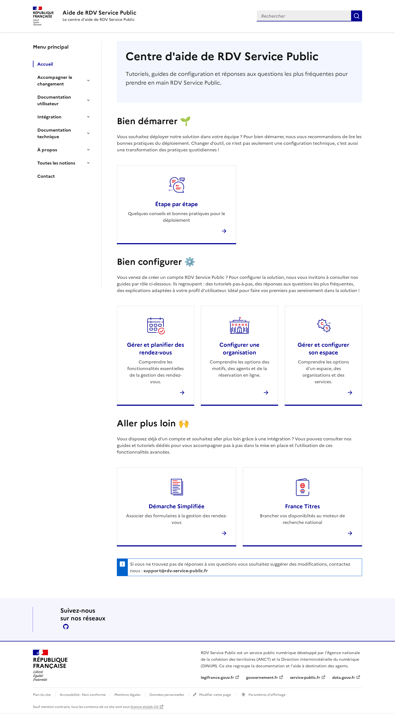
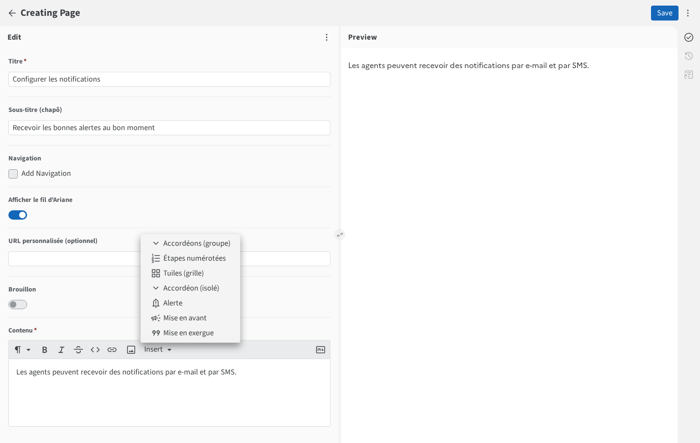

# Aide de RDV Service Public

Site de documentation / centre d'aide de [RDV Service Public](https://www.rdv-service-public.fr/),
généré avec [Eleventy](https://www.11ty.dev/) et le
[Système de Design de l'État (DSFR)](https://www.systeme-de-design.gouv.fr/), à partir du
gabarit [`codegouvfr/eleventy-dsfr`](https://github.com/codegouvfr/eleventy-dsfr).

Il remplace l'ancien site GitBook <https://aide.rdv-service-public.fr/>
(source : [`rdv-solidarites/rdv-service-public-gitbook`](https://github.com/rdv-solidarites/rdv-service-public-gitbook)).



## Développement

Prérequis : Node.js ≥ 18.

```bash
npm ci             # installe les dépendances
npm start          # serveur de dev sur http://localhost:8080
npm run build      # build de production dans _site/ (+ index de recherche Pagefind)
```

Le site est **monolingue (français)** et servi à la racine (pas de préfixe `/fr/`).

## Édition du contenu (Sveltia CMS)

Interface d'édition : `/admin/` (`public/admin/`).



Le menu **« Insert »** de l'éditeur donne accès aux blocs DSFR (accordéons, étapes
numérotées, tuiles, alertes, mises en avant / en exergue). Voir
[`public/admin/editor-components.js`](public/admin/editor-components.js) et
[`markdown-custom-containers.js`](markdown-custom-containers.js).

- **En local** : lancer `npm start`, ouvrir <http://localhost:8080/admin/> dans un
  navigateur Chromium, choisir « Work with Local Repository » et sélectionner le dossier du projet.
- **En production** : « Sign in with Token » avec un
  [jeton d'accès personnel GitHub à granularité fine](https://github.com/settings/tokens?type=beta)
  limité à ce dépôt (permission *Contents: Read and write*).

Le contenu vit dans `content/<section>/<page>/index.md` ; les images sont co-localisées
dans `content/<section>/<page>/assets/`.

## Déploiement

Automatique via GitHub Actions (`.github/workflows/deploy.yml`) sur chaque push `main`,
vers **GitHub Pages** : <https://botadrien.github.io/doc-rdv-service-public-eleventy/>

Build avec `--pathprefix=/doc-rdv-service-public-eleventy/` (sous-chemin GitHub Pages).

### Cutover vers `aide.rdv-service-public.fr` (plus tard)

1. Ajouter `public/CNAME` contenant `aide.rdv-service-public.fr`.
2. Retirer `--pathprefix` du build (`package.json` + workflow).
3. Mettre à jour `_data/metadata.js` (`url`).
4. Configurer le DNS : `aide` → `CNAME` vers `botadrien.github.io`.
5. Mettre en place les redirections depuis les anciennes URL GitBook si nécessaire.

## Licence

Code sous licence MIT, contenu éditorial sous licence Étalab 2.0 — voir [`LICENSE.md`](./LICENSE.md).
