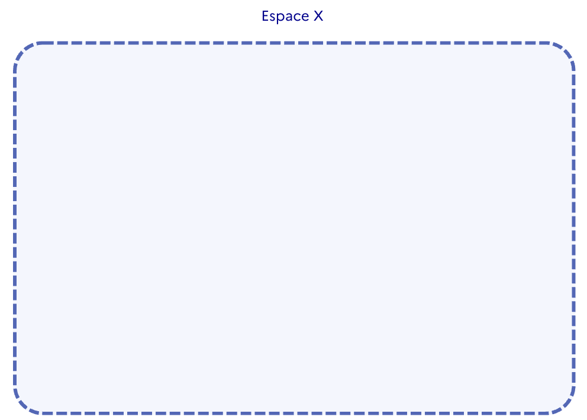
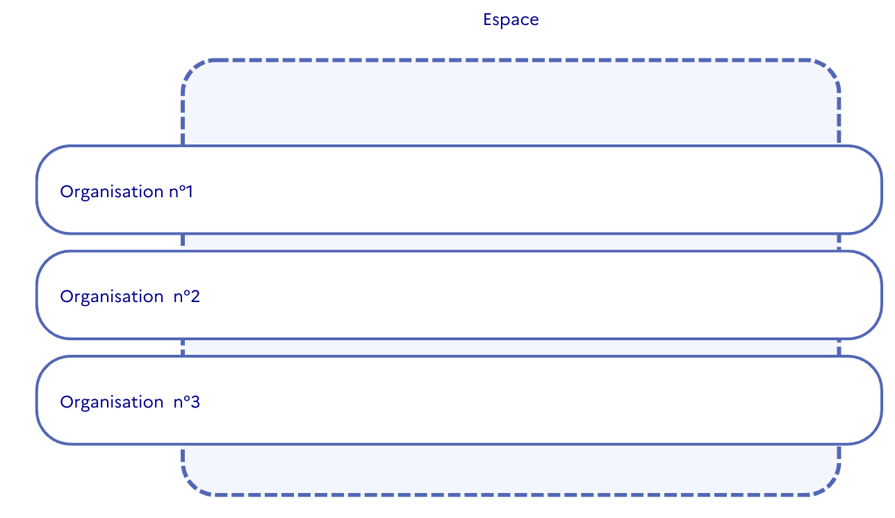
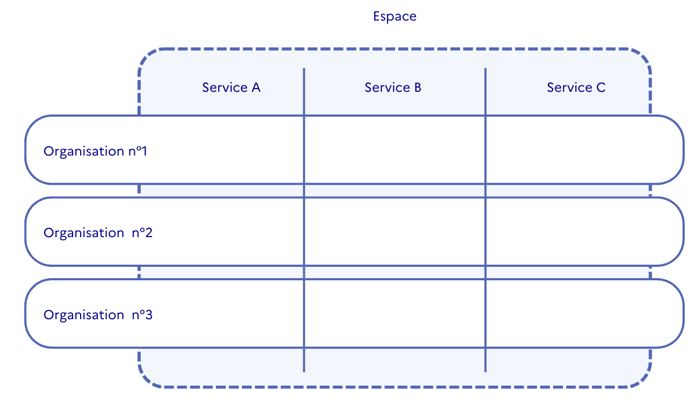
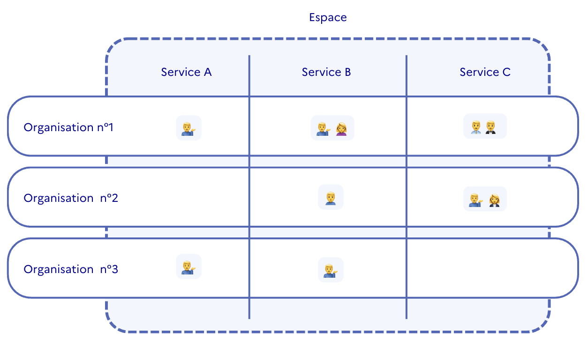
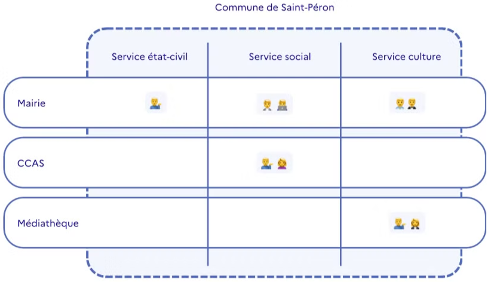

Conçue pour s'adapter aux diverses réalités des administrations publiques, RDV Service Public s'articule autour de 3 niveaux d'accès et d'une architecture en 4 concepts.

La solution offre une grande liberté : aucune limite n'est imposée quant au nombre de services, d'agents ou d'organisations. De plus, vous disposez d'une totale autonomie pour créer et ajuster chaque configuration. Cela permet notamment un déploiement progressif, que ce soit organisation par organisation ou service par service.

## Les niveaux de permission

### Agent Basique

Le statut Agent Basique est le premier niveau d'accès. Il permet d'utiliser toutes les fonctionnalités de planification de rendez-vous. L'agent peut créer des fiches usagers, planifier des rendez-vous et rechercher des disponibilités dans les agendas de ses collègues. Cependant, sa visibilité est limitée aux agendas des _**agents**_ de son _**service**_ et de son _**organisation**_.

:::info
**Vous pouvez associer un Agent Basique à plusieurs services ou plusieurs organsiations au besoin.**
:::

### Agent Admin

Un Agent Admin bénéficie d'une visibilité étendue sur l'ensemble des organisations auxquelles il est associé, tous services confondus. Il peut rechercher des disponibilités dans tous les services de son organisation.

Un Agent Admin a accès à l'onglet _**paramètres**_. Cela lui permet de créer des _**motifs**_, des _**lieux**_ et d'inviter des _**agents**_ dans l'_**organisation**_ à laquelle il est rattaché.

:::info
**Vous pouvez associer un** **Agent Admin** **à plusieurs organisations.**
:::

### Agent Admin d'Espace

Un Agent Admin d'Espace a visibilité et a accès aux options de configuration sur tous les _**services**_ et toutes _**o****rganisations**_ de l'_**espace**_.

Un Agent Admin d'Espace a accès à l'_**espace admin**_. Cet espace lui permet de modifier les droits d'accès de certains agents, de créer des organisations et de former des équipes.

:::info
**Vous pouvez disposer de plusieurs Agents Admin d'Espace dans votre espace.**
:::

## L'architecture

### L'Espace

L'Espace est votre compte dans RDV Service Public où vous intégrez vos _**organisations**_, vos _**services**_ et vos _**agents**_.

### Les organisations

Les _**organisations**_ sont les structures physiques, les sites dans lesquels sont planifiés les rendez-vous et où travaillent les agents. Chaque _**organisation**_ est donc obligatoirement associée à un espace, c'est-à-dire à une entité administrative.

:::info
**Une organisation symbolise un lieu où des agents travaillent et planifient des rendez-vous.**
:::

Par exemple, la Maison des Solidarités de Vernoux et la Maison des Solidarités d'Annonay sont deux organisations du département de l'Ardèche (espace). Vous pouvez créer autant d'organisations que nécessaire !

:::warning
**Chaque organisation peut créer plusieurs lieux. Par défaut, chaque organisation aura un seul lieu (l'adresse de l'organisation). Toutefois, si votre organisation gère des permanences ou des antennes à l'extérieur, vous pouvez créer des lieux supplémentaires**
:::

### Les services

Les services sont rattachés à l'**espace**, c'est-à-dire à l'entité administrative. Les administrations sont généralement organisées en différentes verticales, appelées _**services**_ dans RDV Service Public.

:::info
**Toutes les organisations de votre espace ont accès aux mêmes services. Une organisation ne peut pas avoir de service qui lui soit propre**.
:::

Cette structure permet une organisation plus fine des agents au sein de l'entité administrative globale. Chaque agent est ainsi rattaché à un ou plusieurs _**services**_.

:::info
**Vous avez la possibilité d'activer ou de désactiver des services dans votre espace.**
:::

### Les agents

Les agents sont les utilisateurs de RDV Service Public. Chaque agent obtient un compte utilisateur après avoir été invité par un Agent Admin ou un Agent Admin d'Espace.

### Exemple 💡

Voici un exemple concret de configuration pour une commune.

La commune de Saint-Péron possède un compte (son espace) et utilise la solution pour gérer ses rendez-vous dans trois sites (ses organisations).

Chaque agent est rattaché à son service au sein de son organisation, ce qui permet de cloisonner l'accès aux informations des usagers et des rendez-vous.

