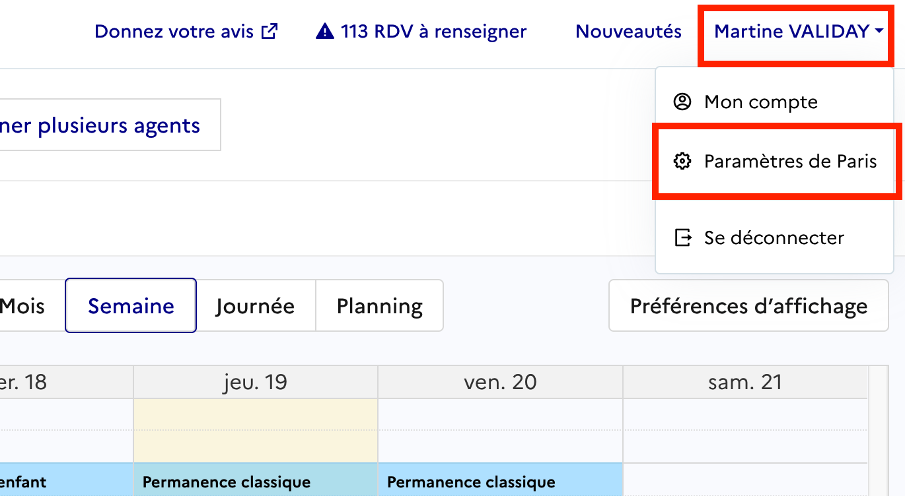
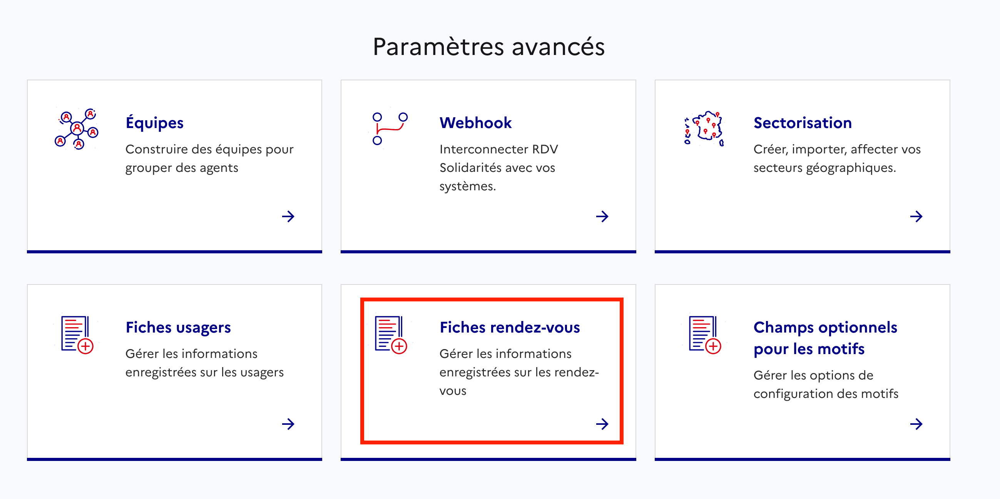

<!--dsfr-editor:source
[
  {
    "id": "d999a675-e85a-4bcd-8dec-ca25d212a9a3",
    "type": "paragraph",
    "props": {
      "backgroundColor": "default",
      "textColor": "default",
      "textAlignment": "left"
    },
    "content": [
      {
        "type": "text",
        "text": "En tant qu’",
        "styles": {}
      },
      {
        "type": "text",
        "text": "Agent Admin d’Espace",
        "styles": {
          "italic": true
        }
      },
      {
        "type": "text",
        "text": ", votre rôle est de configurer l’espace RDV Service Public de manière à ce que vos agents disposent d’une solution adaptée à leurs réalités métier. Votre rôle d’administrateur vise à offrir aux agents un cadre simple, cohérent et efficace pour simplifier le déploiement et l'utilisation.",
        "styles": {}
      }
    ],
    "children": []
  },
  {
    "id": "73ef6c18-58d6-481b-a82b-3b62e039797e",
    "type": "paragraph",
    "props": {
      "backgroundColor": "default",
      "textColor": "default",
      "textAlignment": "left"
    },
    "content": [],
    "children": []
  },
  {
    "id": "38f30e44-5a72-47bd-9dbe-8b3190893728",
    "type": "paragraph",
    "props": {
      "backgroundColor": "default",
      "textColor": "default",
      "textAlignment": "left"
    },
    "content": [
      {
        "type": "text",
        "text": "TEST",
        "styles": {}
      }
    ],
    "children": []
  },
  {
    "id": "9ca59c3a-f427-47e0-ac80-e4639bb71cda",
    "type": "bulletListItem",
    "props": {
      "backgroundColor": "default",
      "textColor": "default",
      "textAlignment": "left"
    },
    "content": [
      {
        "type": "text",
        "text": "Périmètre d’accès : tous les agendas, organisations et services de l’espace",
        "styles": {}
      }
    ],
    "children": []
  },
  {
    "id": "9221a867-2d29-4c2d-a3ae-658eb5d466e9",
    "type": "bulletListItem",
    "props": {
      "backgroundColor": "default",
      "textColor": "default",
      "textAlignment": "left"
    },
    "content": [
      {
        "type": "text",
        "text": "Périmètre de configuration : espace et toutes les organisations",
        "styles": {}
      }
    ],
    "children": []
  },
  {
    "id": "38fc0ffc-72c3-4513-9f1e-22c1221893c3",
    "type": "bulletListItem",
    "props": {
      "backgroundColor": "default",
      "textColor": "default",
      "textAlignment": "left"
    },
    "content": [
      {
        "type": "text",
        "text": "Tâches : créer l’espace, structurer les organisations et les services, nommer les ",
        "styles": {}
      },
      {
        "type": "text",
        "text": "Agents Admin",
        "styles": {
          "italic": true
        }
      },
      {
        "type": "text",
        "text": " dans les organisations et nommer d'autres ",
        "styles": {}
      },
      {
        "type": "text",
        "text": "Agent Admin d'Espace",
        "styles": {
          "italic": true
        }
      }
    ],
    "children": []
  },
  {
    "id": "fdd1e659-f07a-467e-b1c3-79f8a61c6863",
    "type": "paragraph",
    "props": {
      "backgroundColor": "default",
      "textColor": "default",
      "textAlignment": "left"
    },
    "content": [
      {
        "type": "text",
        "text": "Plus de détails sur chaque option :",
        "styles": {
          "bold": true
        }
      }
    ],
    "children": []
  },
  {
    "id": "951c1bbe-5bbe-4b8e-939c-2f590640deb0",
    "type": "dsfrAccordionSection",
    "props": {},
    "content": [
      {
        "type": "text",
        "text": "Agents",
        "styles": {}
      }
    ],
    "children": [
      {
        "id": "df8aa373-a846-4009-859a-1ceeb604104a",
        "type": "paragraph",
        "props": {
          "backgroundColor": "default",
          "textColor": "default",
          "textAlignment": "left"
        },
        "content": [
          {
            "type": "text",
            "text": "En tant qu’",
            "styles": {}
          },
          {
            "type": "text",
            "text": "Administrateur d’Espace",
            "styles": {
              "bold": true
            }
          },
          {
            "type": "text",
            "text": ", vous avez la possibilité d’inviter des agents à rejoindre votre espace RDV Service Public.",
            "styles": {}
          }
        ],
        "children": []
      },
      {
        "id": "140475b4-6b89-44c7-91d4-86a745ccc1b0",
        "type": "heading",
        "props": {
          "backgroundColor": "default",
          "textColor": "default",
          "textAlignment": "left",
          "level": 4
        },
        "content": [
          {
            "type": "text",
            "text": "Inviter un agent",
            "styles": {}
          }
        ],
        "children": []
      },
      {
        "id": "94c82415-a397-4256-be5c-568b825ae5ff",
        "type": "paragraph",
        "props": {
          "backgroundColor": "default",
          "textColor": "default",
          "textAlignment": "left"
        },
        "content": [
          {
            "type": "text",
            "text": "Pour inviter un agent :",
            "styles": {}
          }
        ],
        "children": []
      },
      {
        "id": "657ef722-c9ed-41b7-8d00-9aed63e94cf9",
        "type": "numberedListItem",
        "props": {
          "backgroundColor": "default",
          "textColor": "default",
          "textAlignment": "left"
        },
        "content": [
          {
            "type": "text",
            "text": "Saisissez l’adresse e-mail de l’agent.",
            "styles": {}
          }
        ],
        "children": []
      },
      {
        "id": "e515693f-9f32-4b6c-8c69-a34ed73f55b1",
        "type": "numberedListItem",
        "props": {
          "backgroundColor": "default",
          "textColor": "default",
          "textAlignment": "left"
        },
        "content": [
          {
            "type": "text",
            "text": "Sélectionnez le ou les services auxquels il sera affecté.",
            "styles": {}
          }
        ],
        "children": []
      },
      {
        "id": "6116a6e2-2911-4831-91cc-bfb84d2afc13",
        "type": "numberedListItem",
        "props": {
          "backgroundColor": "default",
          "textColor": "default",
          "textAlignment": "left"
        },
        "content": [
          {
            "type": "text",
            "text": "Associez-le à la ou aux organisations concernées.",
            "styles": {}
          }
        ],
        "children": []
      },
      {
        "id": "18d816e5-a74b-4a17-8046-5cd682106dfd",
        "type": "paragraph",
        "props": {
          "backgroundColor": "default",
          "textColor": "default",
          "textAlignment": "left"
        },
        "content": [
          {
            "type": "text",
            "text": ":::error\n ",
            "styles": {}
          },
          {
            "type": "text",
            "text": "Vous devez inviter les agents individuellement. Il n'est pas possible d'envoyer des invitations à plusieurs adresses e-mail simultanément.",
            "styles": {
              "bold": true
            }
          }
        ],
        "children": []
      },
      {
        "id": "c67ac0bb-0161-4832-9a2a-75d3044fdf49",
        "type": "paragraph",
        "props": {
          "backgroundColor": "default",
          "textColor": "default",
          "textAlignment": "left"
        },
        "content": [
          {
            "type": "text",
            "text": "L’invitation doit être validée par l’agent dans un délai de 48 heures (je sais plus). Passé ce délai, vous devrez procéder à une nouvelle invitation.\n",
            "styles": {
              "bold": true
            }
          },
          {
            "type": "text",
            "text": " :::",
            "styles": {}
          }
        ],
        "children": []
      },
      {
        "id": "a36a147b-1e24-46e9-96a5-12e4244fa2ed",
        "type": "paragraph",
        "props": {
          "backgroundColor": "default",
          "textColor": "default",
          "textAlignment": "left"
        },
        "content": [
          {
            "type": "text",
            "text": "Une fois l’invitation envoyée, l’agent recevra un e-mail contenant un lien lui permettant de rejoindre votre espace.\n L’agent devra obligatoirement valider cette invitation avant que vous puissiez gérer ses paramètres.",
            "styles": {}
          }
        ],
        "children": []
      },
      {
        "id": "494e8bfd-8705-4b34-9a55-bf1afb3f234d",
        "type": "heading",
        "props": {
          "backgroundColor": "default",
          "textColor": "default",
          "textAlignment": "left",
          "level": 4
        },
        "content": [
          {
            "type": "text",
            "text": "Gérer les droits d'accès des agents",
            "styles": {}
          }
        ],
        "children": []
      },
      {
        "id": "770ec13e-764e-4473-b472-4dec9fea986f",
        "type": "paragraph",
        "props": {
          "backgroundColor": "default",
          "textColor": "default",
          "textAlignment": "left"
        },
        "content": [
          {
            "type": "text",
            "text": "Après validation de l’invitation par l’agent, vous pourrez :",
            "styles": {}
          }
        ],
        "children": []
      },
      {
        "id": "9660449f-bb39-4518-8d2e-01c9fcf59bce",
        "type": "bulletListItem",
        "props": {
          "backgroundColor": "default",
          "textColor": "default",
          "textAlignment": "left"
        },
        "content": [
          {
            "type": "text",
            "text": "Modifier ses affectations aux services et organisations.",
            "styles": {}
          }
        ],
        "children": []
      },
      {
        "id": "b33e4e1a-33b2-4cff-8ee5-fa9e31296616",
        "type": "bulletListItem",
        "props": {
          "backgroundColor": "default",
          "textColor": "default",
          "textAlignment": "left"
        },
        "content": [
          {
            "type": "text",
            "text": "Définir ou ajuster ses droits d’accès au sein de chaque organisation.",
            "styles": {}
          }
        ],
        "children": []
      }
    ]
  },
  {
    "id": "cab6efa3-2490-48a7-ae63-bcaa675ce8dd",
    "type": "dsfrAccordionSection",
    "props": {},
    "content": [
      {
        "type": "text",
        "text": "Webhook",
        "styles": {}
      }
    ],
    "children": [
      {
        "id": "d9f34ba3-8caf-4935-b970-854c39f207a3",
        "type": "paragraph",
        "props": {
          "backgroundColor": "default",
          "textColor": "default",
          "textAlignment": "left"
        },
        "content": [
          {
            "type": "text",
            "text": "Les ",
            "styles": {}
          },
          {
            "type": "text",
            "text": "webhooks",
            "styles": {
              "bold": true
            }
          },
          {
            "type": "text",
            "text": " permettent à ",
            "styles": {}
          },
          {
            "type": "text",
            "text": "RDV Service Public",
            "styles": {
              "bold": true
            }
          },
          {
            "type": "text",
            "text": " de communiquer automatiquement avec le système d’information (SI) de votre organisation.",
            "styles": {}
          }
        ],
        "children": []
      },
      {
        "id": "f82b8a60-9ed8-4583-9e15-5207ac7be8e8",
        "type": "paragraph",
        "props": {
          "backgroundColor": "default",
          "textColor": "default",
          "textAlignment": "left"
        },
        "content": [
          {
            "type": "text",
            "text": "RDV Service Public peut envoyer des notifications à votre SI lorsqu’un événement a lieu",
            "styles": {
              "bold": true
            }
          },
          {
            "type": "text",
            "text": ", comme :",
            "styles": {}
          }
        ],
        "children": []
      },
      {
        "id": "3b3721e4-810e-4094-9081-5efc4d4e1048",
        "type": "bulletListItem",
        "props": {
          "backgroundColor": "default",
          "textColor": "default",
          "textAlignment": "left"
        },
        "content": [
          {
            "type": "text",
            "text": "La création d’un rendez-vous.",
            "styles": {}
          }
        ],
        "children": []
      },
      {
        "id": "55a9f4b7-a82b-40ae-89ce-2fa14748800c",
        "type": "bulletListItem",
        "props": {
          "backgroundColor": "default",
          "textColor": "default",
          "textAlignment": "left"
        },
        "content": [
          {
            "type": "text",
            "text": "La modification d’un rendez-vous.",
            "styles": {}
          }
        ],
        "children": []
      },
      {
        "id": "8b648376-7a8e-4202-acf6-2e74cb742dca",
        "type": "bulletListItem",
        "props": {
          "backgroundColor": "default",
          "textColor": "default",
          "textAlignment": "left"
        },
        "content": [
          {
            "type": "text",
            "text": "L’annulation d’un rendez-vous.",
            "styles": {}
          }
        ],
        "children": []
      },
      {
        "id": "6c51f326-7ff8-4104-8f57-7f34200d49e3",
        "type": "paragraph",
        "props": {
          "backgroundColor": "default",
          "textColor": "default",
          "textAlignment": "left"
        },
        "content": [
          {
            "type": "text",
            "text": "Votre équipe informatique peut développer un module dans votre SI pour :",
            "styles": {}
          }
        ],
        "children": []
      },
      {
        "id": "07b7ea68-cc25-47f8-a1c2-ff65ddad3b59",
        "type": "bulletListItem",
        "props": {
          "backgroundColor": "default",
          "textColor": "default",
          "textAlignment": "left"
        },
        "content": [
          {
            "type": "text",
            "text": "Recevoir ces notifications en temps réel.",
            "styles": {
              "bold": true
            }
          }
        ],
        "children": []
      },
      {
        "id": "29a65298-c7fa-4ccf-8026-b6aff50570ea",
        "type": "bulletListItem",
        "props": {
          "backgroundColor": "default",
          "textColor": "default",
          "textAlignment": "left"
        },
        "content": [
          {
            "type": "text",
            "text": "Mettre à jour automatiquement vos calendriers internes, logiciels métiers, etc.",
            "styles": {
              "bold": true
            }
          }
        ],
        "children": []
      },
      {
        "id": "371092a6-7a05-4327-a244-4431b2c26053",
        "type": "paragraph",
        "props": {
          "backgroundColor": "default",
          "textColor": "default",
          "textAlignment": "left"
        },
        "content": [
          {
            "type": "text",
            "text": "Cette intégration vous permet de :",
            "styles": {}
          }
        ],
        "children": []
      },
      {
        "id": "7b93efa2-4385-417c-bc59-5e94f14e4646",
        "type": "bulletListItem",
        "props": {
          "backgroundColor": "default",
          "textColor": "default",
          "textAlignment": "left"
        },
        "content": [
          {
            "type": "text",
            "text": "Automatiser certaines tâches (mise à jour de calendriers, notifications internes, etc).",
            "styles": {}
          }
        ],
        "children": []
      },
      {
        "id": "c9de00e5-324e-4863-945d-a24a40a7b298",
        "type": "bulletListItem",
        "props": {
          "backgroundColor": "default",
          "textColor": "default",
          "textAlignment": "left"
        },
        "content": [
          {
            "type": "text",
            "text": "Réduire les saisies manuelles.",
            "styles": {}
          }
        ],
        "children": []
      },
      {
        "id": "a6144bd7-c506-4240-b592-55c63310b07a",
        "type": "bulletListItem",
        "props": {
          "backgroundColor": "default",
          "textColor": "default",
          "textAlignment": "left"
        },
        "content": [
          {
            "type": "text",
            "text": "Offrir une meilleure synchronisation entre ",
            "styles": {}
          },
          {
            "type": "text",
            "text": "RDV Service Public",
            "styles": {
              "bold": true
            }
          },
          {
            "type": "text",
            "text": " et vos outils internes.",
            "styles": {}
          }
        ],
        "children": []
      },
      {
        "id": "f77bf4bd-3631-43a1-bc55-24a547905955",
        "type": "paragraph",
        "props": {
          "backgroundColor": "default",
          "textColor": "default",
          "textAlignment": "left"
        },
        "content": [
          {
            "type": "text",
            "text": "Pour les détails techniques et la mise en place, vous pouvez consulter la documentation dédiée :\n ",
            "styles": {}
          },
          {
            "type": "link",
            "href": "https://github.com/betagouv/rdv-service-public/blob/production/docs/api/webhooks/api-notifications-webhooks.md",
            "content": [
              {
                "type": "text",
                "text": "Accéder à la documentation technique - Notifications Webhooks",
                "styles": {}
              }
            ]
          }
        ],
        "children": []
      }
    ]
  },
  {
    "id": "5fb5a49a-b195-436e-acf9-687d1414fa1d",
    "type": "dsfrAccordionSection",
    "props": {},
    "content": [
      {
        "type": "text",
        "text": "Fiches usagers",
        "styles": {}
      }
    ],
    "children": [
      {
        "id": "c08d9c15-6327-4d35-b110-4414a36ed20d",
        "type": "paragraph",
        "props": {
          "backgroundColor": "default",
          "textColor": "default",
          "textAlignment": "left"
        },
        "content": [
          {
            "type": "text",
            "text": "En tant qu’",
            "styles": {}
          },
          {
            "type": "text",
            "text": "Administrateur d’Espace",
            "styles": {
              "bold": true
            }
          },
          {
            "type": "text",
            "text": ", vous pouvez personnaliser les informations affichées dans les fiches usagers.",
            "styles": {}
          }
        ],
        "children": []
      },
      {
        "id": "fa70fb2a-71e8-403e-bcd7-7409c4cb1b31",
        "type": "paragraph",
        "props": {
          "backgroundColor": "default",
          "textColor": "default",
          "textAlignment": "left"
        },
        "content": [
          {
            "type": "text",
            "text": "Vous avez la possibilité :",
            "styles": {}
          }
        ],
        "children": []
      },
      {
        "id": "b6dafd10-5c4e-4df9-906e-5264c0f0073d",
        "type": "bulletListItem",
        "props": {
          "backgroundColor": "default",
          "textColor": "default",
          "textAlignment": "left"
        },
        "content": [
          {
            "type": "text",
            "text": "D’",
            "styles": {}
          },
          {
            "type": "text",
            "text": "ajouter des champs personnalisés",
            "styles": {
              "bold": true
            }
          },
          {
            "type": "text",
            "text": " qui seront visibles dans les fiches usagers.",
            "styles": {}
          }
        ],
        "children": []
      },
      {
        "id": "752066a4-3ace-40e2-afd1-4aa1c27c3a9a",
        "type": "bulletListItem",
        "props": {
          "backgroundColor": "default",
          "textColor": "default",
          "textAlignment": "left"
        },
        "content": [
          {
            "type": "text",
            "text": "De ",
            "styles": {}
          },
          {
            "type": "text",
            "text": "masquer certains champs",
            "styles": {
              "bold": true
            }
          },
          {
            "type": "text",
            "text": " que vous ne souhaitez pas afficher.",
            "styles": {}
          }
        ],
        "children": []
      },
      {
        "id": "733c614b-694b-4a88-943f-a51832597de3",
        "type": "paragraph",
        "props": {
          "backgroundColor": "default",
          "textColor": "default",
          "textAlignment": "left"
        },
        "content": [
          {
            "type": "text",
            "text": "Ces ajustements vous permettent d’adapter les fiches aux besoins spécifiques de votre organisation et de vos agents.",
            "styles": {}
          }
        ],
        "children": []
      },
      {
        "id": "91eb4ea4-615a-4a09-8ec2-462377e41ed6",
        "type": "paragraph",
        "props": {
          "backgroundColor": "default",
          "textColor": "default",
          "textAlignment": "left"
        },
        "content": [
          {
            "type": "text",
            "text": ":::warning\n ",
            "styles": {}
          },
          {
            "type": "text",
            "text": "Les modifications que vous apportez s’appliqueront à l’ensemble des organisations et des services de votre espace.\n",
            "styles": {
              "bold": true
            }
          },
          {
            "type": "text",
            "text": " :::",
            "styles": {}
          }
        ],
        "children": []
      }
    ]
  },
  {
    "id": "cb0cf48f-16f5-4dbb-83c7-221002ff5106",
    "type": "dsfrAccordionSection",
    "props": {},
    "content": [
      {
        "type": "text",
        "text": "Fiches RDV",
        "styles": {}
      }
    ],
    "children": [
      {
        "id": "0c6a5d97-0a11-41ca-9996-bdca42f07cab",
        "type": "paragraph",
        "props": {
          "backgroundColor": "default",
          "textColor": "default",
          "textAlignment": "left"
        },
        "content": [
          {
            "type": "text",
            "text": "En tant qu’",
            "styles": {}
          },
          {
            "type": "text",
            "text": "Administrateur d’Espace",
            "styles": {
              "bold": true
            }
          },
          {
            "type": "text",
            "text": ", vous avez la possibilité de personnaliser l’affichage des ",
            "styles": {}
          },
          {
            "type": "text",
            "text": "fiches RDV",
            "styles": {
              "bold": true
            }
          },
          {
            "type": "text",
            "text": " en activant ou désactivant certains champs selon les besoins de vos organisations.",
            "styles": {}
          }
        ],
        "children": []
      },
      {
        "id": "d1dd2072-5d72-4208-a7ee-1743924e9d99",
        "type": "paragraph",
        "props": {
          "backgroundColor": "default",
          "textColor": "default",
          "textAlignment": "left"
        },
        "content": [
          {
            "type": "text",
            "text": "Pour ce faire, cliquez sur votre nom en haut à droite, puis « Paramètres de mon espace ».",
            "styles": {}
          }
        ],
        "children": []
      },
      {
        "id": "a70b7c58-4756-40aa-a8db-d01ac8a8de47",
        "type": "image",
        "props": {
          "textAlignment": "left",
          "backgroundColor": "default",
          "name": "",
          "url": "./assets/sans-titre.png",
          "caption": "",
          "showPreview": true
        },
        "children": []
      },
      {
        "id": "75d47dfc-a7d6-4edd-aad6-6fa89a1af11a",
        "type": "paragraph",
        "props": {
          "backgroundColor": "default",
          "textColor": "default",
          "textAlignment": "left"
        },
        "content": [
          {
            "type": "text",
            "text": "Cliquez ensuite sur la tuile « Fiches rendez-vous ».",
            "styles": {}
          }
        ],
        "children": []
      },
      {
        "id": "f2ca5475-ee7f-43f7-813b-b68ace3ec07d",
        "type": "image",
        "props": {
          "textAlignment": "left",
          "backgroundColor": "default",
          "name": "",
          "url": "./assets/sans-titre-2.png",
          "caption": "",
          "showPreview": true
        },
        "children": []
      },
      {
        "id": "ff539faf-bf87-4d8c-95eb-46177fad20d8",
        "type": "paragraph",
        "props": {
          "backgroundColor": "default",
          "textColor": "default",
          "textAlignment": "left"
        },
        "content": [
          {
            "type": "text",
            "text": "Vous pourrez ensuite activer ou désactiver votre les différentes options décrites ci-après.",
            "styles": {}
          }
        ],
        "children": []
      },
      {
        "id": "ba3b16d7-6cda-4f67-8219-0c02868856d8",
        "type": "paragraph",
        "props": {
          "backgroundColor": "default",
          "textColor": "default",
          "textAlignment": "left"
        },
        "content": [
          {
            "type": "text",
            "text": ":::info\n Si vous ne voyez pas « Paramètre de mon espace », c’est que vous n’êtes pas administrateur de celui-ci. Nous vous invitons donc à contacter votre administrateur d’espace.\n :::",
            "styles": {}
          }
        ],
        "children": []
      },
      {
        "id": "0a1d7687-3b8b-4e64-b493-be2fe490f6ea",
        "type": "paragraph",
        "props": {
          "backgroundColor": "default",
          "textColor": "default",
          "textAlignment": "left"
        },
        "content": [
          {
            "type": "text",
            "text": "Champ Contexte",
            "styles": {
              "bold": true
            }
          }
        ],
        "children": []
      },
      {
        "id": "c31e36e5-2df0-43a8-9276-ba1c8327aa57",
        "type": "paragraph",
        "props": {
          "backgroundColor": "default",
          "textColor": "default",
          "textAlignment": "left"
        },
        "content": [
          {
            "type": "text",
            "text": "Le champ ",
            "styles": {}
          },
          {
            "type": "text",
            "text": "Contexte",
            "styles": {
              "bold": true
            }
          },
          {
            "type": "text",
            "text": " permet aux agents, lors de la prise de rendez-vous, d’ajouter des informations complémentaires utiles à la gestion du rendez-vous.\n Ces informations sont :",
            "styles": {}
          }
        ],
        "children": []
      },
      {
        "id": "24b5fc37-5a35-4936-9c2d-19a7dd5b709a",
        "type": "bulletListItem",
        "props": {
          "backgroundColor": "default",
          "textColor": "default",
          "textAlignment": "left"
        },
        "content": [
          {
            "type": "text",
            "text": "Uniquement visibles en interne",
            "styles": {
              "bold": true
            }
          },
          {
            "type": "text",
            "text": ", par les agents disposant des droits d’accès au rendez-vous concerné.",
            "styles": {}
          }
        ],
        "children": []
      },
      {
        "id": "271ef6df-b507-46ef-8b16-5f367f96fcc2",
        "type": "bulletListItem",
        "props": {
          "backgroundColor": "default",
          "textColor": "default",
          "textAlignment": "left"
        },
        "content": [
          {
            "type": "text",
            "text": "Non accessibles aux usagers.",
            "styles": {}
          }
        ],
        "children": []
      },
      {
        "id": "60202c3a-042d-4a4c-966b-f39a116252f4",
        "type": "paragraph",
        "props": {
          "backgroundColor": "default",
          "textColor": "default",
          "textAlignment": "left"
        },
        "content": [
          {
            "type": "text",
            "text": ":::warning\n ",
            "styles": {}
          },
          {
            "type": "text",
            "text": "Lorsque ce champ est désactivé, il est masqué dans l’interface.\n",
            "styles": {
              "bold": true
            }
          },
          {
            "type": "text",
            "text": " ",
            "styles": {}
          },
          {
            "type": "text",
            "text": "Les informations déjà saisies resteront enregistrées mais ne seront plus visibles.\n",
            "styles": {
              "bold": true
            }
          },
          {
            "type": "text",
            "text": " :::",
            "styles": {}
          }
        ],
        "children": []
      },
      {
        "id": "2e49077c-9127-4f24-8133-637305356f01",
        "type": "heading",
        "props": {
          "backgroundColor": "default",
          "textColor": "default",
          "textAlignment": "left",
          "level": 4
        },
        "content": [
          {
            "type": "text",
            "text": "Salle d’attente",
            "styles": {}
          }
        ],
        "children": []
      },
      {
        "id": "cfb18e93-58ca-4616-8e19-76bac3b771a7",
        "type": "paragraph",
        "props": {
          "backgroundColor": "default",
          "textColor": "default",
          "textAlignment": "left"
        },
        "content": [
          {
            "type": "text",
            "text": "Vous pouvez également configurer les paramètres liés à la ",
            "styles": {}
          },
          {
            "type": "text",
            "text": "salle d’attente",
            "styles": {
              "bold": true
            }
          },
          {
            "type": "text",
            "text": ", notamment :",
            "styles": {}
          }
        ],
        "children": []
      },
      {
        "id": "520db56e-a70c-4773-b702-22babfe0b7fa",
        "type": "bulletListItem",
        "props": {
          "backgroundColor": "default",
          "textColor": "default",
          "textAlignment": "left"
        },
        "content": [
          {
            "type": "text",
            "text": "Définir le ",
            "styles": {}
          },
          {
            "type": "text",
            "text": "mode de notification des agents",
            "styles": {
              "bold": true
            }
          },
          {
            "type": "text",
            "text": " lorsqu’un usager est présent en salle d’attente (notification visuelle, par mail).",
            "styles": {}
          }
        ],
        "children": []
      }
    ]
  },
  {
    "id": "eac56406-439a-4d73-a0b3-ff70fd613797",
    "type": "dsfrAccordionSection",
    "props": {},
    "content": [
      {
        "type": "text",
        "text": "Motifs",
        "styles": {}
      }
    ],
    "children": [
      {
        "id": "2953ccf7-edc1-427c-b298-27a9878f0a70",
        "type": "paragraph",
        "props": {
          "backgroundColor": "default",
          "textColor": "default",
          "textAlignment": "left"
        },
        "content": [
          {
            "type": "text",
            "text": "Le motif est la raison du rendez-vous. Il permet de catégoriser les prises de rendez-vous, d’informer l’agent sur le contenu attendu et d’affiner les options (présentiel, téléphone, visio, option de prise de rendez-vous en ligne).",
            "styles": {}
          }
        ],
        "children": []
      },
      {
        "id": "8da11f26-fc76-4de5-a991-cf0c8344c8fc",
        "type": "paragraph",
        "props": {
          "backgroundColor": "default",
          "textColor": "default",
          "textAlignment": "left"
        },
        "content": [
          {
            "type": "text",
            "text": "En tant qu’Administrateur, vous pouvez créer des ",
            "styles": {}
          },
          {
            "type": "text",
            "text": "motifs à l’échelle de votre espace",
            "styles": {
              "bold": true
            }
          },
          {
            "type": "text",
            "text": ". Cela vous permet de mutualiser les motifs entre plusieurs organisations, sans avoir à les recréer pour chacune.",
            "styles": {}
          }
        ],
        "children": []
      },
      {
        "id": "574d7864-5de4-4f63-a26e-7079f9bac57e",
        "type": "paragraph",
        "props": {
          "backgroundColor": "default",
          "textColor": "default",
          "textAlignment": "left"
        },
        "content": [
          {
            "type": "text",
            "text": "Lors de la création, vous pouvez sélectionner les ",
            "styles": {}
          },
          {
            "type": "text",
            "text": "organisations concernées",
            "styles": {
              "bold": true
            }
          },
          {
            "type": "text",
            "text": " par ce motif.",
            "styles": {}
          }
        ],
        "children": []
      },
      {
        "id": "4d974e9b-8212-4acf-8c51-d3b3ea7b7514",
        "type": "paragraph",
        "props": {
          "backgroundColor": "default",
          "textColor": "default",
          "textAlignment": "left"
        },
        "content": [
          {
            "type": "text",
            "text": "La configuration d’un motif s’effectue via 3 onglets :",
            "styles": {}
          }
        ],
        "children": []
      },
      {
        "id": "0b42cfe5-7e0f-42dd-8642-062a305d8d60",
        "type": "heading",
        "props": {
          "backgroundColor": "default",
          "textColor": "default",
          "textAlignment": "left",
          "level": 4
        },
        "content": [
          {
            "type": "text",
            "text": "Information générale",
            "styles": {
              "bold": true
            }
          }
        ],
        "children": []
      },
      {
        "id": "4eb12e64-90bd-40af-a9d4-b96201824841",
        "type": "paragraph",
        "props": {
          "backgroundColor": "default",
          "textColor": "default",
          "textAlignment": "left"
        },
        "content": [
          {
            "type": "text",
            "text": "Un motif est avant tout un objet de rendez-vous qui se configure par un nom, une durée par défaut, un type et un service associé.",
            "styles": {}
          }
        ],
        "children": []
      },
      {
        "id": "da44ffbb-6d08-47a1-8c71-4f26f73a2aa7",
        "type": "paragraph",
        "props": {
          "backgroundColor": "default",
          "textColor": "default",
          "textAlignment": "left"
        },
        "content": [
          {
            "type": "text",
            "text": ":::success\n ",
            "styles": {}
          },
          {
            "type": "text",
            "text": "Vos motifs seront accessibles par les agents des services associés\n",
            "styles": {
              "bold": true
            }
          },
          {
            "type": "text",
            "text": " :::",
            "styles": {}
          }
        ],
        "children": []
      },
      {
        "id": "05b85a56-88e1-4af8-a7bb-d5925b742ac0",
        "type": "paragraph",
        "props": {
          "backgroundColor": "default",
          "textColor": "default",
          "textAlignment": "left"
        },
        "content": [
          {
            "type": "text",
            "text": "Les agents pourront créer des plages de disponibilités avec des motifs configurés et ainsi faciliter la recherche de créneaux dans votre organisation et planifier des rendez-vous.",
            "styles": {}
          }
        ],
        "children": []
      },
      {
        "id": "c5c12e8b-7307-4072-8a9f-63469420d27f",
        "type": "paragraph",
        "props": {
          "backgroundColor": "default",
          "textColor": "default",
          "textAlignment": "left"
        },
        "content": [
          {
            "type": "text",
            "text": "Si vous souhaitez proposer plusieurs modalités de rendez-vous (sur place, par téléphone, par visioconférence ou à domicile) ou plusieurs durée par défaut (30 minutes ou 60 minutes) pour un même motif, il sera nécessaire de dupliquer et créer plusieurs motifs.",
            "styles": {}
          }
        ],
        "children": []
      },
      {
        "id": "548eea53-003e-4a70-90ab-f1b1ed1d9626",
        "type": "heading",
        "props": {
          "backgroundColor": "default",
          "textColor": "default",
          "textAlignment": "left",
          "level": 4
        },
        "content": [
          {
            "type": "text",
            "text": "Réservation en ligne",
            "styles": {
              "bold": true
            }
          }
        ],
        "children": []
      },
      {
        "id": "8981a655-0f33-4e33-9267-67f1849e93a9",
        "type": "paragraph",
        "props": {
          "backgroundColor": "default",
          "textColor": "default",
          "textAlignment": "left"
        },
        "content": [
          {
            "type": "text",
            "text": "Un motif peut-être ouvert ou non à la prise de rendez-vous en ligne. Vous pouvez sélectionner cette option depuis l'onglet ",
            "styles": {}
          },
          {
            "type": "text",
            "text": "réservation en ligne",
            "styles": {
              "bold": true,
              "italic": true
            }
          },
          {
            "type": "text",
            "text": " de l'écran de configuration des motifs. Vous devez cocher la case ",
            "styles": {}
          },
          {
            "type": "text",
            "text": "ouvert aux usagers",
            "styles": {
              "italic": true
            }
          },
          {
            "type": "text",
            "text": ".",
            "styles": {}
          }
        ],
        "children": []
      },
      {
        "id": "6e3af6ad-0b95-4064-bac2-a5a83861d7cc",
        "type": "paragraph",
        "props": {
          "backgroundColor": "default",
          "textColor": "default",
          "textAlignment": "left"
        },
        "content": [
          {
            "type": "text",
            "text": ":::success\n ",
            "styles": {}
          },
          {
            "type": "text",
            "text": "Une pastille **_",
            "styles": {
              "bold": true
            }
          },
          {
            "type": "text",
            "text": "en ligne",
            "styles": {}
          },
          {
            "type": "text",
            "text": "_",
            "styles": {
              "bold": true
            }
          },
          {
            "type": "text",
            "text": " s'affichera pour chaque motif.**\n :::",
            "styles": {}
          }
        ],
        "children": []
      },
      {
        "id": "dda42234-fe7a-49fc-b139-2b6e2ff68a05",
        "type": "paragraph",
        "props": {
          "backgroundColor": "default",
          "textColor": "default",
          "textAlignment": "left"
        },
        "content": [
          {
            "type": "text",
            "text": "Dès lors que vous ouvrez la prise de rendez-vous en ligne pour un motif, vous accéderez à des options de configurations supplémentaires liées au ",
            "styles": {}
          },
          {
            "type": "text",
            "text": "délais minimum et maximum de réservation",
            "styles": {
              "bold": true
            }
          },
          {
            "type": "text",
            "text": ". En configurant ces options, vous pouvez limiter la visibilités des disponibilités des plages de disponibilités des agents dans le parcours de prise de rendez-vous en ligne.",
            "styles": {}
          }
        ],
        "children": []
      },
      {
        "id": "707803e6-9bb7-43cd-925f-bad875d207a8",
        "type": "paragraph",
        "props": {
          "backgroundColor": "default",
          "textColor": "default",
          "textAlignment": "left"
        },
        "content": [
          {
            "type": "text",
            "text": "Aussi, vous pouvez offrir la possibilité à vos usagers de ",
            "styles": {}
          },
          {
            "type": "text",
            "text": "modifier leur créneau de rendez-vous en autonomie",
            "styles": {
              "bold": true
            }
          },
          {
            "type": "text",
            "text": ". Un bouton déplacer le RDV s'affichera depuis leur récapitulatif de rendez-vous accessible depuis les notifications email et SMS.",
            "styles": {}
          }
        ],
        "children": []
      },
      {
        "id": "c9c24ff8-4913-4202-973c-e71d9c8c6bf3",
        "type": "heading",
        "props": {
          "backgroundColor": "default",
          "textColor": "default",
          "textAlignment": "left",
          "level": 4
        },
        "content": [
          {
            "type": "text",
            "text": "Instruction et notification",
            "styles": {
              "bold": true
            }
          }
        ],
        "children": []
      },
      {
        "id": "48dfa1aa-930a-4e56-9397-de616d098b19",
        "type": "paragraph",
        "props": {
          "backgroundColor": "default",
          "textColor": "default",
          "textAlignment": "left"
        },
        "content": [
          {
            "type": "text",
            "text": "Vous pouvez personnaliser des instructions de rendez-vous, motif par motif. Vous pouvez personnaliser ces instructions depuis l'onglet ",
            "styles": {}
          },
          {
            "type": "text",
            "text": "notification et instruction.",
            "styles": {
              "bold": true,
              "italic": true
            }
          }
        ],
        "children": []
      },
      {
        "id": "a937447a-f877-4140-bf1c-b0e0a9697e41",
        "type": "paragraph",
        "props": {
          "backgroundColor": "default",
          "textColor": "default",
          "textAlignment": "left"
        },
        "content": [
          {
            "type": "text",
            "text": "Cette fonctionnalité permet de faire afficher ces instructions :",
            "styles": {}
          }
        ],
        "children": []
      },
      {
        "id": "dc418d5c-4c30-4375-9873-d778c1500d27",
        "type": "bulletListItem",
        "props": {
          "backgroundColor": "default",
          "textColor": "default",
          "textAlignment": "left"
        },
        "content": [
          {
            "type": "text",
            "text": "Avant le rendez-vous",
            "styles": {
              "bold": true
            }
          },
          {
            "type": "text",
            "text": " : dans le parcours en ligne, avant qu'un usager sélectionne un créneau",
            "styles": {}
          }
        ],
        "children": []
      },
      {
        "id": "a8e7730f-1fbf-43a8-a011-8ed0eb99cd34",
        "type": "bulletListItem",
        "props": {
          "backgroundColor": "default",
          "textColor": "default",
          "textAlignment": "left"
        },
        "content": [
          {
            "type": "text",
            "text": "Après le rendez-vous",
            "styles": {
              "bold": true
            }
          },
          {
            "type": "text",
            "text": " : dans l'écran de confirmation du rendez-vous ainsi que dans la notification SMS, via l'URL ",
            "styles": {}
          },
          {
            "type": "text",
            "text": "info/annulation",
            "styles": {
              "italic": true
            }
          },
          {
            "type": "text",
            "text": " et dans la notification email, via le champ ",
            "styles": {}
          },
          {
            "type": "text",
            "text": "information supplémentaires",
            "styles": {
              "italic": true
            }
          }
        ],
        "children": []
      }
    ]
  },
  {
    "id": "4310b51a-b342-4b7b-b4ee-1ed52a75d1c6",
    "type": "dsfrAccordionSection",
    "props": {},
    "content": [
      {
        "type": "text",
        "text": "Services",
        "styles": {}
      }
    ],
    "children": [
      {
        "id": "c48784da-e5b6-4007-9dc5-2672f1bb46a5",
        "type": "paragraph",
        "props": {
          "backgroundColor": "default",
          "textColor": "default",
          "textAlignment": "left"
        },
        "content": [
          {
            "type": "text",
            "text": "Vous pouvez gérer les services auxquels vos agents peuvent être affectés dans les différentes organisations.",
            "styles": {}
          }
        ],
        "children": []
      },
      {
        "id": "18d92f27-6343-49b1-bffc-77b109cffc22",
        "type": "paragraph",
        "props": {
          "backgroundColor": "default",
          "textColor": "default",
          "textAlignment": "left"
        },
        "content": [
          {
            "type": "text",
            "text": "Vous avez la possibilité d’",
            "styles": {}
          },
          {
            "type": "text",
            "text": "activer un service",
            "styles": {
              "bold": true
            }
          },
          {
            "type": "text",
            "text": " pour qu’il soit disponible dans votre espace.",
            "styles": {}
          }
        ],
        "children": []
      },
      {
        "id": "51e5adcd-f7b2-4adc-86d4-04ffa86fe56f",
        "type": "paragraph",
        "props": {
          "backgroundColor": "default",
          "textColor": "default",
          "textAlignment": "left"
        },
        "content": [
          {
            "type": "text",
            "text": "Vous pouvez également ",
            "styles": {}
          },
          {
            "type": "text",
            "text": "désactiver un service",
            "styles": {
              "bold": true
            }
          },
          {
            "type": "text",
            "text": ". Les agents ne pourront alors plus être affectés à ce service.",
            "styles": {}
          }
        ],
        "children": []
      },
      {
        "id": "d40bed91-d7e3-48b4-a8ec-6c07ad5c1eca",
        "type": "paragraph",
        "props": {
          "backgroundColor": "default",
          "textColor": "default",
          "textAlignment": "left"
        },
        "content": [
          {
            "type": "text",
            "text": ":::info\n ",
            "styles": {}
          },
          {
            "type": "text",
            "text": "Si le service souhaité n’apparaît pas dans la liste proposée, vous pouvez en faire la demande en nous contactant via ce",
            "styles": {
              "bold": true
            }
          },
          {
            "type": "text",
            "text": " ",
            "styles": {}
          },
          {
            "type": "link",
            "href": "https://rdv.anct.gouv.fr/aide/demande_support/new?role=agent\\&sujet=Ajout+d%E2%80%99un+service",
            "content": [
              {
                "type": "text",
                "text": "formulaire",
                "styles": {
                  "bold": true
                }
              }
            ]
          },
          {
            "type": "text",
            "text": ".\n",
            "styles": {
              "bold": true
            }
          },
          {
            "type": "text",
            "text": " :::",
            "styles": {}
          }
        ],
        "children": []
      }
    ]
  },
  {
    "id": "8e1bd9c9-651e-4bdb-ba56-74e9eb6ed6e7",
    "type": "dsfrAccordionSection",
    "props": {},
    "content": [
      {
        "type": "text",
        "text": "Organisations",
        "styles": {}
      }
    ],
    "children": [
      {
        "id": "4095ce53-9382-4adb-9b95-15b44f274d67",
        "type": "paragraph",
        "props": {
          "backgroundColor": "default",
          "textColor": "default",
          "textAlignment": "left"
        },
        "content": [
          {
            "type": "text",
            "text": "En tant qu’administrateur, vous pouvez accéder à la liste de vos organisations présentes dans votre espace et consulter ou modifier leur configuration.",
            "styles": {}
          }
        ],
        "children": []
      },
      {
        "id": "c7a0d166-e38f-4d1b-b2c9-949ab4fe0c31",
        "type": "paragraph",
        "props": {
          "backgroundColor": "default",
          "textColor": "default",
          "textAlignment": "left"
        },
        "content": [
          {
            "type": "text",
            "text": "Vous avez également la possibilité d’ajouter une nouvelle organisation à votre espace.",
            "styles": {}
          }
        ],
        "children": []
      }
    ]
  },
  {
    "id": "5779173d-3efe-46d6-980b-a92b922b365e",
    "type": "dsfrAccordionSection",
    "props": {},
    "content": [
      {
        "type": "text",
        "text": "Calendrier",
        "styles": {}
      }
    ],
    "children": [
      {
        "id": "8c7fa506-a93d-4c77-93fa-cf47ba4590c3",
        "type": "paragraph",
        "props": {
          "backgroundColor": "default",
          "textColor": "default",
          "textAlignment": "left"
        },
        "content": [
          {
            "type": "text",
            "text": "Par défaut, les dimanches sont cachés du calendrier et les jours fériés sont automatiquement considérés comme des jours où tous les agents sont indisponibles.",
            "styles": {}
          }
        ],
        "children": []
      },
      {
        "id": "7ab2261e-3f90-45af-80e7-938e5fbf5245",
        "type": "paragraph",
        "props": {
          "backgroundColor": "default",
          "textColor": "default",
          "textAlignment": "left"
        },
        "content": [
          {
            "type": "text",
            "text": "Cependant, si votre service travaille le dimanche et/ou les jours fériés, vous pouvez activer l'option de ce menu pour que les dimanches et les jours fériés soient considérés comme des jours normaux.",
            "styles": {}
          }
        ],
        "children": []
      },
      {
        "id": "ac8f1360-ac95-47a3-b999-770155d24fda",
        "type": "paragraph",
        "props": {
          "backgroundColor": "default",
          "textColor": "default",
          "textAlignment": "left"
        },
        "content": [
          {
            "type": "text",
            "text": "Vos agents pourront alors ouvrir des créneaux sur ces jours.",
            "styles": {}
          }
        ],
        "children": []
      }
    ]
  },
  {
    "id": "970a819f-3ea3-4449-8200-1797047eb296",
    "type": "dsfrAlert",
    "props": {
      "severity": "success",
      "small": true,
      "title": ""
    },
    "content": [
      {
        "type": "text",
        "text": "Vous trouverez également des informations complémentaires dans la ",
        "styles": {}
      },
      {
        "type": "link",
        "href": "/documentation-utilisateur/faq/",
        "content": [
          {
            "type": "text",
            "text": "Foire Aux Questions",
            "styles": {
              "bold": true
            }
          },
          {
            "type": "text",
            "text": "​",
            "styles": {}
          }
        ]
      }
    ],
    "children": []
  }
]
-->

En tant qu’<em>Agent Admin d’Espace</em>, votre rôle est de configurer l’espace RDV Service Public de manière à ce que vos agents disposent d’une solution adaptée à leurs réalités métier. Votre rôle d’administrateur vise à offrir aux agents un cadre simple, cohérent et efficace pour simplifier le déploiement et l'utilisation.

TEST
<ul><li>
Périmètre d’accès : tous les agendas, organisations et services de l’espace
</li><li>
Périmètre de configuration : espace et toutes les organisations
</li><li>
Tâches : créer l’espace, structurer les organisations et les services, nommer les <em>Agents Admin</em> dans les organisations et nommer d'autres <em>Agent Admin d'Espace</em>
</li></ul>
<strong>Plus de détails sur chaque option :</strong>

<section class="fr-accordion"><h3 class="fr-accordion__title"><button type="button" class="fr-accordion__btn" aria-expanded="false" aria-controls="acc-951c1bbe-5bbe-4b8e-939c-2f590640deb0">Agents</button></h3>

En tant qu’<strong>Administrateur d’Espace</strong>, vous avez la possibilité d’inviter des agents à rejoindre votre espace RDV Service Public.
<h4 id="inviter-un-agent">Inviter un agent</h4>
Pour inviter un agent :
<ol><li>
Saisissez l’adresse e-mail de l’agent.
</li><li>
Sélectionnez le ou les services auxquels il sera affecté.
</li><li>
Associez-le à la ou aux organisations concernées.
</li></ol>
:::error  <strong>Vous devez inviter les agents individuellement. Il n'est pas possible d'envoyer des invitations à plusieurs adresses e-mail simultanément.</strong>

<strong>L’invitation doit être validée par l’agent dans un délai de 48 heures (je sais plus). Passé ce délai, vous devrez procéder à une nouvelle invitation.</strong>  :::

Une fois l’invitation envoyée, l’agent recevra un e-mail contenant un lien lui permettant de rejoindre votre espace.  L’agent devra obligatoirement valider cette invitation avant que vous puissiez gérer ses paramètres.
<h4 id="gerer-les-droits-d-acces-des-agents">Gérer les droits d'accès des agents</h4>
Après validation de l’invitation par l’agent, vous pourrez :
<ul><li>
Modifier ses affectations aux services et organisations.
</li><li>
Définir ou ajuster ses droits d’accès au sein de chaque organisation.
</li></ul>
</section><section class="fr-accordion"><h3 class="fr-accordion__title"><button type="button" class="fr-accordion__btn" aria-expanded="false" aria-controls="acc-cab6efa3-2490-48a7-ae63-bcaa675ce8dd">Webhook</button></h3>

Les <strong>webhooks</strong> permettent à <strong>RDV Service Public</strong> de communiquer automatiquement avec le système d’information (SI) de votre organisation.

<strong>RDV Service Public peut envoyer des notifications à votre SI lorsqu’un événement a lieu</strong>, comme :
<ul><li>
La création d’un rendez-vous.
</li><li>
La modification d’un rendez-vous.
</li><li>
L’annulation d’un rendez-vous.
</li></ul>
Votre équipe informatique peut développer un module dans votre SI pour :
<ul><li>
<strong>Recevoir ces notifications en temps réel.</strong>
</li><li>
<strong>Mettre à jour automatiquement vos calendriers internes, logiciels métiers, etc.</strong>
</li></ul>
Cette intégration vous permet de :
<ul><li>
Automatiser certaines tâches (mise à jour de calendriers, notifications internes, etc).
</li><li>
Réduire les saisies manuelles.
</li><li>
Offrir une meilleure synchronisation entre <strong>RDV Service Public</strong> et vos outils internes.
</li></ul>
Pour les détails techniques et la mise en place, vous pouvez consulter la documentation dédiée :  <a href="https://github.com/betagouv/rdv-service-public/blob/production/docs/api/webhooks/api-notifications-webhooks.md" target="_blank" rel="noopener noreferrer nofollow">Accéder à la documentation technique - Notifications Webhooks</a>

</section><section class="fr-accordion"><h3 class="fr-accordion__title"><button type="button" class="fr-accordion__btn" aria-expanded="false" aria-controls="acc-5fb5a49a-b195-436e-acf9-687d1414fa1d">Fiches usagers</button></h3>

En tant qu’<strong>Administrateur d’Espace</strong>, vous pouvez personnaliser les informations affichées dans les fiches usagers.

Vous avez la possibilité :
<ul><li>
D’<strong>ajouter des champs personnalisés</strong> qui seront visibles dans les fiches usagers.
</li><li>
De <strong>masquer certains champs</strong> que vous ne souhaitez pas afficher.
</li></ul>
Ces ajustements vous permettent d’adapter les fiches aux besoins spécifiques de votre organisation et de vos agents.

:::warning  <strong>Les modifications que vous apportez s’appliqueront à l’ensemble des organisations et des services de votre espace.</strong>  :::

</section><section class="fr-accordion"><h3 class="fr-accordion__title"><button type="button" class="fr-accordion__btn" aria-expanded="false" aria-controls="acc-cb0cf48f-16f5-4dbb-83c7-221002ff5106">Fiches RDV</button></h3>

En tant qu’<strong>Administrateur d’Espace</strong>, vous avez la possibilité de personnaliser l’affichage des <strong>fiches RDV</strong> en activant ou désactivant certains champs selon les besoins de vos organisations.

Pour ce faire, cliquez sur votre nom en haut à droite, puis « Paramètres de mon espace ».

Cliquez ensuite sur la tuile « Fiches rendez-vous ».

Vous pourrez ensuite activer ou désactiver votre les différentes options décrites ci-après.

:::info  Si vous ne voyez pas « Paramètre de mon espace », c’est que vous n’êtes pas administrateur de celui-ci. Nous vous invitons donc à contacter votre administrateur d’espace.  :::

<strong>Champ Contexte</strong>

Le champ <strong>Contexte</strong> permet aux agents, lors de la prise de rendez-vous, d’ajouter des informations complémentaires utiles à la gestion du rendez-vous.  Ces informations sont :
<ul><li>
<strong>Uniquement visibles en interne</strong>, par les agents disposant des droits d’accès au rendez-vous concerné.
</li><li>
Non accessibles aux usagers.
</li></ul>
:::warning  <strong>Lorsque ce champ est désactivé, il est masqué dans l’interface.</strong>  <strong>Les informations déjà saisies resteront enregistrées mais ne seront plus visibles.</strong>  :::
<h4 id="salle-d-attente">Salle d’attente</h4>
Vous pouvez également configurer les paramètres liés à la <strong>salle d’attente</strong>, notamment :
<ul><li>
Définir le <strong>mode de notification des agents</strong> lorsqu’un usager est présent en salle d’attente (notification visuelle, par mail).
</li></ul>
</section><section class="fr-accordion"><h3 class="fr-accordion__title"><button type="button" class="fr-accordion__btn" aria-expanded="false" aria-controls="acc-eac56406-439a-4d73-a0b3-ff70fd613797">Motifs</button></h3>

Le motif est la raison du rendez-vous. Il permet de catégoriser les prises de rendez-vous, d’informer l’agent sur le contenu attendu et d’affiner les options (présentiel, téléphone, visio, option de prise de rendez-vous en ligne).

En tant qu’Administrateur, vous pouvez créer des <strong>motifs à l’échelle de votre espace</strong>. Cela vous permet de mutualiser les motifs entre plusieurs organisations, sans avoir à les recréer pour chacune.

Lors de la création, vous pouvez sélectionner les <strong>organisations concernées</strong> par ce motif.

La configuration d’un motif s’effectue via 3 onglets :
<h4 id="information-generale"><strong>Information générale</strong></h4>
Un motif est avant tout un objet de rendez-vous qui se configure par un nom, une durée par défaut, un type et un service associé.

:::success  <strong>Vos motifs seront accessibles par les agents des services associés</strong>  :::

Les agents pourront créer des plages de disponibilités avec des motifs configurés et ainsi faciliter la recherche de créneaux dans votre organisation et planifier des rendez-vous.

Si vous souhaitez proposer plusieurs modalités de rendez-vous (sur place, par téléphone, par visioconférence ou à domicile) ou plusieurs durée par défaut (30 minutes ou 60 minutes) pour un même motif, il sera nécessaire de dupliquer et créer plusieurs motifs.
<h4 id="reservation-en-ligne"><strong>Réservation en ligne</strong></h4>
Un motif peut-être ouvert ou non à la prise de rendez-vous en ligne. Vous pouvez sélectionner cette option depuis l'onglet <strong><em>réservation en ligne</em></strong> de l'écran de configuration des motifs. Vous devez cocher la case <em>ouvert aux usagers</em>.

:::success  <strong>Une pastille **_</strong>en ligne<strong>_</strong> s'affichera pour chaque motif.**  :::

Dès lors que vous ouvrez la prise de rendez-vous en ligne pour un motif, vous accéderez à des options de configurations supplémentaires liées au <strong>délais minimum et maximum de réservation</strong>. En configurant ces options, vous pouvez limiter la visibilités des disponibilités des plages de disponibilités des agents dans le parcours de prise de rendez-vous en ligne.

Aussi, vous pouvez offrir la possibilité à vos usagers de <strong>modifier leur créneau de rendez-vous en autonomie</strong>. Un bouton déplacer le RDV s'affichera depuis leur récapitulatif de rendez-vous accessible depuis les notifications email et SMS.
<h4 id="instruction-et-notification"><strong>Instruction et notification</strong></h4>
Vous pouvez personnaliser des instructions de rendez-vous, motif par motif. Vous pouvez personnaliser ces instructions depuis l'onglet <strong><em>notification et instruction.</em></strong>

Cette fonctionnalité permet de faire afficher ces instructions :
<ul><li>
<strong>Avant le rendez-vous</strong> : dans le parcours en ligne, avant qu'un usager sélectionne un créneau
</li><li>
<strong>Après le rendez-vous</strong> : dans l'écran de confirmation du rendez-vous ainsi que dans la notification SMS, via l'URL <em>info/annulation</em> et dans la notification email, via le champ <em>information supplémentaires</em>
</li></ul>
</section><section class="fr-accordion"><h3 class="fr-accordion__title"><button type="button" class="fr-accordion__btn" aria-expanded="false" aria-controls="acc-4310b51a-b342-4b7b-b4ee-1ed52a75d1c6">Services</button></h3>

Vous pouvez gérer les services auxquels vos agents peuvent être affectés dans les différentes organisations.

Vous avez la possibilité d’<strong>activer un service</strong> pour qu’il soit disponible dans votre espace.

Vous pouvez également <strong>désactiver un service</strong>. Les agents ne pourront alors plus être affectés à ce service.

:::info  <strong>Si le service souhaité n’apparaît pas dans la liste proposée, vous pouvez en faire la demande en nous contactant via ce</strong> <strong><a href="https://rdv.anct.gouv.fr/aide/demande_support/new?role=agent\&amp;sujet=Ajout+d%E2%80%99un+service" target="_blank" rel="noopener noreferrer nofollow">formulaire</a></strong><strong>.</strong>  :::

</section><section class="fr-accordion"><h3 class="fr-accordion__title"><button type="button" class="fr-accordion__btn" aria-expanded="false" aria-controls="acc-8e1bd9c9-651e-4bdb-ba56-74e9eb6ed6e7">Organisations</button></h3>

En tant qu’administrateur, vous pouvez accéder à la liste de vos organisations présentes dans votre espace et consulter ou modifier leur configuration.

Vous avez également la possibilité d’ajouter une nouvelle organisation à votre espace.

</section><section class="fr-accordion"><h3 class="fr-accordion__title"><button type="button" class="fr-accordion__btn" aria-expanded="false" aria-controls="acc-5779173d-3efe-46d6-980b-a92b922b365e">Calendrier</button></h3>

Par défaut, les dimanches sont cachés du calendrier et les jours fériés sont automatiquement considérés comme des jours où tous les agents sont indisponibles.

Cependant, si votre service travaille le dimanche et/ou les jours fériés, vous pouvez activer l'option de ce menu pour que les dimanches et les jours fériés soient considérés comme des jours normaux.

Vos agents pourront alors ouvrir des créneaux sur ces jours.

</section>

Vous trouverez également des informations complémentaires dans la <strong><a href="/documentation-utilisateur/faq/" target="_blank" rel="noopener noreferrer nofollow">Foire Aux Questions</a></strong><a href="/documentation-utilisateur/faq/" target="_blank" rel="noopener noreferrer nofollow">​</a>

