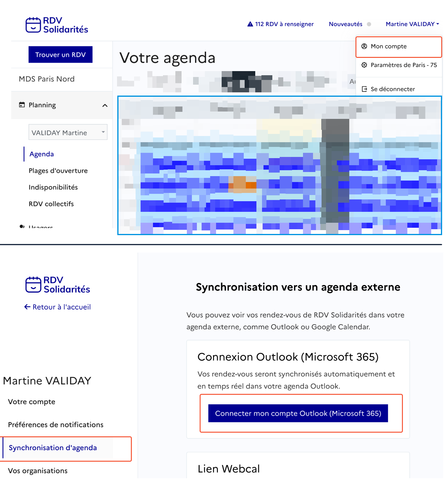
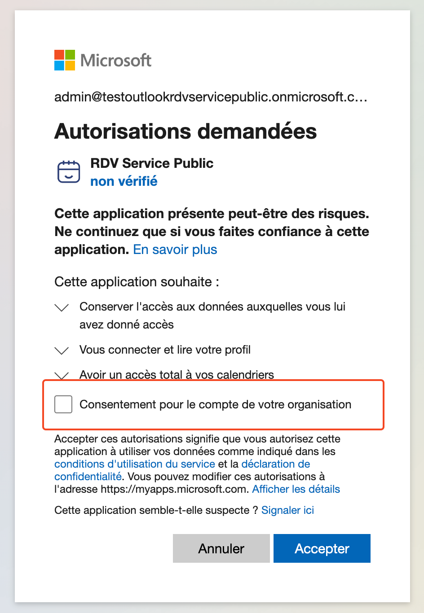
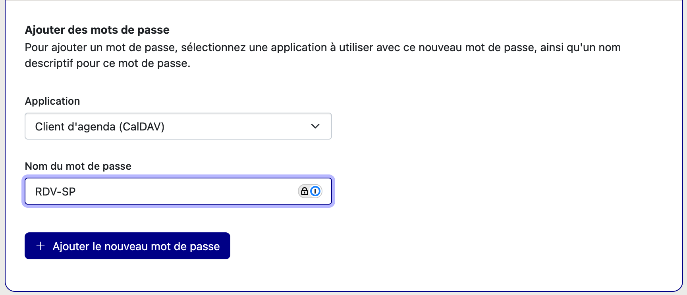
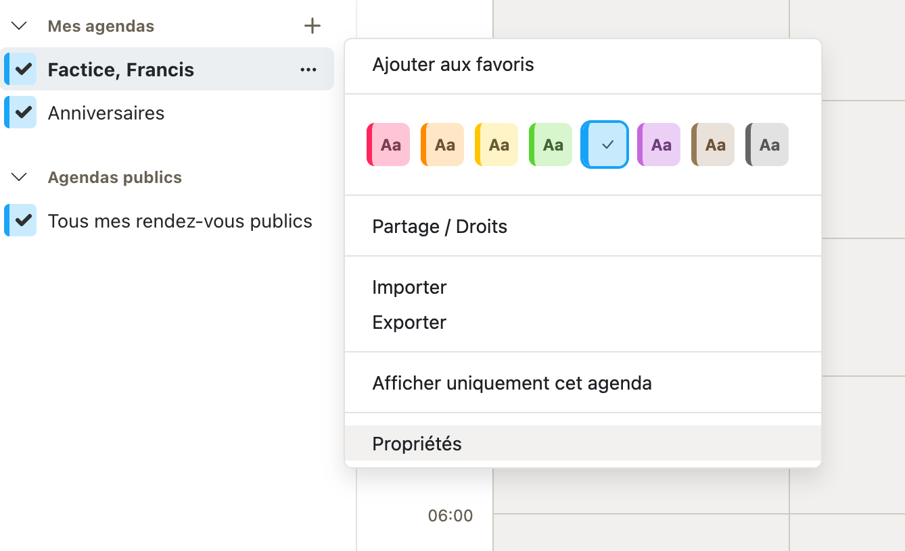
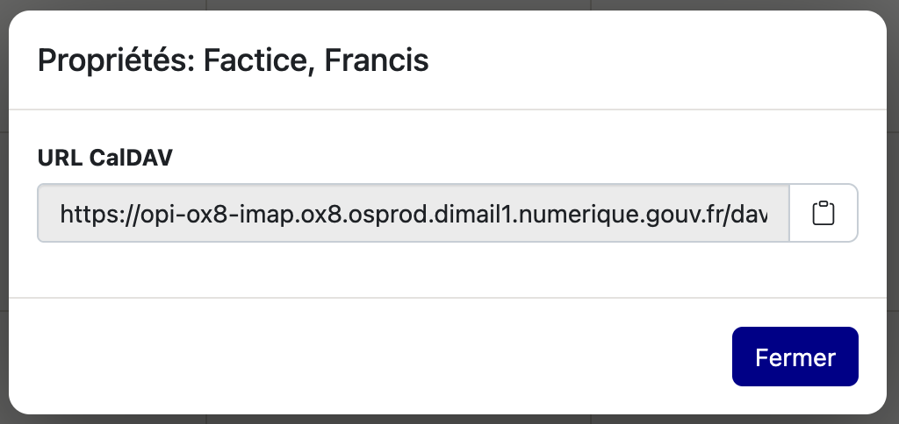
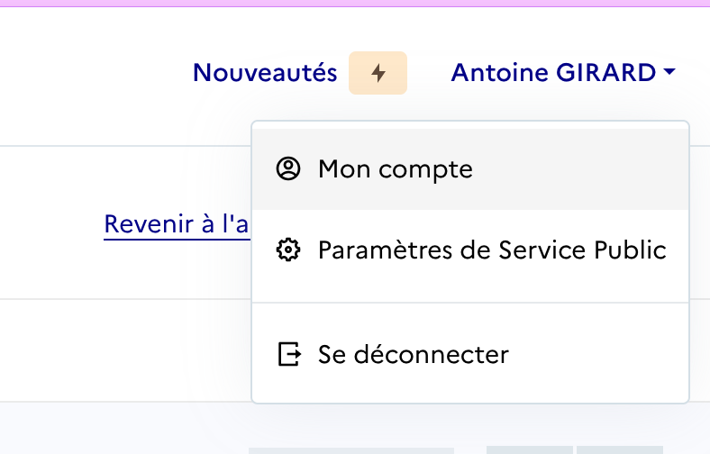
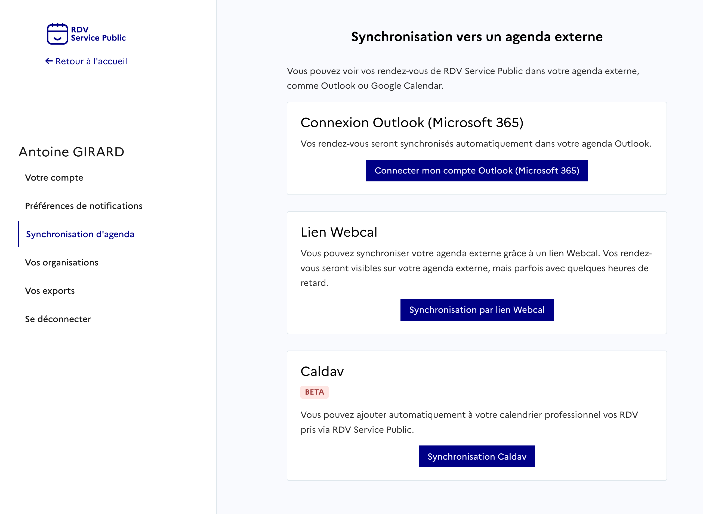
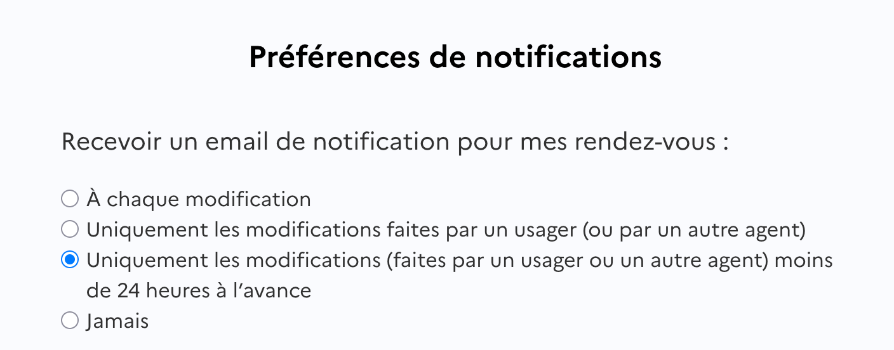

<!--dsfr-editor:source
[
  {
    "id": "ac2c11ae-8e67-4651-8ca8-726488544b15",
    "type": "heading",
    "props": {
      "backgroundColor": "default",
      "textColor": "default",
      "textAlignment": "left",
      "level": 2
    },
    "content": [
      {
        "type": "text",
        "text": "Les notifications agent",
        "styles": {}
      }
    ],
    "children": []
  },
  {
    "id": "fa71b028-f0e1-46b3-93f9-9a482c6848d2",
    "type": "dsfrAccordionSection",
    "props": {},
    "content": [
      {
        "type": "text",
        "text": "Comment recevoir des notifications d’alertes de rendez-vous ?",
        "styles": {}
      }
    ],
    "children": [
      {
        "id": "bcdfd506-76ac-4b40-9f4d-8771a7ec7af1",
        "type": "paragraph",
        "props": {
          "backgroundColor": "default",
          "textColor": "default",
          "textAlignment": "left"
        },
        "content": [
          {
            "type": "text",
            "text": "Cette fonctionnalité permet de recevoir des notifications par email lorsqu’un rendez-vous est ajouté, modifié ou annulé dans un agenda. Elle répond au besoin des agents souhaitant être alertés en cas de changement dans leur planning.",
            "styles": {}
          }
        ],
        "children": []
      },
      {
        "id": "a3a4d22b-28ee-4be7-a65b-7a03a7093d4c",
        "type": "paragraph",
        "props": {
          "backgroundColor": "default",
          "textColor": "default",
          "textAlignment": "left"
        },
        "content": [
          {
            "type": "text",
            "text": "Vous pouvez personnaliser vos préférences de notification dans l’onglet ",
            "styles": {}
          },
          {
            "type": "text",
            "text": "Mon Compte",
            "styles": {
              "bold": true,
              "italic": true
            }
          },
          {
            "type": "text",
            "text": ", accessible en cliquant sur votre prénom en haut à droite de votre calendrier.",
            "styles": {}
          }
        ],
        "children": []
      },
      {
        "id": "9d9aa72b-13b6-4c1c-a4fd-da2668dc3fe4",
        "type": "image",
        "props": {
          "textAlignment": "left",
          "backgroundColor": "default",
          "name": "",
          "url": "./assets/image-1-1.png",
          "caption": "",
          "showPreview": true
        },
        "children": []
      },
      {
        "id": "2614d72e-b9ab-42e7-b237-cb69db8a379f",
        "type": "paragraph",
        "props": {
          "backgroundColor": "default",
          "textColor": "default",
          "textAlignment": "left"
        },
        "content": [
          {
            "type": "text",
            "text": "Chaque email contient une pièce jointe au format ",
            "styles": {}
          },
          {
            "type": "text",
            "text": "ICS",
            "styles": {
              "bold": true
            }
          },
          {
            "type": "text",
            "text": ", compatible avec la plupart des logiciels de calendrier. Votre calendrier externe reconnaîtra automatiquement ces mises à jour, bien que certains logiciels demandent une validation manuelle des modifications.",
            "styles": {}
          }
        ],
        "children": []
      }
    ]
  },
  {
    "id": "373a4838-0bc7-41a9-a11d-4306ab352cd8",
    "type": "dsfrAccordionSection",
    "props": {},
    "content": [
      {
        "type": "text",
        "text": "Je ne reçois pas les emails de RDV·SP. Comment y remédier ?",
        "styles": {}
      }
    ],
    "children": [
      {
        "id": "6a0d7fe6-8176-4ef4-a738-4cdbd5b6cd19",
        "type": "heading",
        "props": {
          "backgroundColor": "default",
          "textColor": "default",
          "textAlignment": "left",
          "level": 3
        },
        "content": [
          {
            "type": "text",
            "text": "Votre client mail classe nos emails en spam",
            "styles": {}
          }
        ],
        "children": []
      },
      {
        "id": "234cdc51-497b-49f5-a437-e473ccda998a",
        "type": "paragraph",
        "props": {
          "backgroundColor": "default",
          "textColor": "default",
          "textAlignment": "left"
        },
        "content": [
          {
            "type": "text",
            "text": "Les emails provenant de l’adresse RDV Service Public peuvent être classifiés à tort comme du spam par votre client mail (Outlook, Thunderbird, etc).",
            "styles": {}
          }
        ],
        "children": []
      },
      {
        "id": "afe962e8-3f41-4911-b272-4b433451127f",
        "type": "paragraph",
        "props": {
          "backgroundColor": "default",
          "textColor": "default",
          "textAlignment": "left"
        },
        "content": [
          {
            "type": "text",
            "text": "Solution",
            "styles": {
              "bold": true
            }
          },
          {
            "type": "text",
            "text": " : Dans votre boîte e-mail, vérifiez les dossiers « spam » ou « indésirables ». En complément, vous pouvez signaler l’adresse RDV Service Public comme n’étant pas un spam. De cette façon, vous recevrez les e-mails RDV Services Publics directement",
            "styles": {}
          }
        ],
        "children": []
      },
      {
        "id": "9d471769-faf7-4e98-bd9a-a1474e84841d",
        "type": "heading",
        "props": {
          "backgroundColor": "default",
          "textColor": "default",
          "textAlignment": "left",
          "level": 3
        },
        "content": [
          {
            "type": "text",
            "text": "Un autre logiciel de filtrage d’email classe nos emails en spam",
            "styles": {}
          }
        ],
        "children": []
      },
      {
        "id": "03c0af1d-9ff2-4cb3-a4f3-4bef9d655b7d",
        "type": "paragraph",
        "props": {
          "backgroundColor": "default",
          "textColor": "default",
          "textAlignment": "left"
        },
        "content": [
          {
            "type": "text",
            "text": "Le domaine RDV Service Public peut être bloqué par un outil de protection des e-mails, tel que ",
            "styles": {}
          },
          {
            "type": "text",
            "text": "MailinBlack",
            "styles": {
              "bold": true
            }
          },
          {
            "type": "text",
            "text": ".",
            "styles": {}
          }
        ],
        "children": []
      },
      {
        "id": "d4358a86-03bd-493c-94ba-af05d3e0f98c",
        "type": "paragraph",
        "props": {
          "backgroundColor": "default",
          "textColor": "default",
          "textAlignment": "left"
        },
        "content": [
          {
            "type": "text",
            "text": "Solution",
            "styles": {
              "bold": true
            }
          },
          {
            "type": "text",
            "text": " : Autorisez notre adresse e-mail en suivant ces étapes :",
            "styles": {}
          }
        ],
        "children": []
      },
      {
        "id": "d5835fe8-de6c-4435-844c-2bb30ecbe872",
        "type": "bulletListItem",
        "props": {
          "backgroundColor": "default",
          "textColor": "default",
          "textAlignment": "left"
        },
        "content": [
          {
            "type": "text",
            "text": "Connectez-vous à votre interface MailinBlack.",
            "styles": {}
          }
        ],
        "children": []
      },
      {
        "id": "fd146998-9417-4934-ab0d-f3dc0bbf183e",
        "type": "bulletListItem",
        "props": {
          "backgroundColor": "default",
          "textColor": "default",
          "textAlignment": "left"
        },
        "content": [
          {
            "type": "text",
            "text": "Sur la page principale, sélectionnez l’onglet « Newsletter »",
            "styles": {}
          }
        ],
        "children": []
      },
      {
        "id": "0f890974-b51f-4c63-bdc2-4f14682fe48a",
        "type": "bulletListItem",
        "props": {
          "backgroundColor": "default",
          "textColor": "default",
          "textAlignment": "left"
        },
        "content": [
          {
            "type": "text",
            "text": "Cliquez sur l’icône de droite et autorisez les adresses du domaine @rdv-solidarites.fr / @rdv-service-public.fr / @rdv-aide-numerique.fr",
            "styles": {}
          }
        ],
        "children": []
      },
      {
        "id": "8bd89ee9-c5b0-4df2-b1fd-2369b0b75eb9",
        "type": "bulletListItem",
        "props": {
          "backgroundColor": "default",
          "textColor": "default",
          "textAlignment": "left"
        },
        "content": [
          {
            "type": "text",
            "text": "Confirmez en validant le message \"Autoriser les messages de ces domaines\".",
            "styles": {}
          }
        ],
        "children": []
      },
      {
        "id": "f9887d91-abe1-44bf-9729-9ea05b5fb91c",
        "type": "paragraph",
        "props": {
          "backgroundColor": "default",
          "textColor": "default",
          "textAlignment": "left"
        },
        "content": [
          {
            "type": "text",
            "text": "Cette autorisation est appliquée à titre individuel et vos collègues auront potentiellement le même problème. Vous pouvez suggérer au responsable technique de votre administration de consulter cette page pour corriger ce problème pour tout le monde.",
            "styles": {}
          }
        ],
        "children": []
      },
      {
        "id": "8d3a8d7e-f666-4049-8a90-a3bc5b8cb411",
        "type": "heading",
        "props": {
          "backgroundColor": "default",
          "textColor": "default",
          "textAlignment": "left",
          "level": 3
        },
        "content": [
          {
            "type": "text",
            "text": "Un problème temporaire sur les serveurs de RDV Service Public empêche l’envoi des emails",
            "styles": {}
          }
        ],
        "children": []
      },
      {
        "id": "b23de5bc-26a1-49ad-a9be-a425509cbdbf",
        "type": "paragraph",
        "props": {
          "backgroundColor": "default",
          "textColor": "default",
          "textAlignment": "left"
        },
        "content": [
          {
            "type": "text",
            "text": "Il arrive que les serveurs de RDV Service Public rencontrent des ralentissements ou soient temporairement inaccessibles.",
            "styles": {}
          }
        ],
        "children": []
      },
      {
        "id": "1c359342-5ab0-4c98-869d-adef004f5a66",
        "type": "paragraph",
        "props": {
          "backgroundColor": "default",
          "textColor": "default",
          "textAlignment": "left"
        },
        "content": [
          {
            "type": "text",
            "text": "Solution",
            "styles": {
              "bold": true
            }
          },
          {
            "type": "text",
            "text": " :  Vous pouvez suivre en temps réel l'évolution du dysfonctionnement sur notre ",
            "styles": {}
          },
          {
            "type": "link",
            "href": "https://rdv-service-public.instatus.com",
            "content": [
              {
                "type": "text",
                "text": "page de statut",
                "styles": {}
              }
            ]
          },
          {
            "type": "text",
            "text": ".",
            "styles": {}
          }
        ],
        "children": []
      },
      {
        "id": "f298246f-9bc2-4ad9-b2fa-18b838ad2f34",
        "type": "heading",
        "props": {
          "backgroundColor": "default",
          "textColor": "default",
          "textAlignment": "left",
          "level": 3
        },
        "content": [
          {
            "type": "text",
            "text": "Un problème temporaire sur les serveurs de votre système informatique (SI) empêche la réception des emails",
            "styles": {}
          }
        ],
        "children": []
      },
      {
        "id": "82b89dff-d504-4790-bccb-3f6401666d8a",
        "type": "paragraph",
        "props": {
          "backgroundColor": "default",
          "textColor": "default",
          "textAlignment": "left"
        },
        "content": [
          {
            "type": "text",
            "text": "Il peut arriver que le système d’information ou le réseau interne sur lequel vous naviguez rencontre des ralentissements ou soit inacessible temporairement.",
            "styles": {}
          }
        ],
        "children": []
      },
      {
        "id": "2e4fd23a-7515-4a99-9765-74fca1dee867",
        "type": "paragraph",
        "props": {
          "backgroundColor": "default",
          "textColor": "default",
          "textAlignment": "left"
        },
        "content": [
          {
            "type": "text",
            "text": "Solution",
            "styles": {
              "bold": true
            }
          },
          {
            "type": "text",
            "text": " :",
            "styles": {}
          }
        ],
        "children": []
      },
      {
        "id": "f89e224b-6650-47b9-af0b-964d52f5eae1",
        "type": "bulletListItem",
        "props": {
          "backgroundColor": "default",
          "textColor": "default",
          "textAlignment": "left"
        },
        "content": [
          {
            "type": "text",
            "text": "Contactez le service informatique",
            "styles": {}
          }
        ],
        "children": []
      },
      {
        "id": "cad146dd-f9b1-471a-b975-aa7f89c2cd43",
        "type": "bulletListItem",
        "props": {
          "backgroundColor": "default",
          "textColor": "default",
          "textAlignment": "left"
        },
        "content": [
          {
            "type": "text",
            "text": "Vous pouvez effectuer les tests suivants pour comprendre si le problème vient du SI de votre service ou de RDV Service Public :",
            "styles": {}
          }
        ],
        "children": [
          {
            "id": "a38aa013-ba8a-485a-8fa1-b46c14f92c1e",
            "type": "bulletListItem",
            "props": {
              "backgroundColor": "default",
              "textColor": "default",
              "textAlignment": "left"
            },
            "content": [
              {
                "type": "text",
                "text": "Demander à un collègue de vous envoyer un e-mail",
                "styles": {}
              }
            ],
            "children": []
          },
          {
            "id": "a899d3f7-b872-45ff-9d96-7a7c0c3a29d9",
            "type": "bulletListItem",
            "props": {
              "backgroundColor": "default",
              "textColor": "default",
              "textAlignment": "left"
            },
            "content": [
              {
                "type": "text",
                "text": "Envoyez-vous un e-mail depuis une adresse personnelle (Gmail, Outlook, etc.)",
                "styles": {}
              }
            ],
            "children": []
          }
        ]
      },
      {
        "id": "5d366063-0dfc-436c-ab39-165031b798b8",
        "type": "paragraph",
        "props": {
          "backgroundColor": "default",
          "textColor": "default",
          "textAlignment": "left"
        },
        "content": [
          {
            "type": "text",
            "text": "Si le problème est lié au SI de votre service, nous ne pourrons malheureusement pas intervenir directement.",
            "styles": {}
          }
        ],
        "children": []
      },
      {
        "id": "5d667866-170f-4a0f-870f-cb23bb746e38",
        "type": "heading",
        "props": {
          "backgroundColor": "default",
          "textColor": "default",
          "textAlignment": "left",
          "level": 3
        },
        "content": [
          {
            "type": "text",
            "text": "Votre adresse a été bloquée par notre fournisseur d’envoi d’e-mails",
            "styles": {}
          }
        ],
        "children": []
      },
      {
        "id": "b4042c78-542c-45af-85e1-5db61d559cf5",
        "type": "paragraph",
        "props": {
          "backgroundColor": "default",
          "textColor": "default",
          "textAlignment": "left"
        },
        "content": [
          {
            "type": "text",
            "text": "Votre adresse e-mail peut être bloquée par notre fournisseur d’envoi.",
            "styles": {}
          }
        ],
        "children": []
      },
      {
        "id": "5442d1bc-a0e0-4f05-82e5-867bb817e926",
        "type": "paragraph",
        "props": {
          "backgroundColor": "default",
          "textColor": "default",
          "textAlignment": "left"
        },
        "content": [
          {
            "type": "text",
            "text": "Cette situation peut se produire dans deux cas :",
            "styles": {}
          }
        ],
        "children": []
      },
      {
        "id": "99542236-1d38-4394-aee3-db358aef177e",
        "type": "bulletListItem",
        "props": {
          "backgroundColor": "default",
          "textColor": "default",
          "textAlignment": "left"
        },
        "content": [
          {
            "type": "text",
            "text": "vous avez cliqué sur les liens de nos e-mails qui vous permettent de vous désabonner",
            "styles": {}
          }
        ],
        "children": []
      },
      {
        "id": "a3284e66-f465-4c0f-9690-f6f55d1877bb",
        "type": "bulletListItem",
        "props": {
          "backgroundColor": "default",
          "textColor": "default",
          "textAlignment": "left"
        },
        "content": [
          {
            "type": "text",
            "text": "le serveur mail de votre SI a refusé la réception des emails envoyés par RDV Service Public car il les considérant comme du spam. Cela se produit suite à une classification manuelle d’un de nos mails comme du spam par un agent au sein de votre SI, ou par une classification automatique.",
            "styles": {}
          }
        ],
        "children": []
      },
      {
        "id": "7162517e-674a-4457-8c94-a211053e069e",
        "type": "paragraph",
        "props": {
          "backgroundColor": "default",
          "textColor": "default",
          "textAlignment": "left"
        },
        "content": [
          {
            "type": "text",
            "text": "Solution",
            "styles": {
              "bold": true
            }
          },
          {
            "type": "text",
            "text": " :  Envoyez-nous un e-mail à ",
            "styles": {}
          },
          {
            "type": "link",
            "href": "mailto:support@rdv-service-public.fr",
            "content": [
              {
                "type": "text",
                "text": "support@rdv-service-public.fr",
                "styles": {}
              }
            ]
          }
        ],
        "children": []
      },
      {
        "id": "dab8c281-8ac7-4af2-9181-3c17c45acd5b",
        "type": "paragraph",
        "props": {
          "backgroundColor": "default",
          "textColor": "default",
          "textAlignment": "left"
        },
        "content": [
          {
            "type": "text",
            "text": "Si vous vous retrouvez dans cette situation, il est probable que plusieurs de vos collègues soient dans la même situation. Vous pouvez suggérer aux responsables techniques de votre SI de consulter le sinformations ci-dessous pour corriger le problème durablement et à l’échelle de tout votre service :",
            "styles": {}
          }
        ],
        "children": []
      },
      {
        "id": "cb47ddff-b89d-488c-a7e5-ab1596534c6a",
        "type": "heading",
        "props": {
          "backgroundColor": "default",
          "textColor": "default",
          "textAlignment": "left",
          "level": 3
        },
        "content": [
          {
            "type": "text",
            "text": "Les emails de RDV Service Public ne sont pas reçus par les agents",
            "styles": {}
          }
        ],
        "children": []
      },
      {
        "id": "2b064f81-849f-46f5-ae48-bd58ccfae30d",
        "type": "paragraph",
        "props": {
          "backgroundColor": "default",
          "textColor": "default",
          "textAlignment": "left"
        },
        "content": [
          {
            "type": "text",
            "text": "Si un des agents de votre service rencontre ce genre de problèmes de réception d’emails, il est probable que d’autres le rencontrent à leur tour. En tant que responsable technique vous avez la possibilité de configurer le SI pour corriger ces problèmes pour tous les agents.",
            "styles": {}
          }
        ],
        "children": []
      },
      {
        "id": "1dc9b69d-cc0b-4004-88f4-91c86020915c",
        "type": "paragraph",
        "props": {
          "backgroundColor": "default",
          "textColor": "default",
          "textAlignment": "left"
        },
        "content": [
          {
            "type": "text",
            "text": "Le but est de faire en sorte que les serveurs mails du SI ne refusent jamais les emails envoyés par RDV Service Public. L’idée est de mettre dans des listes d’acceptations tous les emails émis par RDV Service Public (on parle aussi de ",
            "styles": {}
          },
          {
            "type": "text",
            "text": "whitelists",
            "styles": {
              "italic": true
            }
          },
          {
            "type": "text",
            "text": ").",
            "styles": {}
          }
        ],
        "children": []
      },
      {
        "id": "ed9fbde0-c078-457e-bb45-c3a916f64f0b",
        "type": "paragraph",
        "props": {
          "backgroundColor": "default",
          "textColor": "default",
          "textAlignment": "left"
        },
        "content": [
          {
            "type": "text",
            "text": "Il faut le cas échéant faire cette configuration à deux niveaux :",
            "styles": {}
          }
        ],
        "children": []
      },
      {
        "id": "2234dd31-9c46-43d2-92de-f39cf96279f2",
        "type": "bulletListItem",
        "props": {
          "backgroundColor": "default",
          "textColor": "default",
          "textAlignment": "left"
        },
        "content": [
          {
            "type": "text",
            "text": "le système de détection de spam natif du serveur mail de votre SI",
            "styles": {}
          }
        ],
        "children": []
      },
      {
        "id": "88b07365-6fbd-4984-a2b9-74a93542c11b",
        "type": "bulletListItem",
        "props": {
          "backgroundColor": "default",
          "textColor": "default",
          "textAlignment": "left"
        },
        "content": [
          {
            "type": "text",
            "text": "le(s) logiciel(s) de filtrage d’email branchés sur votre serveur comme MailInBlack",
            "styles": {}
          }
        ],
        "children": []
      },
      {
        "id": "321d0a87-cafe-4fb0-91d2-93f6d3792ad7",
        "type": "paragraph",
        "props": {
          "backgroundColor": "default",
          "textColor": "default",
          "textAlignment": "left"
        },
        "content": [
          {
            "type": "text",
            "text": "Le plus robuste est d’ajouter dans les listes d’acceptations l’adresse IP suivante,  nous envoyons tous nos emails depuis cette adresse :",
            "styles": {}
          }
        ],
        "children": []
      },
      {
        "id": "c96bb4c0-1f4a-4105-b08b-7b6335333d40",
        "type": "codeBlock",
        "props": {
          "language": "text"
        },
        "content": [
          {
            "type": "text",
            "text": "212.146.241.127",
            "styles": {}
          }
        ],
        "children": []
      },
      {
        "id": "583ed503-ecf7-441e-80ee-a5a19608e5af",
        "type": "paragraph",
        "props": {
          "backgroundColor": "default",
          "textColor": "default",
          "textAlignment": "left"
        },
        "content": [
          {
            "type": "text",
            "text": "Si vous ne trouvez pas l’option pour ajouter une IP dans une liste d’acceptation, vous pouvez en repli ajouter les domaines émetteurs suivants comme domaines de confiance  :",
            "styles": {}
          }
        ],
        "children": []
      },
      {
        "id": "c7bb4d17-2fdd-4376-a1cc-dadae7bca038",
        "type": "codeBlock",
        "props": {
          "language": "text"
        },
        "content": [
          {
            "type": "text",
            "text": "reply.demo.rdv-solidarites.fr\nreply.staging.rdv-service-public.fr\nreply.rdv-service-public.fr\nreply.demo.rdv-aide-numerique.fr\nreply.demo.rdv-service-public.fr\nreply.rdv-aide-numerique.fr\nrdv-aide-numerique.fr\nrdv-service-public.fr\nreply.rdv-solidarites.fr\nemail.rdv-solidarites.fr\nrdv-solidarites.fr",
            "styles": {}
          }
        ],
        "children": []
      },
      {
        "id": "cc8c1831-c5b9-492d-8409-7b78d648811f",
        "type": "paragraph",
        "props": {
          "backgroundColor": "default",
          "textColor": "default",
          "textAlignment": "left"
        },
        "content": [
          {
            "type": "text",
            "text": "N’hésitez pas à nous contacter à support@rdv-service-public.fr pour que nous puissions vous aider à faire ces configurations.",
            "styles": {}
          }
        ],
        "children": []
      }
    ]
  },
  {
    "id": "81a409ef-f902-4a6f-86e7-6ce2f2e8faff",
    "type": "heading",
    "props": {
      "backgroundColor": "default",
      "textColor": "default",
      "textAlignment": "left",
      "level": 2
    },
    "content": [
      {
        "type": "text",
        "text": "Synchronisation calendrier",
        "styles": {}
      }
    ],
    "children": []
  },
  {
    "id": "84298519-4979-401f-abe7-ee2c782b49a1",
    "type": "dsfrAccordionSection",
    "props": {},
    "content": [
      {
        "type": "text",
        "text": "Synchronisation Outlook (Microsoft 365)",
        "styles": {}
      }
    ],
    "children": [
      {
        "id": "bf82713b-d7d3-4a2a-9d41-7cc0e3a173a8",
        "type": "heading",
        "props": {
          "backgroundColor": "default",
          "textColor": "default",
          "textAlignment": "left",
          "level": 4
        },
        "content": [
          {
            "type": "text",
            "text": "Distinction des versions d’Outlook",
            "styles": {}
          }
        ],
        "children": []
      },
      {
        "id": "72cb4f97-d128-4c34-83b2-75cc430cf86b",
        "type": "paragraph",
        "props": {
          "backgroundColor": "default",
          "textColor": "default",
          "textAlignment": "left"
        },
        "content": [
          {
            "type": "text",
            "text": "Il existe deux versions d’Outlook :",
            "styles": {}
          }
        ],
        "children": []
      },
      {
        "id": "2c675635-5146-4896-a052-827362e3fb09",
        "type": "numberedListItem",
        "props": {
          "backgroundColor": "default",
          "textColor": "default",
          "textAlignment": "left"
        },
        "content": [
          {
            "type": "text",
            "text": "Outlook hébergé à distance (Microsoft 365)",
            "styles": {}
          }
        ],
        "children": []
      },
      {
        "id": "72acc541-5b88-436e-9b72-107f4a768ecf",
        "type": "numberedListItem",
        "props": {
          "backgroundColor": "default",
          "textColor": "default",
          "textAlignment": "left"
        },
        "content": [
          {
            "type": "text",
            "text": "Outlook hébergé sur place par l’administration (Microsoft Exchange)",
            "styles": {}
          }
        ],
        "children": []
      },
      {
        "id": "4f41e8b6-83b8-46c6-b623-ecafd9791e86",
        "type": "paragraph",
        "props": {
          "backgroundColor": "default",
          "textColor": "default",
          "textAlignment": "left"
        },
        "content": [
          {
            "type": "text",
            "text": ":::warning\n ",
            "styles": {}
          },
          {
            "type": "text",
            "text": "Nous proposons une solution de synchronisation uniquement pour la première version : Outlook hébergé à distance (Microsoft 365)",
            "styles": {
              "bold": true
            }
          },
          {
            "type": "text",
            "text": ".\n :::",
            "styles": {}
          }
        ],
        "children": []
      },
      {
        "id": "6f1c48e7-0be2-461e-97c5-c272deed3081",
        "type": "paragraph",
        "props": {
          "backgroundColor": "default",
          "textColor": "default",
          "textAlignment": "left"
        },
        "content": [
          {
            "type": "text",
            "text": "Ce guide décrit cette solution. N’hésitez pas à nous contacter si vous avez besoin d’aide pour la mettre en place sur votre espace.",
            "styles": {}
          }
        ],
        "children": []
      },
      {
        "id": "3efe0806-5f84-4536-b113-baf894e4dfea",
        "type": "paragraph",
        "props": {
          "backgroundColor": "default",
          "textColor": "default",
          "textAlignment": "left"
        },
        "content": [
          {
            "type": "text",
            "text": "RDV Service Public ne propose pour l’instant pas de solution de synchronisation clé en main pour Outlook hébergé sur place. Certaines structures utilisant RDV Service Public et ce type d’Outlook ont mis en place des solutions via webhooks, qui nécessitent du développement en interne.",
            "styles": {}
          }
        ],
        "children": []
      },
      {
        "id": "322cfac2-e0cc-4b9f-b857-b59e076532a0",
        "type": "heading",
        "props": {
          "backgroundColor": "default",
          "textColor": "default",
          "textAlignment": "left",
          "level": 4
        },
        "content": [
          {
            "type": "text",
            "text": "Fonctionnement",
            "styles": {}
          }
        ],
        "children": []
      },
      {
        "id": "fe3bdc5b-2d9c-42aa-9ddc-08d711249d1c",
        "type": "paragraph",
        "props": {
          "backgroundColor": "default",
          "textColor": "default",
          "textAlignment": "left"
        },
        "content": [
          {
            "type": "text",
            "text": "Une application Microsoft Outlook 365 permet aux agents de synchroniser leur agenda RDV Service Public avec leur agenda Microsoft Outlook.",
            "styles": {}
          }
        ],
        "children": []
      },
      {
        "id": "fe19390a-b16a-4bb2-99a2-a9dd68aee20e",
        "type": "paragraph",
        "props": {
          "backgroundColor": "default",
          "textColor": "default",
          "textAlignment": "left"
        },
        "content": [
          {
            "type": "text",
            "text": "Cette application requiert les droits d’écriture sur les calendriers Outlook.",
            "styles": {}
          }
        ],
        "children": []
      },
      {
        "id": "4d3e8631-c9c9-496e-b18e-ee79117e4c6c",
        "type": "paragraph",
        "props": {
          "backgroundColor": "default",
          "textColor": "default",
          "textAlignment": "left"
        },
        "content": [
          {
            "type": "text",
            "text": "Elle utilise l’API de Microsoft pour créer et mettre à jour des événements correspondants aux RDV pris dans RDV Service Public.",
            "styles": {}
          }
        ],
        "children": []
      },
      {
        "id": "62749ab3-6254-49fc-8d57-2978204e441c",
        "type": "heading",
        "props": {
          "backgroundColor": "default",
          "textColor": "default",
          "textAlignment": "left",
          "level": 4
        },
        "content": [
          {
            "type": "text",
            "text": "Procédure à suivre",
            "styles": {}
          }
        ],
        "children": []
      },
      {
        "id": "49c79665-66de-4792-ad1b-ed404b33d01b",
        "type": "paragraph",
        "props": {
          "backgroundColor": "default",
          "textColor": "default",
          "textAlignment": "left"
        },
        "content": [
          {
            "type": "text",
            "text": "Pour que les agents puissent utiliser l’application Microsoft 365, un·e administrateur·ice du compte Outlook du département doit au préalable l’autoriser via un flux OAuth.",
            "styles": {}
          }
        ],
        "children": []
      },
      {
        "id": "641f4a65-c003-4a30-a94e-ff06436e8b2a",
        "type": "paragraph",
        "props": {
          "backgroundColor": "default",
          "textColor": "default",
          "textAlignment": "left"
        },
        "content": [
          {
            "type": "text",
            "text": ":::info\n Cette procédure doit être effectuée une seule fois pour tout un compte Microsoft 365\n :::",
            "styles": {}
          }
        ],
        "children": []
      },
      {
        "id": "75ae16fc-bf5a-44c5-947c-4aeb45663de7",
        "type": "paragraph",
        "props": {
          "backgroundColor": "default",
          "textColor": "default",
          "textAlignment": "left"
        },
        "content": [
          {
            "type": "text",
            "text": "Étape 1",
            "styles": {
              "bold": true
            }
          },
          {
            "type": "text",
            "text": " : L’administrateur·ice Outlook du département doit être invité à créer un compte sur RDV Service Public.",
            "styles": {}
          }
        ],
        "children": []
      },
      {
        "id": "4642a041-c6d0-4110-b3f3-6e3a2faa880f",
        "type": "paragraph",
        "props": {
          "backgroundColor": "default",
          "textColor": "default",
          "textAlignment": "left"
        },
        "content": [
          {
            "type": "text",
            "text": "Étape 2",
            "styles": {
              "bold": true
            }
          },
          {
            "type": "text",
            "text": " : Une fois connecté·e sur RDV Service Public, l’administrateur·ice doit cliquer sur son nom en haut à droite > Mon Compte > Synchronisation d’agenda > Connexion Outlook > Se connecter avec Microsoft",
            "styles": {}
          }
        ],
        "children": []
      },
      {
        "id": "b2f8adc9-a17b-4804-918f-2ef1f2b9fa99",
        "type": "image",
        "props": {
          "textAlignment": "left",
          "backgroundColor": "default",
          "name": "Chemin à suivre pour la connexion Outlook",
          "url": "./assets/connexion-outlook.png",
          "caption": "",
          "showPreview": true
        },
        "children": []
      },
      {
        "id": "59b7610b-25a0-4158-bd62-3ef04dbeab9f",
        "type": "paragraph",
        "props": {
          "backgroundColor": "default",
          "textColor": "default",
          "textAlignment": "left"
        },
        "content": [
          {
            "type": "text",
            "text": "Étape 3",
            "styles": {
              "bold": true
            }
          },
          {
            "type": "text",
            "text": " : L’administrateur·ice doit accepter les permissions. Il faut nécessairement cocher la case ",
            "styles": {}
          },
          {
            "type": "text",
            "text": "“Consentement pour le compte de votre organisation”",
            "styles": {
              "bold": true
            }
          },
          {
            "type": "text",
            "text": " pour que les agents non-administrateur·ices puissent à leur tour utiliser l’application.",
            "styles": {}
          }
        ],
        "children": []
      },
      {
        "id": "54b83797-bb65-4102-86e8-be2fb849a6d4",
        "type": "image",
        "props": {
          "textAlignment": "left",
          "backgroundColor": "default",
          "name": "",
          "url": "./assets/image-3.png",
          "caption": "L’application Oauth est actuellement indiquée comme “non vérifiée” car le processus de validation avec Microsoft n’a pas encore été finalisé.",
          "showPreview": true
        },
        "children": []
      },
      {
        "id": "72eeaf8c-0abe-45b4-ae5f-3e9b04b273a1",
        "type": "heading",
        "props": {
          "backgroundColor": "default",
          "textColor": "default",
          "textAlignment": "left",
          "level": 4
        },
        "content": [
          {
            "type": "text",
            "text": "Sécurité et code source",
            "styles": {}
          }
        ],
        "children": []
      },
      {
        "id": "336e0f6c-080b-4352-8659-793eb6bc8051",
        "type": "paragraph",
        "props": {
          "backgroundColor": "default",
          "textColor": "default",
          "textAlignment": "left"
        },
        "content": [
          {
            "type": "text",
            "text": "Pour des raisons de sécurité et de confidentialité, les événements créés dans Outlook ne contiennent pas d’informations personnelles sur les usagers. Ils contiennent uniquement un lien vers RDV Service Public. Ce lien permet à l’agent, une fois authentifié et autorisé, d’accéder aux détails du rendez-vous.",
            "styles": {}
          }
        ],
        "children": []
      },
      {
        "id": "3f927d7d-f2b4-4bc3-9c98-531209b606eb",
        "type": "paragraph",
        "props": {
          "backgroundColor": "default",
          "textColor": "default",
          "textAlignment": "left"
        },
        "content": [
          {
            "type": "text",
            "text": "Notre application Microsoft demande les permissions suivantes : ",
            "styles": {}
          },
          {
            "type": "text",
            "text": "Calendars.ReadWrite",
            "styles": {
              "code": true
            }
          },
          {
            "type": "text",
            "text": " et ",
            "styles": {}
          },
          {
            "type": "text",
            "text": "User.read",
            "styles": {
              "code": true
            }
          },
          {
            "type": "text",
            "text": " ",
            "styles": {}
          },
          {
            "type": "link",
            "href": "https://learn.microsoft.com/en-us/graph/permissions-reference#calendarsreadwrite",
            "content": [
              {
                "type": "text",
                "text": "voir la documentation Microsoft",
                "styles": {}
              }
            ]
          },
          {
            "type": "text",
            "text": ".",
            "styles": {}
          }
        ],
        "children": []
      },
      {
        "id": "a8c49080-6d1c-4d64-83f7-3b87c8030916",
        "type": "paragraph",
        "props": {
          "backgroundColor": "default",
          "textColor": "default",
          "textAlignment": "left"
        },
        "content": [
          {
            "type": "text",
            "text": "Le code source de RDV Service Public est accessible en open source sur ",
            "styles": {}
          },
          {
            "type": "link",
            "href": "https://github.com/betagouv/rdv-solidarites.fr",
            "content": [
              {
                "type": "text",
                "text": "GitHub (betagouv/rdv-solidarites.fr)",
                "styles": {}
              }
            ]
          },
          {
            "type": "text",
            "text": " :",
            "styles": {}
          }
        ],
        "children": []
      },
      {
        "id": "238a9e66-729e-4a9d-ad5a-af45d83dc134",
        "type": "bulletListItem",
        "props": {
          "backgroundColor": "default",
          "textColor": "default",
          "textAlignment": "left"
        },
        "content": [
          {
            "type": "text",
            "text": "Configuration du client OAuth",
            "styles": {
              "bold": true
            }
          },
          {
            "type": "text",
            "text": " : ",
            "styles": {}
          },
          {
            "type": "link",
            "href": "https://github.com/betagouv/rdv-service-public/blob/production/config/initializers/omniauth.rb#L6",
            "content": [
              {
                "type": "text",
                "text": "https://github.com/betagouv/rdv-service-public/blob/production/config/initializers/omniauth.rb#L6",
                "styles": {}
              }
            ]
          }
        ],
        "children": []
      },
      {
        "id": "c4031c66-3a83-423e-9b3d-910ff722d9fb",
        "type": "bulletListItem",
        "props": {
          "backgroundColor": "default",
          "textColor": "default",
          "textAlignment": "left"
        },
        "content": [
          {
            "type": "text",
            "text": "Code du client REST",
            "styles": {
              "bold": true
            }
          },
          {
            "type": "text",
            "text": " : ",
            "styles": {}
          },
          {
            "type": "link",
            "href": "https://github.com/betagouv/rdv-service-public/blob/production/app/models/outlook/api_client.rb",
            "content": [
              {
                "type": "text",
                "text": "https://github.com/betagouv/rdv-service-public/blob/production/app/models/outlook/api_client.rb",
                "styles": {}
              }
            ]
          }
        ],
        "children": []
      }
    ]
  },
  {
    "id": "6b89cf24-d929-4b1c-b38f-27b63a55ef58",
    "type": "dsfrAccordionSection",
    "props": {},
    "content": [
      {
        "type": "text",
        "text": "Synchronisation avec La Suite numérique (CalDAV)",
        "styles": {}
      }
    ],
    "children": [
      {
        "id": "8a98cd2d-caae-4eff-a36c-b4190f5cb2ec",
        "type": "paragraph",
        "props": {
          "backgroundColor": "default",
          "textColor": "default",
          "textAlignment": "left"
        },
        "content": [
          {
            "type": "text",
            "text": "La synchronisation CalDAV est actuellement en bêta de notre côté. Elle a été principalement testée avec le calendrier de La Suite numérique, mais reste compatible avec l’ensemble des agendas utilisant le standard CalDAV.\n \n Elle permet de synchroniser les événements de votre agenda RDV Service Public avec l’agenda de La Suite, dans les deux sens. Ainsi, un rendez-vous créé dans La Suite peut apparaître comme une indisponibilité dans RDV Service Public, empêchant les usagers de prendre rendez-vous sur ce créneau.",
            "styles": {}
          }
        ],
        "children": []
      },
      {
        "id": "82e66acf-4b49-414c-9ea7-e2e163789c88",
        "type": "heading",
        "props": {
          "backgroundColor": "default",
          "textColor": "default",
          "textAlignment": "left",
          "level": 4
        },
        "content": [
          {
            "type": "text",
            "text": "Étape 1 : création d’un mot de passe dédié à la synchronisation",
            "styles": {}
          }
        ],
        "children": []
      },
      {
        "id": "0868d18b-08be-485b-b743-b625f99e0dfe",
        "type": "paragraph",
        "props": {
          "backgroundColor": "default",
          "textColor": "default",
          "textAlignment": "left"
        },
        "content": [
          {
            "type": "text",
            "text": "Afin d’effectuer la synchronisation avec La Suite, il est nécessaire de créer un mot de passe dédié.",
            "styles": {}
          }
        ],
        "children": []
      },
      {
        "id": "a54e9001-eced-4895-8a5c-3f353cddbde2",
        "type": "paragraph",
        "props": {
          "backgroundColor": "default",
          "textColor": "default",
          "textAlignment": "left"
        },
        "content": [
          {
            "type": "text",
            "text": "Il faut d'abord se rendre dans les paramètres de Messagerie, qui est l’agenda de La Suite Numérique :",
            "styles": {}
          }
        ],
        "children": []
      },
      {
        "id": "d84f8d0e-c6ac-4f55-8bda-19ddcef8738d",
        "type": "codeBlock",
        "props": {
          "language": "text"
        },
        "content": [
          {
            "type": "text",
            "text": "Réglages → Sécurité → Mots de passe d’applications.",
            "styles": {}
          }
        ],
        "children": []
      },
      {
        "id": "d4703998-72e6-471a-a3a1-45d5feee9ef4",
        "type": "paragraph",
        "props": {
          "backgroundColor": "default",
          "textColor": "default",
          "textAlignment": "left"
        },
        "content": [
          {
            "type": "text",
            "text": "Dans la section ",
            "styles": {}
          },
          {
            "type": "text",
            "text": "« Ajouter des mots de passe »",
            "styles": {
              "italic": true
            }
          },
          {
            "type": "text",
            "text": " sélectionnez ",
            "styles": {}
          },
          {
            "type": "text",
            "text": "« Client d’agenda (CalDAV) »",
            "styles": {
              "italic": true
            }
          },
          {
            "type": "text",
            "text": " puis donnez un nom de votre choix au mot de passe.",
            "styles": {}
          }
        ],
        "children": []
      },
      {
        "id": "f253e848-8fa7-47a1-abe8-1d6121372b7c",
        "type": "image",
        "props": {
          "textAlignment": "left",
          "backgroundColor": "default",
          "name": "",
          "url": "./assets/520aed14-b71a-42ac-acea-81f792b90030.png",
          "caption": "",
          "showPreview": true
        },
        "children": []
      },
      {
        "id": "28bb9d2c-489e-45aa-95b4-ec866717f3b5",
        "type": "paragraph",
        "props": {
          "backgroundColor": "default",
          "textColor": "default",
          "textAlignment": "left"
        },
        "content": [
          {
            "type": "text",
            "text": "Conservez le mot de passe généré.",
            "styles": {}
          }
        ],
        "children": []
      },
      {
        "id": "e4d9ea6d-fb8e-4fff-bd7b-3032faf8ce8c",
        "type": "paragraph",
        "props": {
          "backgroundColor": "default",
          "textColor": "default",
          "textAlignment": "left"
        },
        "content": [
          {
            "type": "text",
            "text": ":::info\n Si vous avez perdu le mot de passe généré, supprimez le dans Mots de passe existants et recréez en un nouveau.\n :::",
            "styles": {}
          }
        ],
        "children": []
      },
      {
        "id": "5bbc00f9-d188-4e09-a617-869a5da7e5b2",
        "type": "heading",
        "props": {
          "backgroundColor": "default",
          "textColor": "default",
          "textAlignment": "left",
          "level": 4
        },
        "content": [
          {
            "type": "text",
            "text": "Étape 2 : récupération du lien du calendrier à synchroniser",
            "styles": {}
          }
        ],
        "children": []
      },
      {
        "id": "87165bb2-0a24-470b-bbac-bdeb569f0731",
        "type": "paragraph",
        "props": {
          "backgroundColor": "default",
          "textColor": "default",
          "textAlignment": "left"
        },
        "content": [
          {
            "type": "text",
            "text": "Allez dans les propriétés de votre calendrier",
            "styles": {}
          }
        ],
        "children": []
      },
      {
        "id": "d9d7d821-0cf9-4588-a37b-2563ddf8c3de",
        "type": "image",
        "props": {
          "textAlignment": "left",
          "backgroundColor": "default",
          "name": "",
          "url": "./assets/29c6f23b-468e-4ac7-b73c-d157649a02c0.png",
          "caption": "",
          "showPreview": true
        },
        "children": []
      },
      {
        "id": "ece8d7c3-c5e9-4988-b266-d58b53f4b0c2",
        "type": "paragraph",
        "props": {
          "backgroundColor": "default",
          "textColor": "default",
          "textAlignment": "left"
        },
        "content": [
          {
            "type": "text",
            "text": "Puis copiez l’URL CalDAV",
            "styles": {}
          }
        ],
        "children": []
      },
      {
        "id": "8a2dff9e-0576-4863-9a41-8a0d8771c107",
        "type": "image",
        "props": {
          "textAlignment": "left",
          "backgroundColor": "default",
          "name": "",
          "url": "./assets/8f91b34d-2c06-40e1-b51a-42f2c5909445.png",
          "caption": "",
          "showPreview": true
        },
        "children": []
      },
      {
        "id": "ea4b2199-1b8a-46a0-bac7-b401c7fa9889",
        "type": "heading",
        "props": {
          "backgroundColor": "default",
          "textColor": "default",
          "textAlignment": "left",
          "level": 4
        },
        "content": [
          {
            "type": "text",
            "text": "Étape 3 : configuration de la synchronisation dans RDV Service Public",
            "styles": {}
          }
        ],
        "children": []
      },
      {
        "id": "92a2b42e-d49e-49ca-9a0e-e6a35100b41a",
        "type": "paragraph",
        "props": {
          "backgroundColor": "default",
          "textColor": "default",
          "textAlignment": "left"
        },
        "content": [
          {
            "type": "text",
            "text": "Sur RDV Service Public, cliquez sur votre nom en haut à droite, ouvrez « ",
            "styles": {}
          },
          {
            "type": "text",
            "text": "Mon compte",
            "styles": {
              "italic": true
            }
          },
          {
            "type": "text",
            "text": " », puis sélectionnez « ",
            "styles": {}
          },
          {
            "type": "text",
            "text": "Synchronisation d’agenda",
            "styles": {
              "italic": true
            }
          },
          {
            "type": "text",
            "text": " ».",
            "styles": {}
          }
        ],
        "children": []
      },
      {
        "id": "0701c141-58eb-410a-8cda-fdc45cfea401",
        "type": "image",
        "props": {
          "textAlignment": "left",
          "backgroundColor": "default",
          "name": "",
          "url": "./assets/762bb42a-264f-4a17-a3c6-58633b9b2fba.png",
          "caption": "",
          "showPreview": true
        },
        "children": []
      },
      {
        "id": "ed250cfb-029a-47e5-9a99-9e4b806dc6e2",
        "type": "image",
        "props": {
          "textAlignment": "left",
          "backgroundColor": "default",
          "name": "",
          "url": "./assets/52ac213d-0356-458b-8507-a0c64301667c-1.png",
          "caption": "",
          "showPreview": true
        },
        "children": []
      },
      {
        "id": "5eeb39e8-c3b8-4fca-b645-b78d079f2a65",
        "type": "paragraph",
        "props": {
          "backgroundColor": "default",
          "textColor": "default",
          "textAlignment": "left"
        },
        "content": [
          {
            "type": "text",
            "text": "Cliquez sur « ",
            "styles": {}
          },
          {
            "type": "text",
            "text": "CalDAV",
            "styles": {
              "italic": true
            }
          },
          {
            "type": "text",
            "text": " ».",
            "styles": {}
          }
        ],
        "children": []
      },
      {
        "id": "7307aa65-ede3-4f18-9f74-9e4fe56500ef",
        "type": "paragraph",
        "props": {
          "backgroundColor": "default",
          "textColor": "default",
          "textAlignment": "left"
        },
        "content": [
          {
            "type": "text",
            "text": ":::info\n 💡Si vous ne voyez pas le menu ci-après, rendez-vous directement sur cette page : ",
            "styles": {}
          },
          {
            "type": "link",
            "href": "https://rdv.anct.gouv.fr/agents/calendar_sync/caldav_sync",
            "content": [
              {
                "type": "text",
                "text": "https://rdv.anct.gouv.fr/agents/calendar_sync/caldav_sync\n",
                "styles": {}
              }
            ]
          },
          {
            "type": "text",
            "text": " :::",
            "styles": {}
          }
        ],
        "children": []
      },
      {
        "id": "d43052d6-0cd1-4357-8264-69977e52ccbc",
        "type": "paragraph",
        "props": {
          "backgroundColor": "default",
          "textColor": "default",
          "textAlignment": "left"
        },
        "content": [
          {
            "type": "text",
            "text": "Dans le formulaire qui s’affiche, renseignez les informations suivantes :",
            "styles": {}
          }
        ],
        "children": []
      },
      {
        "id": "71f7121d-69b0-43ba-b8c0-41bf2d3a0c0a",
        "type": "bulletListItem",
        "props": {
          "backgroundColor": "default",
          "textColor": "default",
          "textAlignment": "left"
        },
        "content": [
          {
            "type": "text",
            "text": "Nom d’utilisateur",
            "styles": {
              "bold": true
            }
          },
          {
            "type": "text",
            "text": " : votre adresse email utilisée pour la connexion à votre compte de La Suite.",
            "styles": {}
          }
        ],
        "children": []
      },
      {
        "id": "4f75d5ea-e2b3-47d6-95a3-d1833f5e230e",
        "type": "bulletListItem",
        "props": {
          "backgroundColor": "default",
          "textColor": "default",
          "textAlignment": "left"
        },
        "content": [
          {
            "type": "text",
            "text": "Mot de passe",
            "styles": {
              "bold": true
            }
          },
          {
            "type": "text",
            "text": " : le mot de passe généré dans l'étape 1.",
            "styles": {}
          }
        ],
        "children": []
      },
      {
        "id": "7014ba53-da1e-42f6-9d26-1be901e4d3fc",
        "type": "bulletListItem",
        "props": {
          "backgroundColor": "default",
          "textColor": "default",
          "textAlignment": "left"
        },
        "content": [
          {
            "type": "text",
            "text": "URL de l’agenda CalDAV",
            "styles": {
              "bold": true
            }
          },
          {
            "type": "text",
            "text": " : l’URL copiée à l’étape 2.",
            "styles": {}
          }
        ],
        "children": []
      },
      {
        "id": "76e2611b-132f-41f3-bafa-9110789b8547",
        "type": "paragraph",
        "props": {
          "backgroundColor": "default",
          "textColor": "default",
          "textAlignment": "left"
        },
        "content": [
          {
            "type": "text",
            "text": "Si vous avez saisi les bonnes informations, tous vos rendez-vous à partir de la date du jour seront automatiquement envoyé dans le calendrier choisi.",
            "styles": {}
          }
        ],
        "children": []
      }
    ]
  },
  {
    "id": "9736ef12-a062-4430-beb1-76b4945a4ec0",
    "type": "dsfrAccordionSection",
    "props": {},
    "content": [
      {
        "type": "text",
        "text": "Comment synchroniser les rendez-vous avec mon agenda ?",
        "styles": {}
      }
    ],
    "children": [
      {
        "id": "ccd8f9d6-54dd-4bff-aa43-91746ff0738d",
        "type": "paragraph",
        "props": {
          "backgroundColor": "default",
          "textColor": "default",
          "textAlignment": "left"
        },
        "content": [
          {
            "type": "text",
            "text": "Cette fonctionnalité permet d'envoyer les informations des rendez-vous planifié dans un agenda extérieur à RDV Service Public. Elle répond au besoin de faire afficher les rendez-vous planifié dans un agenda du quotidien, souvent utilisé dans les administrations pour gérer leur quotidien métier en dehors des rendez-vous (réunion d'équipe etc ...)",
            "styles": {}
          }
        ],
        "children": []
      },
      {
        "id": "fecf0c2c-9468-402a-a89b-9da800139675",
        "type": "heading",
        "props": {
          "backgroundColor": "default",
          "textColor": "default",
          "textAlignment": "left",
          "level": 4
        },
        "content": [
          {
            "type": "text",
            "text": "Notes générales",
            "styles": {}
          }
        ],
        "children": []
      },
      {
        "id": "215cb7ca-9345-4528-9dba-271e7d174f47",
        "type": "paragraph",
        "props": {
          "backgroundColor": "default",
          "textColor": "default",
          "textAlignment": "left"
        },
        "content": [
          {
            "type": "text",
            "text": "RDV Service Public propose différents mécanismes de synchronisation. Voici quelques remarques importantes valables pour tous les mécanismes :",
            "styles": {}
          }
        ],
        "children": []
      },
      {
        "id": "6700c5a4-9ca0-48fe-98d5-348ac9fb184e",
        "type": "bulletListItem",
        "props": {
          "backgroundColor": "default",
          "textColor": "default",
          "textAlignment": "left"
        },
        "content": [
          {
            "type": "text",
            "text": "Pour protéger les données personnelles de vos usagers, les événements envoyés à votre logiciel de calendrier externe ne contiendront que le motif, l'adresse du rendez-vous et un lien vers les détails dans RDV Service Public ;",
            "styles": {}
          }
        ],
        "children": []
      },
      {
        "id": "e91e97db-ccbf-4ca9-b3a0-8a1539d6f8a8",
        "type": "bulletListItem",
        "props": {
          "backgroundColor": "default",
          "textColor": "default",
          "textAlignment": "left"
        },
        "content": [
          {
            "type": "text",
            "text": "Nous proposons de synchroniser les créations, changements et annulations depuis RDV Service Public vers les logiciels de calendrier externes mais pas l’inverse. Si vous supprimez un RDV depuis votre logiciel de calendrier externe, cela ne sera pas répercuté dans RDV Service Public et l’usager n’en sera pas averti.",
            "styles": {}
          }
        ],
        "children": []
      },
      {
        "id": "0441965c-32ae-4ac4-9958-76b9001aa447",
        "type": "heading",
        "props": {
          "backgroundColor": "default",
          "textColor": "default",
          "textAlignment": "left",
          "level": 4
        },
        "content": [
          {
            "type": "text",
            "text": "S",
            "styles": {}
          },
          {
            "type": "text",
            "text": "ynchronisation par email",
            "styles": {
              "bold": true
            }
          }
        ],
        "children": []
      },
      {
        "id": "55a4a69f-58ed-465e-b6bb-19fd907235d6",
        "type": "paragraph",
        "props": {
          "backgroundColor": "default",
          "textColor": "default",
          "textAlignment": "left"
        },
        "content": [
          {
            "type": "text",
            "text": "Cette synchronisation envoie un email pour chaque création, modification ou annulation de RDV.",
            "styles": {}
          }
        ],
        "children": []
      },
      {
        "id": "ab48b239-d4ad-4437-9171-f9403f5b7941",
        "type": "paragraph",
        "props": {
          "backgroundColor": "default",
          "textColor": "default",
          "textAlignment": "left"
        },
        "content": [
          {
            "type": "text",
            "text": "Chaque email contient une pièce jointe au format ICS, un format largement supporté. Votre logiciel de calendrier externe reconnaîtra ces emails et mettra automatiquement à jour les évènements dans votre calendrier. Certains logiciels de calendrier demandent « d’accepter » chaque modification.",
            "styles": {}
          }
        ],
        "children": []
      },
      {
        "id": "7fcc0a09-dcf8-45a0-8b5c-9eda29553517",
        "type": "paragraph",
        "props": {
          "backgroundColor": "default",
          "textColor": "default",
          "textAlignment": "left"
        },
        "content": [
          {
            "type": "text",
            "text": "Vous pouvez modifier vos préférences de notifications email dans l’espace « Mon Compte » accessible en cliquant sur votre prénom en haut à droite depuis votre vue calendrier.",
            "styles": {}
          }
        ],
        "children": []
      },
      {
        "id": "f97ff510-e3f7-4743-b1d7-461d50f651b6",
        "type": "heading",
        "props": {
          "backgroundColor": "default",
          "textColor": "default",
          "textAlignment": "left",
          "level": 4
        },
        "content": [
          {
            "type": "text",
            "text": "Synchronisation Outlook (Microsoft 365)",
            "styles": {
              "bold": true
            }
          }
        ],
        "children": []
      },
      {
        "id": "5139899f-4a16-4eb4-a9bc-bb988b785078",
        "type": "paragraph",
        "props": {
          "backgroundColor": "default",
          "textColor": "default",
          "textAlignment": "left"
        },
        "content": [
          {
            "type": "text",
            "text": "Une application Microsoft 365 permet de synchroniser vos RDV vers votre agenda Outlook. Cette application ne fonctionne que pour les versions d’Outlook hébergées par Microsoft, pas pour les versions hébergées sur site.",
            "styles": {}
          }
        ],
        "children": []
      },
      {
        "id": "0b4062a2-47f4-44c7-ac07-c62781cb9c34",
        "type": "paragraph",
        "props": {
          "backgroundColor": "default",
          "textColor": "default",
          "textAlignment": "left"
        },
        "content": [
          {
            "type": "text",
            "text": "Vous trouverez plus d’informations sur ",
            "styles": {}
          },
          {
            "type": "link",
            "href": "/documentation-utilisateur/faq/",
            "content": [
              {
                "type": "text",
                "text": "ici",
                "styles": {}
              }
            ]
          },
          {
            "type": "text",
            "text": ".",
            "styles": {}
          }
        ],
        "children": []
      },
      {
        "id": "f1cb2c12-1726-4137-994d-58dc2977c9c1",
        "type": "heading",
        "props": {
          "backgroundColor": "default",
          "textColor": "default",
          "textAlignment": "left",
          "level": 4
        },
        "content": [
          {
            "type": "text",
            "text": "Synchronisation Webcal",
            "styles": {
              "bold": true
            }
          }
        ],
        "children": []
      },
      {
        "id": "de339a84-0296-4b35-8b30-b9b55661d70b",
        "type": "paragraph",
        "props": {
          "backgroundColor": "default",
          "textColor": "default",
          "textAlignment": "left"
        },
        "content": [
          {
            "type": "text",
            "text": "Webcal est un protocole largement supporté par les logiciels de calendrier.",
            "styles": {}
          }
        ],
        "children": []
      },
      {
        "id": "e4cedf0e-46ce-4236-8568-56071298af8e",
        "type": "paragraph",
        "props": {
          "backgroundColor": "default",
          "textColor": "default",
          "textAlignment": "left"
        },
        "content": [
          {
            "type": "text",
            "text": "Nous vous fournissons une URL individuelle fournissant le contenu de votre agenda au format ICS. Cette URL peut être récupérée depuis dans l’espace « Mon Compte » accessible en cliquant sur votre prénom en haut à droite depuis votre vue calendrier. Il suffit de copier cette URL dans votre logiciel de calendrier externe et la synchronisation se fera automatiquement.",
            "styles": {}
          }
        ],
        "children": []
      },
      {
        "id": "9a1468ff-0a1f-4630-87a9-eb3edb280bb0",
        "type": "paragraph",
        "props": {
          "backgroundColor": "default",
          "textColor": "default",
          "textAlignment": "left"
        },
        "content": [
          {
            "type": "text",
            "text": "Si vous synchronisez votre agenda RDV Solidarités avec Google Agenda, la mise à jour peut prendre jusqu'à 12 heures. Avec le calendrier Outlook, l'affichage est plus rapide, généralement dans l'heure suivant la prise de rendez-vous.",
            "styles": {}
          }
        ],
        "children": []
      },
      {
        "id": "2596fd7e-dda0-4c37-bae5-a4900da69b5f",
        "type": "paragraph",
        "props": {
          "backgroundColor": "default",
          "textColor": "default",
          "textAlignment": "left"
        },
        "content": [
          {
            "type": "text",
            "text": "La synchronisation WebCal n’est pas instantanée.",
            "styles": {}
          }
        ],
        "children": []
      },
      {
        "id": "b476aa98-328a-414a-b777-05f0cf2cc36a",
        "type": "paragraph",
        "props": {
          "backgroundColor": "default",
          "textColor": "default",
          "textAlignment": "left"
        },
        "content": [
          {
            "type": "text",
            "text": "\n La fréquence de mise à jour dépend de chaque logiciel de calendrier externe. Avec Google Agenda par exemple, la mise à jour peut prendre jusqu’à 12h. Avec Outlook, cette fréquence est généralement d’environ une heure mais chaque logiciel peut se comporter différemment.",
            "styles": {}
          }
        ],
        "children": []
      },
      {
        "id": "34989d59-8e30-4e32-b827-f876e62af773",
        "type": "heading",
        "props": {
          "backgroundColor": "default",
          "textColor": "default",
          "textAlignment": "left",
          "level": 4
        },
        "content": [
          {
            "type": "text",
            "text": "Synchronisation spécifique Outlook",
            "styles": {}
          }
        ],
        "children": []
      },
      {
        "id": "dd9ac91c-b668-4630-8366-425b508df250",
        "type": "paragraph",
        "props": {
          "backgroundColor": "default",
          "textColor": "default",
          "textAlignment": "left"
        },
        "content": [
          {
            "type": "text",
            "text": "Il existe deux grandes versions d'Outlook :",
            "styles": {}
          }
        ],
        "children": []
      },
      {
        "id": "7b0350d0-457d-4b24-a610-fd7c08da985b",
        "type": "bulletListItem",
        "props": {
          "backgroundColor": "default",
          "textColor": "default",
          "textAlignment": "left"
        },
        "content": [
          {
            "type": "text",
            "text": "Outlook hébergé à distance, aussi appelé Microsoft 365",
            "styles": {}
          }
        ],
        "children": []
      },
      {
        "id": "fe88491b-036a-4d30-8c0b-2342dc99cf2e",
        "type": "bulletListItem",
        "props": {
          "backgroundColor": "default",
          "textColor": "default",
          "textAlignment": "left"
        },
        "content": [
          {
            "type": "text",
            "text": "Outlook hébergé sur place par l’administration, aussi appelé Microsoft Exchange",
            "styles": {}
          }
        ],
        "children": []
      },
      {
        "id": "6faf1340-ff59-458a-9e98-bf625ea1dd8d",
        "type": "paragraph",
        "props": {
          "backgroundColor": "default",
          "textColor": "default",
          "textAlignment": "left"
        },
        "content": [
          {
            "type": "text",
            "text": "Nous avons un prototype de synchronisation spécifique pour la version hébergée à distance (Microsoft 365). N’hésitez pas à nous contacter si vous souhaitez l’expérimenter sur votre territoire.",
            "styles": {}
          }
        ],
        "children": []
      },
      {
        "id": "9a2bdad6-df35-484e-8a9c-4ffbab0f0676",
        "type": "paragraph",
        "props": {
          "backgroundColor": "default",
          "textColor": "default",
          "textAlignment": "left"
        },
        "content": [
          {
            "type": "text",
            "text": "Nous ne fournissons pour l’instant pas de solution spécifique pour Outlook hébergé sur place (Microsoft Exchange). Certaines structures utilisant RDV Service Public et ce type d’Outlook ont cependant mis en place des solutions via webhooks (voir ci-dessous).",
            "styles": {}
          }
        ],
        "children": []
      },
      {
        "id": "dc19498b-1ea5-4823-b643-c2f41a5bea7c",
        "type": "heading",
        "props": {
          "backgroundColor": "default",
          "textColor": "default",
          "textAlignment": "left",
          "level": 4
        },
        "content": [
          {
            "type": "text",
            "text": "Synchronisation via webhooks",
            "styles": {}
          }
        ],
        "children": []
      },
      {
        "id": "48a92959-3ea1-4b38-9de3-a89cf33dc2c5",
        "type": "paragraph",
        "props": {
          "backgroundColor": "default",
          "textColor": "default",
          "textAlignment": "left"
        },
        "content": [
          {
            "type": "text",
            "text": "Cette solution demande du développement spécifique en interne par votre DSI.",
            "styles": {}
          }
        ],
        "children": []
      },
      {
        "id": "f29f158f-a2bd-47b2-9d6e-d5bf35ce91a0",
        "type": "paragraph",
        "props": {
          "backgroundColor": "default",
          "textColor": "default",
          "textAlignment": "left"
        },
        "content": [
          {
            "type": "text",
            "text": "Les webhooks sont une manière de communiquer entre deux systèmes d’information. Nous proposons d’émettre des webhooks vers le SI de votre organisation.",
            "styles": {}
          }
        ],
        "children": []
      },
      {
        "id": "256ff9c5-ce31-48b1-8139-b019a1e89a75",
        "type": "paragraph",
        "props": {
          "backgroundColor": "default",
          "textColor": "default",
          "textAlignment": "left"
        },
        "content": [
          {
            "type": "text",
            "text": "Il est possible de développer un logiciel dans votre SI pour recevoir ces webhooks et mettre à jour les calendriers des agents en conséquence. Cette solution est déjà en place dans plusieurs structures utilisant RDV Service Public.",
            "styles": {}
          }
        ],
        "children": []
      },
      {
        "id": "40073136-3d39-4555-8ff1-044a2bf42f03",
        "type": "paragraph",
        "props": {
          "backgroundColor": "default",
          "textColor": "default",
          "textAlignment": "left"
        },
        "content": [
          {
            "type": "text",
            "text": "Vous trouverez des informations techniques ici : ",
            "styles": {}
          },
          {
            "type": "link",
            "href": "https://github.com/betagouv/rdv-service-public/blob/production/docs/api/webhooks/api-notifications-webhooks.md",
            "content": [
              {
                "type": "text",
                "text": "https://github.com/betagouv/rdv-service-public/blob/production/docs/api/webhooks/api-notifications-webhooks.md",
                "styles": {}
              }
            ]
          }
        ],
        "children": []
      }
    ]
  },
  {
    "id": "febacaac-d74f-4d85-bcb2-5a120c8e889f",
    "type": "dsfrAccordionSection",
    "props": {},
    "content": [
      {
        "type": "text",
        "text": "Pourquoi certains RDV ne sont pas synchronisés dans mon calendrier externe ?",
        "styles": {}
      }
    ],
    "children": [
      {
        "id": "66f991d5-789b-4154-aed9-b82446b9c3f2",
        "type": "paragraph",
        "props": {
          "backgroundColor": "default",
          "textColor": "default",
          "textAlignment": "left"
        },
        "content": [
          {
            "type": "text",
            "text": "Les raisons de ce genre de problèmes dépendent du type de synchronisation avec votre calendrier externe (voir question précédente).",
            "styles": {}
          }
        ],
        "children": []
      },
      {
        "id": "ec05254f-9e0d-40ef-b177-b2bcce2ebd10",
        "type": "paragraph",
        "props": {
          "backgroundColor": "default",
          "textColor": "default",
          "textAlignment": "left"
        },
        "content": [
          {
            "type": "text",
            "text": "Le mécanisme de synchronisation le plus répandu est celui utilisant les emails avec des pièces-jointes ICS. Dans ce cas, la raison la plus fréquente pour laquelle une partie des RDV ne se synchronisent pas c’est que vos préférences de notifications par mail sont trop restrictives.",
            "styles": {}
          }
        ],
        "children": []
      },
      {
        "id": "896dd185-ee08-4884-a06a-0b5f0ec43bed",
        "type": "image",
        "props": {
          "textAlignment": "left",
          "backgroundColor": "default",
          "name": "",
          "url": "./assets/image-2.png",
          "caption": "",
          "showPreview": true
        },
        "children": []
      },
      {
        "id": "d9c5201b-85f1-485f-b711-b6cbd4e841fc",
        "type": "paragraph",
        "props": {
          "backgroundColor": "default",
          "textColor": "default",
          "textAlignment": "left"
        },
        "content": [
          {
            "type": "text",
            "text": "cf cette question pour apprendre à modifier ces préférences :",
            "styles": {}
          }
        ],
        "children": []
      },
      {
        "id": "6602e833-dc6c-44a4-8f6a-68acdc262132",
        "type": "paragraph",
        "props": {
          "backgroundColor": "default",
          "textColor": "default",
          "textAlignment": "left"
        },
        "content": [
          {
            "type": "link",
            "href": "/documentation-utilisateur/faq/#comment-recevoir-des-notifications-dalertes-de-rendez-vous",
            "content": [
              {
                "type": "text",
                "text": "#comment-recevoir-des-notifications-dalertes-de-rendez-vous",
                "styles": {}
              }
            ]
          }
        ],
        "children": []
      }
    ]
  },
  {
    "id": "88ce7f2d-f5b2-4402-a564-288ef52458f7",
    "type": "heading",
    "props": {
      "backgroundColor": "default",
      "textColor": "default",
      "textAlignment": "left",
      "level": 2
    },
    "content": [
      {
        "type": "text",
        "text": "Prise de rendez-vous en ligne",
        "styles": {}
      }
    ],
    "children": []
  },
  {
    "id": "9dda83e0-2e30-4319-8772-8fb793d6223a",
    "type": "dsfrAccordionSection",
    "props": {},
    "content": [
      {
        "type": "text",
        "text": "Comment mettre en place de la prise de rendez-vous en ligne ?",
        "styles": {}
      }
    ],
    "children": [
      {
        "id": "f994d38c-3b14-45f6-9219-bcf9784e6f72",
        "type": "paragraph",
        "props": {
          "backgroundColor": "default",
          "textColor": "default",
          "textAlignment": "left"
        },
        "content": [
          {
            "type": "text",
            "text": "Cette fonctionnalité permet aux usagers d’accéder aux disponibilités de votre organisation et de planifier un rendez-vous en toute autonomie, depuis un ordinateur ou un téléphone.",
            "styles": {}
          }
        ],
        "children": []
      },
      {
        "id": "578f7284-2135-46bf-8ff1-344412c7a0c3",
        "type": "paragraph",
        "props": {
          "backgroundColor": "default",
          "textColor": "default",
          "textAlignment": "left"
        },
        "content": [
          {
            "type": "text",
            "text": "Pour activer cette option, trois étapes sont nécessaires :",
            "styles": {}
          }
        ],
        "children": []
      },
      {
        "id": "199a9edf-e052-42f8-a4a9-a3c35cf03ede",
        "type": "bulletListItem",
        "props": {
          "backgroundColor": "default",
          "textColor": "default",
          "textAlignment": "left"
        },
        "content": [
          {
            "type": "text",
            "text": "Configurer des motifs ouverts à la réservation en ligne",
            "styles": {
              "bold": true
            }
          }
        ],
        "children": []
      },
      {
        "id": "6d7af162-a4e3-4afc-844d-742e16fb6377",
        "type": "paragraph",
        "props": {
          "backgroundColor": "default",
          "textColor": "default",
          "textAlignment": "left"
        },
        "content": [
          {
            "type": "text",
            "text": "Dans les paramètres des motifs, sélectionnez au moins un motif et activez l’option ",
            "styles": {}
          },
          {
            "type": "text",
            "text": "Ouvert aux agents, aux prescripteurs et aux usagers",
            "styles": {
              "bold": true,
              "italic": true
            }
          },
          {
            "type": "text",
            "text": ". Vous pouvez également définir un délai minimum et maximum de réservation et ajouter des instructions personnalisées dans l’onglet ",
            "styles": {}
          },
          {
            "type": "text",
            "text": "Instruction et notification",
            "styles": {
              "bold": true,
              "italic": true
            }
          },
          {
            "type": "text",
            "text": ".",
            "styles": {}
          }
        ],
        "children": []
      },
      {
        "id": "1f2acd6f-00a9-4d50-a7d2-08019c949f13",
        "type": "bulletListItem",
        "props": {
          "backgroundColor": "default",
          "textColor": "default",
          "textAlignment": "left"
        },
        "content": [
          {
            "type": "text",
            "text": "Configurer une plage d’ouverture",
            "styles": {
              "bold": true
            }
          }
        ],
        "children": []
      },
      {
        "id": "830bc8c5-b00a-4d53-8079-322551e483bc",
        "type": "paragraph",
        "props": {
          "backgroundColor": "default",
          "textColor": "default",
          "textAlignment": "left"
        },
        "content": [
          {
            "type": "text",
            "text": "Créez une plage d’ouverture en y associant des motifs configurés pour la réservation en ligne. Ces motifs sont identifiés par une pastille spécifique dans l’écran de suivi des motifs.",
            "styles": {}
          }
        ],
        "children": []
      },
      {
        "id": "0385fe9d-aaa7-48a8-a734-a2747b72ff1e",
        "type": "bulletListItem",
        "props": {
          "backgroundColor": "default",
          "textColor": "default",
          "textAlignment": "left"
        },
        "content": [
          {
            "type": "text",
            "text": "Partager votre URL de prise de rendez-vous",
            "styles": {
              "bold": true
            }
          }
        ],
        "children": []
      },
      {
        "id": "e74fa5b5-eceb-474b-99af-b03c74cd1a47",
        "type": "paragraph",
        "props": {
          "backgroundColor": "default",
          "textColor": "default",
          "textAlignment": "left"
        },
        "content": [
          {
            "type": "text",
            "text": "Un lien URL est disponible dans le menu ",
            "styles": {}
          },
          {
            "type": "text",
            "text": "Réservation en ligne",
            "styles": {
              "bold": true,
              "italic": true
            }
          },
          {
            "type": "text",
            "text": ". Ce lien permet aux usagers et prescripteurs d’accéder directement à vos disponibilités via un navigateur web. Vous pouvez partager cette URL ou l’intégrer dans différents supports, tels que votre site internet ou une plaquette numérique.",
            "styles": {}
          }
        ],
        "children": []
      }
    ]
  },
  {
    "id": "e2f4070b-1087-4043-a974-056ac1352fe6",
    "type": "dsfrAccordionSection",
    "props": {},
    "content": [
      {
        "type": "text",
        "text": "Est-il possible d'ajouter un formulaire dans le parcours en ligne ?",
        "styles": {}
      }
    ],
    "children": [
      {
        "id": "dac53ec8-0483-4a08-8c8b-bf23c15c7da7",
        "type": "paragraph",
        "props": {
          "backgroundColor": "default",
          "textColor": "default",
          "textAlignment": "left"
        },
        "content": [
          {
            "type": "text",
            "text": "Il n'est pas possible d'intégrer de formulaire ou de questionnaire en amont du choix du créneaux. Cette fonctionnalité n'exsite pas encore dans notre solution. Toutefois, vous pouvez personnaliser un message d'instruction qui s'affichera dans le parcours de prise de rendez-vous en ligne. Ce message est personnalisable motif par motif.",
            "styles": {}
          }
        ],
        "children": []
      },
      {
        "id": "79ee9a73-20a6-4a64-b4ff-8698bc643613",
        "type": "paragraph",
        "props": {
          "backgroundColor": "default",
          "textColor": "default",
          "textAlignment": "left"
        },
        "content": [
          {
            "type": "text",
            "text": "Pour ajouter un message d'instruction :",
            "styles": {}
          }
        ],
        "children": []
      },
      {
        "id": "5e9afcbc-215c-4424-aad2-a173109ab93c",
        "type": "bulletListItem",
        "props": {
          "backgroundColor": "default",
          "textColor": "default",
          "textAlignment": "left"
        },
        "content": [
          {
            "type": "text",
            "text": "Sélectionner un motif à modifier depuis ",
            "styles": {}
          },
          {
            "type": "text",
            "text": "paramètre",
            "styles": {
              "bold": true,
              "italic": true
            }
          },
          {
            "type": "text",
            "text": " puis ",
            "styles": {}
          },
          {
            "type": "text",
            "text": "motif",
            "styles": {
              "bold": true,
              "italic": true
            }
          }
        ],
        "children": []
      },
      {
        "id": "f469701e-88a8-4e06-9f0d-e0a0de3cd105",
        "type": "bulletListItem",
        "props": {
          "backgroundColor": "default",
          "textColor": "default",
          "textAlignment": "left"
        },
        "content": [
          {
            "type": "text",
            "text": "Accéder à l'onglet ",
            "styles": {}
          },
          {
            "type": "text",
            "text": "notifications et instructions",
            "styles": {
              "bold": true,
              "italic": true
            }
          }
        ],
        "children": []
      },
      {
        "id": "61b717bc-2618-4809-8710-4947f05195df",
        "type": "bulletListItem",
        "props": {
          "backgroundColor": "default",
          "textColor": "default",
          "textAlignment": "left"
        },
        "content": [
          {
            "type": "text",
            "text": "Compléter le champ ",
            "styles": {}
          },
          {
            "type": "text",
            "text": "instructions affichées avant la prise de rendez-vous",
            "styles": {
              "bold": true,
              "italic": true
            }
          }
        ],
        "children": []
      },
      {
        "id": "7c7c9526-416a-4c2b-bb0a-81748710fc1d",
        "type": "paragraph",
        "props": {
          "backgroundColor": "default",
          "textColor": "default",
          "textAlignment": "left"
        },
        "content": [
          {
            "type": "text",
            "text": "Ces informations apparaîtront entre la sélection du lieu de rendez-vous et du créneau de rendez-vous dans le parcours en ligne.",
            "styles": {}
          }
        ],
        "children": []
      }
    ]
  },
  {
    "id": "bd5e25f0-fd89-427f-96ff-a0131f2b6710",
    "type": "dsfrAccordionSection",
    "props": {},
    "content": [
      {
        "type": "text",
        "text": "Puis-je utiliser une solution d'intégration type iFrame sur mon site internet ?",
        "styles": {}
      }
    ],
    "children": [
      {
        "id": "ec3706eb-770b-4856-97ce-433405ce5052",
        "type": "paragraph",
        "props": {
          "backgroundColor": "default",
          "textColor": "default",
          "textAlignment": "left"
        },
        "content": [
          {
            "type": "text",
            "text": "Nous ne proposons pas encore ce type d'intégration. Nous proposons une intégration simple via un URL à intégrer dans votre site internet :",
            "styles": {}
          }
        ],
        "children": []
      },
      {
        "id": "d46e1ed4-4372-45e0-8e5c-d637d4d8c8c8",
        "type": "bulletListItem",
        "props": {
          "backgroundColor": "default",
          "textColor": "default",
          "textAlignment": "left"
        },
        "content": [
          {
            "type": "text",
            "text": "Soit directement en corps de texte d'une page web",
            "styles": {}
          }
        ],
        "children": []
      },
      {
        "id": "5d72ab14-a280-44fa-94c1-b5e85e49d996",
        "type": "bulletListItem",
        "props": {
          "backgroundColor": "default",
          "textColor": "default",
          "textAlignment": "left"
        },
        "content": [
          {
            "type": "text",
            "text": "Soit via un bouton CTA avec l'URL en hyperlien.",
            "styles": {}
          }
        ],
        "children": []
      }
    ]
  },
  {
    "id": "773fa6ed-98b2-4e7f-ad81-234361d6bf22",
    "type": "dsfrAccordionSection",
    "props": {},
    "content": [
      {
        "type": "text",
        "text": "Comment les usagers prennent-ils rendez-vous ?",
        "styles": {}
      }
    ],
    "children": [
      {
        "id": "0c69059e-e504-4cd5-8d7d-54018cd04d22",
        "type": "paragraph",
        "props": {
          "backgroundColor": "default",
          "textColor": "default",
          "textAlignment": "left"
        },
        "content": [
          {
            "type": "text",
            "text": "Les usagers peuvent prendre rendez-vous en ligne si cette option est activée et que vous avez partagé votre lien de réservation. Ce lien peut être diffusé sur votre site web ou tout autre support.",
            "styles": {}
          }
        ],
        "children": []
      },
      {
        "id": "e6be47b0-9710-4a8a-bbb1-9e892884bd4a",
        "type": "paragraph",
        "props": {
          "backgroundColor": "default",
          "textColor": "default",
          "textAlignment": "left"
        },
        "content": [
          {
            "type": "text",
            "text": "Une fois sur la plateforme, ils pourront :",
            "styles": {}
          }
        ],
        "children": []
      },
      {
        "id": "105bfbc9-4c3c-4519-93b2-c5d8135ab155",
        "type": "bulletListItem",
        "props": {
          "backgroundColor": "default",
          "textColor": "default",
          "textAlignment": "left"
        },
        "content": [
          {
            "type": "text",
            "text": "Choisir un service et un motif de rendez-vous.",
            "styles": {}
          }
        ],
        "children": []
      },
      {
        "id": "84696eea-069f-4889-8f50-e692fafa1666",
        "type": "bulletListItem",
        "props": {
          "backgroundColor": "default",
          "textColor": "default",
          "textAlignment": "left"
        },
        "content": [
          {
            "type": "text",
            "text": "Sélectionner un créneau disponible",
            "styles": {}
          }
        ],
        "children": []
      },
      {
        "id": "cf7a918b-fb4d-40ca-9b71-ddc2c8efb111",
        "type": "bulletListItem",
        "props": {
          "backgroundColor": "default",
          "textColor": "default",
          "textAlignment": "left"
        },
        "content": [
          {
            "type": "text",
            "text": "S’identifier pour confirmer leur rendez-vous.",
            "styles": {}
          }
        ],
        "children": []
      },
      {
        "id": "f9f89f32-8e5c-42eb-bc89-47ee0c204dc7",
        "type": "paragraph",
        "props": {
          "backgroundColor": "default",
          "textColor": "default",
          "textAlignment": "left"
        },
        "content": [
          {
            "type": "text",
            "text": "Deux options d’identification :",
            "styles": {}
          }
        ],
        "children": []
      },
      {
        "id": "e1573847-da13-4094-9d4d-8efc4392f25b",
        "type": "numberedListItem",
        "props": {
          "backgroundColor": "default",
          "textColor": "default",
          "textAlignment": "left"
        },
        "content": [
          {
            "type": "text",
            "text": "FranceConnect",
            "styles": {
              "bold": true
            }
          },
          {
            "type": "text",
            "text": " : les informations de contact sont récupérées automatiquement. C'est le parcours le plus rapide et sécurisé.",
            "styles": {}
          }
        ],
        "children": []
      },
      {
        "id": "5263a5bf-4d47-4758-8ef3-8259e4eb260c",
        "type": "numberedListItem",
        "props": {
          "backgroundColor": "default",
          "textColor": "default",
          "textAlignment": "left"
        },
        "content": [
          {
            "type": "text",
            "text": "Création de compte",
            "styles": {
              "bold": true
            }
          },
          {
            "type": "text",
            "text": " : si l’usager ne passe pas par FranceConnect, il doit renseigner son nom, prénom, email et (optionnellement) son numéro de téléphone. Un email de vérification lui sera envoyé, et en cliquant sur le lien de vérificatio présent dans le mail, il sera redirigé vers son parcours et pourra finaliser son rendez-vous.",
            "styles": {}
          }
        ],
        "children": []
      }
    ]
  },
  {
    "id": "fa811850-f8bf-480a-b466-cea88389874e",
    "type": "dsfrAccordionSection",
    "props": {},
    "content": [
      {
        "type": "text",
        "text": "Comment rendre accessible mes disponiblités à des partenaires ?",
        "styles": {}
      }
    ],
    "children": [
      {
        "id": "bf0b521d-bf90-4a3c-badc-2486ddcc3489",
        "type": "paragraph",
        "props": {
          "backgroundColor": "default",
          "textColor": "default",
          "textAlignment": "left"
        },
        "content": [
          {
            "type": "text",
            "text": "La fonctionnalité ",
            "styles": {}
          },
          {
            "type": "text",
            "text": "prescripteur",
            "styles": {
              "bold": true
            }
          },
          {
            "type": "text",
            "text": " permet à un partenaire extérieur (ex. : association, administration, collectivité) de planifier des rendez-vous pour un usager dans vos disponibilités. Cela facilite le parcours des usagers en permettant à différentes entités administratives de rediriger les usagers vers un rendez-vous dans votre structure.",
            "styles": {}
          }
        ],
        "children": []
      },
      {
        "id": "64ba8b3f-5955-4229-919c-b54f348748cd",
        "type": "heading",
        "props": {
          "backgroundColor": "default",
          "textColor": "default",
          "textAlignment": "left",
          "level": 4
        },
        "content": [
          {
            "type": "text",
            "text": "Comment ça fonctionne ?",
            "styles": {
              "bold": true
            }
          }
        ],
        "children": []
      },
      {
        "id": "8d20efb7-121c-4acd-860c-206c805ef17f",
        "type": "bulletListItem",
        "props": {
          "backgroundColor": "default",
          "textColor": "default",
          "textAlignment": "left"
        },
        "content": [
          {
            "type": "text",
            "text": "Configuration",
            "styles": {
              "bold": true
            }
          },
          {
            "type": "text",
            "text": " : Activez des motifs de rendez-vous ouverts à la réservation en ligne dans vos disponibilités.",
            "styles": {}
          }
        ],
        "children": []
      },
      {
        "id": "5914cc02-79fc-469f-a2fd-604ccdb1319c",
        "type": "bulletListItem",
        "props": {
          "backgroundColor": "default",
          "textColor": "default",
          "textAlignment": "left"
        },
        "content": [
          {
            "type": "text",
            "text": "Partage de l'URL",
            "styles": {
              "bold": true
            }
          },
          {
            "type": "text",
            "text": " : Envoyez l'URL de réservation en ligne à vos partenaires.",
            "styles": {}
          }
        ],
        "children": []
      },
      {
        "id": "f6a3b4a0-3ca2-4bf0-9730-7f5fd36fed74",
        "type": "paragraph",
        "props": {
          "backgroundColor": "default",
          "textColor": "default",
          "textAlignment": "left"
        },
        "content": [
          {
            "type": "text",
            "text": "Des notifications seront envoyées une fois le rendez-vous planifié :",
            "styles": {}
          }
        ],
        "children": []
      },
      {
        "id": "a4701108-94ee-4b88-bcc1-3b9c006db994",
        "type": "bulletListItem",
        "props": {
          "backgroundColor": "default",
          "textColor": "default",
          "textAlignment": "left"
        },
        "content": [
          {
            "type": "text",
            "text": "Prescripteur",
            "styles": {
              "bold": true
            }
          },
          {
            "type": "text",
            "text": " : Reçoit un e-mail de confirmation du rendez-vous.",
            "styles": {}
          }
        ],
        "children": []
      },
      {
        "id": "7f4c2bcd-7cf8-4fdb-b71e-9bcd90897483",
        "type": "bulletListItem",
        "props": {
          "backgroundColor": "default",
          "textColor": "default",
          "textAlignment": "left"
        },
        "content": [
          {
            "type": "text",
            "text": "Usager",
            "styles": {
              "bold": true
            }
          },
          {
            "type": "text",
            "text": " : Reçoit une confirmation et un rappel 48 heures avant le rendez-vous.",
            "styles": {}
          }
        ],
        "children": []
      },
      {
        "id": "84b16a09-4842-4215-8727-3bc21ac2f39d",
        "type": "bulletListItem",
        "props": {
          "backgroundColor": "default",
          "textColor": "default",
          "textAlignment": "left"
        },
        "content": [
          {
            "type": "text",
            "text": "Professionnel",
            "styles": {
              "bold": true
            }
          },
          {
            "type": "text",
            "text": " : Le rendez-vous apparaît dans son agenda, avec synchronisation possible.",
            "styles": {}
          }
        ],
        "children": []
      },
      {
        "id": "665283c9-bcc0-47d3-aa56-14ff741ffd63",
        "type": "paragraph",
        "props": {
          "backgroundColor": "default",
          "textColor": "default",
          "textAlignment": "left"
        },
        "content": [
          {
            "type": "text",
            "text": "Que doit faire un prescripteur ?",
            "styles": {
              "bold": true
            }
          }
        ],
        "children": []
      },
      {
        "id": "08015616-c7d6-46fe-968d-a9c8ea67c7a0",
        "type": "bulletListItem",
        "props": {
          "backgroundColor": "default",
          "textColor": "default",
          "textAlignment": "left"
        },
        "content": [
          {
            "type": "text",
            "text": "Accéder à la prise de rendez-vous en ligne et réaliser le parcours",
            "styles": {}
          }
        ],
        "children": []
      },
      {
        "id": "9efbbe10-7ace-4040-b113-41eedb5134a6",
        "type": "bulletListItem",
        "props": {
          "backgroundColor": "default",
          "textColor": "default",
          "textAlignment": "left"
        },
        "content": [
          {
            "type": "text",
            "text": "Cliquer sur ",
            "styles": {}
          },
          {
            "type": "text",
            "text": "Je suis un prescripteur qui oriente un bénéficiaire",
            "styles": {
              "bold": true,
              "italic": true
            }
          },
          {
            "type": "text",
            "text": " lors du dernier écran d'authentification usager.",
            "styles": {}
          }
        ],
        "children": []
      },
      {
        "id": "8995da6a-33d6-4feb-bf96-99f631994cb5",
        "type": "bulletListItem",
        "props": {
          "backgroundColor": "default",
          "textColor": "default",
          "textAlignment": "left"
        },
        "content": [
          {
            "type": "text",
            "text": "Saisir les coordonnées prescripteurs et celles de l'usager.",
            "styles": {}
          }
        ],
        "children": []
      },
      {
        "id": "780c72f9-7f6c-4e8d-838c-910d4bdded1d",
        "type": "bulletListItem",
        "props": {
          "backgroundColor": "default",
          "textColor": "default",
          "textAlignment": "left"
        },
        "content": [
          {
            "type": "text",
            "text": "Confirmer le rendez-vous. Un récapitulatif sera généré à la fin.",
            "styles": {}
          }
        ],
        "children": []
      }
    ]
  },
  {
    "id": "05960b48-7d11-48ae-8456-24604adea6f4",
    "type": "heading",
    "props": {
      "backgroundColor": "default",
      "textColor": "default",
      "textAlignment": "left",
      "level": 2
    },
    "content": [
      {
        "type": "text",
        "text": "Les notification usagers",
        "styles": {}
      }
    ],
    "children": []
  },
  {
    "id": "282dfa8e-4be3-4c39-9946-6ffae79e2a8f",
    "type": "dsfrAccordionSection",
    "props": {},
    "content": [
      {
        "type": "text",
        "text": "Puis-je modifier les informations du SMS ?",
        "styles": {}
      }
    ],
    "children": [
      {
        "id": "c11aa79b-6fa8-40ff-a881-740bb6293841",
        "type": "paragraph",
        "props": {
          "backgroundColor": "default",
          "textColor": "default",
          "textAlignment": "left"
        },
        "content": [
          {
            "type": "text",
            "text": "Il n’est pas possible de modifier le modèle SMS : le nombre de caractères pour les SMS est limité. Aussi certaines informations comme le nom du motif peut porter atteinte à l’usager. Nous avons donc fait le choix de limiter les informations présentes dans le SMS.",
            "styles": {}
          }
        ],
        "children": []
      }
    ]
  },
  {
    "id": "eae1c3a6-0482-40fe-be33-c4ecd1251f85",
    "type": "dsfrAccordionSection",
    "props": {},
    "content": [
      {
        "type": "text",
        "text": "Quand sont envoyées les notifications SMS et email des usagers ?",
        "styles": {}
      }
    ],
    "children": [
      {
        "id": "35823950-95f6-4e90-978b-b9472b983bb1",
        "type": "paragraph",
        "props": {
          "backgroundColor": "default",
          "textColor": "default",
          "textAlignment": "left"
        },
        "content": [
          {
            "type": "text",
            "text": "Cette fonctionnalité permet d'automatiser les informations de rendez-vous à vos usagers. Elle répond à plusieurs besoins agents et usagers. Elle permet de diminuer l'absentéisme et d'éviter les manipulation de rappel chronophage pour les agents. Elle permet aussi à l'usager de garder une trace des informations du rendez-vous dans son téléphone.",
            "styles": {}
          }
        ],
        "children": []
      },
      {
        "id": "bbb05ef8-c1ec-4068-962f-d9e96cfd57cb",
        "type": "paragraph",
        "props": {
          "backgroundColor": "default",
          "textColor": "default",
          "textAlignment": "left"
        },
        "content": [
          {
            "type": "text",
            "text": "Plusieurs actions déclenchent l'envoi de SMS :",
            "styles": {}
          }
        ],
        "children": []
      },
      {
        "id": "ba5b03d0-61c1-4f8e-841c-fbd6938139cb",
        "type": "bulletListItem",
        "props": {
          "backgroundColor": "default",
          "textColor": "default",
          "textAlignment": "left"
        },
        "content": [
          {
            "type": "text",
            "text": "Une notification de ",
            "styles": {}
          },
          {
            "type": "text",
            "text": "confirmation",
            "styles": {
              "bold": true
            }
          },
          {
            "type": "text",
            "text": " est envoyée immédiatement après la création du rendez-vous.",
            "styles": {}
          }
        ],
        "children": []
      },
      {
        "id": "84345c8a-5f15-4218-a3f3-0678d6d6e2fa",
        "type": "bulletListItem",
        "props": {
          "backgroundColor": "default",
          "textColor": "default",
          "textAlignment": "left"
        },
        "content": [
          {
            "type": "text",
            "text": "Une notification de ",
            "styles": {}
          },
          {
            "type": "text",
            "text": "rappel",
            "styles": {
              "bold": true
            }
          },
          {
            "type": "text",
            "text": " est envoyée à l'usager 48h avant le rendez-vous (hors jours fériés et dimanches).",
            "styles": {}
          }
        ],
        "children": []
      },
      {
        "id": "ef0ab13f-0792-47fd-900c-bee4016f22f6",
        "type": "bulletListItem",
        "props": {
          "backgroundColor": "default",
          "textColor": "default",
          "textAlignment": "left"
        },
        "content": [
          {
            "type": "text",
            "text": "Une notification de ",
            "styles": {}
          },
          {
            "type": "text",
            "text": "rendez-vous modifié",
            "styles": {
              "bold": true
            }
          },
          {
            "type": "text",
            "text": " : l'usager reçoit immédiatement une notification en cas de modification du rendez-vous.",
            "styles": {}
          }
        ],
        "children": []
      },
      {
        "id": "def22afb-42e3-4aeb-93e7-770e90c73a2f",
        "type": "bulletListItem",
        "props": {
          "backgroundColor": "default",
          "textColor": "default",
          "textAlignment": "left"
        },
        "content": [
          {
            "type": "text",
            "text": "Une notification de ",
            "styles": {}
          },
          {
            "type": "text",
            "text": "rendez-vous annulé",
            "styles": {
              "bold": true
            }
          },
          {
            "type": "text",
            "text": " : l'usager reçoit immédiatement une notification en cas d'annulation du rendez-vous. Si l'usager est à l'origine de l'annulation, il doit le faire au moins 4 heures avant l'heure prévue du rendez-vous.",
            "styles": {}
          }
        ],
        "children": []
      }
    ]
  },
  {
    "id": "3fe39f97-965f-4337-afd3-c7b68f9dd0bb",
    "type": "dsfrAccordionSection",
    "props": {},
    "content": [
      {
        "type": "text",
        "text": "Puis-je ajouter des instructions dans les notifications des usagers ?",
        "styles": {}
      }
    ],
    "children": [
      {
        "id": "859c4dce-6bcc-4ffe-a7e7-529cdf3746aa",
        "type": "paragraph",
        "props": {
          "backgroundColor": "default",
          "textColor": "default",
          "textAlignment": "left"
        },
        "content": [
          {
            "type": "text",
            "text": "Vous pouvez ajouter des instructions dans les notifications emails que recevront les usagers. Ces instructions peuvent être personnalisées motif par motif.",
            "styles": {}
          }
        ],
        "children": []
      },
      {
        "id": "74180b1b-0e4c-424d-9e3e-34d53fab53a7",
        "type": "paragraph",
        "props": {
          "backgroundColor": "default",
          "textColor": "default",
          "textAlignment": "left"
        },
        "content": [
          {
            "type": "text",
            "text": "Pour ajouter des instructions dans les notification email :",
            "styles": {}
          }
        ],
        "children": []
      },
      {
        "id": "69ca8a40-d001-4a91-bbdb-421baae9491e",
        "type": "bulletListItem",
        "props": {
          "backgroundColor": "default",
          "textColor": "default",
          "textAlignment": "left"
        },
        "content": [
          {
            "type": "text",
            "text": "Sélectionner un motif à modifier depuis ",
            "styles": {}
          },
          {
            "type": "text",
            "text": "paramètre",
            "styles": {
              "bold": true,
              "italic": true
            }
          },
          {
            "type": "text",
            "text": "  puis ",
            "styles": {}
          },
          {
            "type": "text",
            "text": "motif",
            "styles": {
              "bold": true,
              "italic": true
            }
          }
        ],
        "children": []
      },
      {
        "id": "2a680ba3-0715-4f09-8abb-c8d571b1817b",
        "type": "bulletListItem",
        "props": {
          "backgroundColor": "default",
          "textColor": "default",
          "textAlignment": "left"
        },
        "content": [
          {
            "type": "text",
            "text": "Accéder à l'onglet  ",
            "styles": {}
          },
          {
            "type": "text",
            "text": "notifications et instructions",
            "styles": {
              "bold": true,
              "italic": true
            }
          }
        ],
        "children": []
      },
      {
        "id": "d68b5e55-c272-443b-b471-a4e36923518f",
        "type": "bulletListItem",
        "props": {
          "backgroundColor": "default",
          "textColor": "default",
          "textAlignment": "left"
        },
        "content": [
          {
            "type": "text",
            "text": "Compléter le champ ",
            "styles": {}
          },
          {
            "type": "text",
            "text": "instructions affichées après la prise de rendez-vous",
            "styles": {
              "bold": true,
              "italic": true
            }
          }
        ],
        "children": []
      },
      {
        "id": "1b4cb0d0-5339-4222-a40a-0804aa9685eb",
        "type": "paragraph",
        "props": {
          "backgroundColor": "default",
          "textColor": "default",
          "textAlignment": "left"
        },
        "content": [
          {
            "type": "text",
            "text": "Ces informations apparaîtront à 3 niveaux :",
            "styles": {}
          }
        ],
        "children": []
      },
      {
        "id": "2b6a1884-6a9a-4750-b120-1dccd3269ef8",
        "type": "bulletListItem",
        "props": {
          "backgroundColor": "default",
          "textColor": "default",
          "textAlignment": "left"
        },
        "content": [
          {
            "type": "text",
            "text": "Dans le dernier écran de confirmation du parcours usager",
            "styles": {}
          }
        ],
        "children": []
      },
      {
        "id": "69ec4827-1069-4c1f-902c-d05033dd6964",
        "type": "bulletListItem",
        "props": {
          "backgroundColor": "default",
          "textColor": "default",
          "textAlignment": "left"
        },
        "content": [
          {
            "type": "text",
            "text": "Dans la notification email de création et de rappel usager",
            "styles": {}
          }
        ],
        "children": []
      },
      {
        "id": "6e7d1fd3-2657-4631-b32d-478d601db936",
        "type": "bulletListItem",
        "props": {
          "backgroundColor": "default",
          "textColor": "default",
          "textAlignment": "left"
        },
        "content": [
          {
            "type": "text",
            "text": "Dans la note d'information accessible depuis l'URL du SMS",
            "styles": {}
          }
        ],
        "children": []
      }
    ]
  },
  {
    "id": "8ee6db2c-f666-4ced-af13-9a16688af540",
    "type": "dsfrAccordionSection",
    "props": {},
    "content": [
      {
        "type": "text",
        "text": "Qu’est-ce que peut faire un usager depuis ces notification SMS ?",
        "styles": {}
      }
    ],
    "children": [
      {
        "id": "e593da30-980f-41a3-8b94-2e3953ce0045",
        "type": "paragraph",
        "props": {
          "backgroundColor": "default",
          "textColor": "default",
          "textAlignment": "left"
        },
        "content": [
          {
            "type": "text",
            "text": "Chaque usager recevra une notification par SMS et/ou email.",
            "styles": {}
          }
        ],
        "children": []
      },
      {
        "id": "1273599e-2147-49ed-a5e9-295605f8bcf4",
        "type": "bulletListItem",
        "props": {
          "backgroundColor": "default",
          "textColor": "default",
          "textAlignment": "left"
        },
        "content": [
          {
            "type": "text",
            "text": "Le SMS contiendra un lien ",
            "styles": {}
          },
          {
            "type": "text",
            "text": "Infos/Annulation",
            "styles": {
              "bold": true,
              "italic": true
            }
          },
          {
            "type": "text",
            "text": ".",
            "styles": {}
          }
        ],
        "children": []
      },
      {
        "id": "5dc460d9-2ba0-42c2-bccb-45372ba4fa6e",
        "type": "bulletListItem",
        "props": {
          "backgroundColor": "default",
          "textColor": "default",
          "textAlignment": "left"
        },
        "content": [
          {
            "type": "text",
            "text": "En cliquant dessus, il accèdera à une page web où il devra saisir les trois premières lettres de son nom de famille.",
            "styles": {}
          }
        ],
        "children": []
      },
      {
        "id": "e6b4fcb8-e1ff-4a2e-ac24-f01b888614f9",
        "type": "bulletListItem",
        "props": {
          "backgroundColor": "default",
          "textColor": "default",
          "textAlignment": "left"
        },
        "content": [
          {
            "type": "text",
            "text": "S'il les saisit correctement, il verra un récapitulatif de son rendez-vous avec les instructions associées ainsi que les informations de contact de votre organisation.",
            "styles": {}
          }
        ],
        "children": []
      },
      {
        "id": "c28d3372-f7ad-4c35-a61f-0b8d209d96ea",
        "type": "paragraph",
        "props": {
          "backgroundColor": "default",
          "textColor": "default",
          "textAlignment": "left"
        },
        "content": [
          {
            "type": "text",
            "text": "Un bouton  ",
            "styles": {}
          },
          {
            "type": "text",
            "text": "Annuler le rendez-vous",
            "styles": {
              "bold": true,
              "italic": true
            }
          },
          {
            "type": "text",
            "text": " lui permettra d’annuler sans vous contacter, jusqu’à ",
            "styles": {}
          },
          {
            "type": "text",
            "text": "4 heures avant",
            "styles": {
              "bold": true
            }
          },
          {
            "type": "text",
            "text": " l’heure prévue. Au-delà, il devra vous contacter via les informations de contact disponible dans le récapitulatif de rendez-vous.",
            "styles": {}
          }
        ],
        "children": []
      }
    ]
  },
  {
    "id": "6f5706da-5137-40ab-9504-7b0bd3ddb7f4",
    "type": "heading",
    "props": {
      "backgroundColor": "default",
      "textColor": "default",
      "textAlignment": "left",
      "level": 2
    },
    "content": [
      {
        "type": "text",
        "text": "Les agendas",
        "styles": {}
      }
    ],
    "children": []
  },
  {
    "id": "1cc7e439-7c50-4a3c-bf00-9570e7431622",
    "type": "dsfrAccordionSection",
    "props": {},
    "content": [
      {
        "type": "text",
        "text": "Qui peut voir et modifier mon agenda ?",
        "styles": {}
      }
    ],
    "children": [
      {
        "id": "fa0cc400-22d1-4ecb-a0cc-e52c64fece7d",
        "type": "paragraph",
        "props": {
          "backgroundColor": "default",
          "textColor": "default",
          "textAlignment": "left"
        },
        "content": [
          {
            "type": "text",
            "text": "Par défaut, seuls les agents de votre service et de votre organisation peuvent consulter et planifier des rendez-vous dans votre agenda. De plus, les agents d’accueils (anciennement agents affectés au service secrétariat) de votre organisation ont un accès étendu : ils peuvent voir, modifier et planifier des rendez-vous de tous les agendas.",
            "styles": {}
          }
        ],
        "children": []
      }
    ]
  },
  {
    "id": "5f530b27-7480-475e-a118-3162e26ff4c2",
    "type": "dsfrAccordionSection",
    "props": {},
    "content": [
      {
        "type": "text",
        "text": "Comment utiliser les plages d’ouvertures ?",
        "styles": {}
      }
    ],
    "children": [
      {
        "id": "5aceaf3f-a257-4e1f-b8b3-e34a4e784071",
        "type": "paragraph",
        "props": {
          "backgroundColor": "default",
          "textColor": "default",
          "textAlignment": "left"
        },
        "content": [
          {
            "type": "text",
            "text": "Les plages d’ouverture permettent de définir les disponibilités d’un agent. Une fois configurées, elles simplifient la prise de rendez-vous : les agents peuvent directement rechercher un créneau via le bouton ",
            "styles": {}
          },
          {
            "type": "text",
            "text": "Trouver un RDV",
            "styles": {
              "bold": true,
              "italic": true
            }
          },
          {
            "type": "text",
            "text": ", évitant ainsi une consultation fastidieuse des agendas individuels.",
            "styles": {}
          }
        ],
        "children": []
      },
      {
        "id": "9733757c-c61a-4082-ab43-0e1901d672f7",
        "type": "paragraph",
        "props": {
          "backgroundColor": "default",
          "textColor": "default",
          "textAlignment": "left"
        },
        "content": [
          {
            "type": "text",
            "text": "Pour créer une plage d’ouverture :",
            "styles": {}
          }
        ],
        "children": []
      },
      {
        "id": "5c7f7f83-5d98-48c0-8a0e-ee22df495457",
        "type": "bulletListItem",
        "props": {
          "backgroundColor": "default",
          "textColor": "default",
          "textAlignment": "left"
        },
        "content": [
          {
            "type": "text",
            "text": "Accédez au menu  ",
            "styles": {}
          },
          {
            "type": "text",
            "text": "Plages d’ouverture",
            "styles": {
              "bold": true,
              "italic": true
            }
          },
          {
            "type": "text",
            "text": " dans l’onglet  ",
            "styles": {}
          },
          {
            "type": "text",
            "text": "Planning",
            "styles": {
              "bold": true,
              "italic": true
            }
          }
        ],
        "children": []
      },
      {
        "id": "5572a2d8-b759-4b1d-88a8-7539408dc77b",
        "type": "bulletListItem",
        "props": {
          "backgroundColor": "default",
          "textColor": "default",
          "textAlignment": "left"
        },
        "content": [
          {
            "type": "text",
            "text": "Cliquer sur  ",
            "styles": {}
          },
          {
            "type": "text",
            "text": "Créer une plage d’ouverture",
            "styles": {
              "bold": true,
              "italic": true
            }
          }
        ],
        "children": []
      },
      {
        "id": "328f82cc-5942-4076-8978-05bf25219d03",
        "type": "paragraph",
        "props": {
          "backgroundColor": "default",
          "textColor": "default",
          "textAlignment": "left"
        },
        "content": [
          {
            "type": "text",
            "text": "Lors de la création, sélectionnez un ou plusieurs motifs pour indiquer les types de rendez-vous possibles. Cette option est particulièrement utile si certains motifs nécessitent du matériel spécifique.",
            "styles": {}
          }
        ],
        "children": []
      },
      {
        "id": "b65a2d08-0cbb-4151-a0c1-6452a843ef84",
        "type": "paragraph",
        "props": {
          "backgroundColor": "default",
          "textColor": "default",
          "textAlignment": "left"
        },
        "content": [
          {
            "type": "text",
            "text": "Si un motif est ouvert à la réservation en ligne, la plage d’ouverture sera accessible aux réservations en ligne depuis votre url de prise de rendez-vous en ligne.",
            "styles": {}
          }
        ],
        "children": []
      },
      {
        "id": "f2af85e9-85f5-45c2-9f45-9b9eb75fe813",
        "type": "paragraph",
        "props": {
          "backgroundColor": "default",
          "textColor": "default",
          "textAlignment": "left"
        },
        "content": [
          {
            "type": "text",
            "text": "Vous pouvez créer une plage exceptionnelle (pour un jour unique) ou récurrente (tous les jours de la semaine). Pour une répétition, indiquez d’abord les horaires, puis cochez l’option ",
            "styles": {}
          },
          {
            "type": "text",
            "text": "Répéter",
            "styles": {
              "bold": true,
              "italic": true
            }
          },
          {
            "type": "text",
            "text": ".",
            "styles": {}
          }
        ],
        "children": []
      },
      {
        "id": "fce390ea-c87b-4e3c-87e1-5c6fafcb6dcc",
        "type": "paragraph",
        "props": {
          "backgroundColor": "default",
          "textColor": "default",
          "textAlignment": "left"
        },
        "content": [
          {
            "type": "text",
            "text": "Les plages d’ouverture de plus d’un an sont automatiquement supprimées.",
            "styles": {}
          }
        ],
        "children": []
      }
    ]
  },
  {
    "id": "2923e835-ccaa-4da9-95f8-457c0e293a4f",
    "type": "dsfrAccordionSection",
    "props": {},
    "content": [
      {
        "type": "text",
        "text": "Comment gérer une indisponibilité ponctuelle ?",
        "styles": {}
      }
    ],
    "children": [
      {
        "id": "bd68eb0a-f0cd-4d4b-8e57-5aa872df5650",
        "type": "paragraph",
        "props": {
          "backgroundColor": "default",
          "textColor": "default",
          "textAlignment": "left"
        },
        "content": [
          {
            "type": "text",
            "text": "Les indisponibilités permettent de signaler vos absences ponctuelles ou régulières à vos collègues et aux usagers. Cette fonctionnalité évite de modifier les plages d'ouvertures en cas d'indisponiblité ponctuelle des agents. Si une indisponibilité couvre la période d'une plage d'ouverture, les disponibilités de cette période seront supprimées.",
            "styles": {}
          }
        ],
        "children": []
      },
      {
        "id": "f6419bc9-6652-48fc-b5c0-9c6f260f4096",
        "type": "paragraph",
        "props": {
          "backgroundColor": "default",
          "textColor": "default",
          "textAlignment": "left"
        },
        "content": [
          {
            "type": "text",
            "text": "Pour créer une indisponibilité :",
            "styles": {}
          }
        ],
        "children": []
      },
      {
        "id": "f937b6d4-6571-4fc5-aaf8-ffe83fd2dcda",
        "type": "bulletListItem",
        "props": {
          "backgroundColor": "default",
          "textColor": "default",
          "textAlignment": "left"
        },
        "content": [
          {
            "type": "text",
            "text": "Accédez au menu ",
            "styles": {}
          },
          {
            "type": "text",
            "text": "planning",
            "styles": {
              "bold": true,
              "italic": true
            }
          }
        ],
        "children": []
      },
      {
        "id": "9ec8fffb-fe85-487b-9913-c3a565102da6",
        "type": "bulletListItem",
        "props": {
          "backgroundColor": "default",
          "textColor": "default",
          "textAlignment": "left"
        },
        "content": [
          {
            "type": "text",
            "text": "Sélectionnez ",
            "styles": {}
          },
          {
            "type": "text",
            "text": "indisponibilité",
            "styles": {
              "bold": true,
              "italic": true
            }
          }
        ],
        "children": []
      },
      {
        "id": "01fbc21e-1018-40c1-89c9-88eaf75bee71",
        "type": "bulletListItem",
        "props": {
          "backgroundColor": "default",
          "textColor": "default",
          "textAlignment": "left"
        },
        "content": [
          {
            "type": "text",
            "text": "Cliquez sur  ",
            "styles": {}
          },
          {
            "type": "text",
            "text": "créer une indisponibilité",
            "styles": {
              "bold": true,
              "italic": true
            }
          }
        ],
        "children": []
      },
      {
        "id": "bc7f0095-af1e-4e19-9d3d-27e985af9152",
        "type": "bulletListItem",
        "props": {
          "backgroundColor": "default",
          "textColor": "default",
          "textAlignment": "left"
        },
        "content": [
          {
            "type": "text",
            "text": "Renseignez les informations demandées",
            "styles": {}
          }
        ],
        "children": []
      },
      {
        "id": "deeebfe5-f6fa-4a5c-a76b-13efa3131cfd",
        "type": "paragraph",
        "props": {
          "backgroundColor": "default",
          "textColor": "default",
          "textAlignment": "left"
        },
        "content": [
          {
            "type": "text",
            "text": "Vous pouvez configurer des absences ponctuelles ou récurrentes en utilisant l'option ",
            "styles": {}
          },
          {
            "type": "text",
            "text": "répéter",
            "styles": {
              "bold": true,
              "italic": true
            }
          },
          {
            "type": "text",
            "text": ".",
            "styles": {}
          }
        ],
        "children": []
      },
      {
        "id": "785d19b6-ef9c-4631-954c-bb2fb37ac25e",
        "type": "paragraph",
        "props": {
          "backgroundColor": "default",
          "textColor": "default",
          "textAlignment": "left"
        },
        "content": [
          {
            "type": "text",
            "text": "Les indisponibilités apparaissent en gris sur votre agenda et ceux de vos collègues.",
            "styles": {}
          }
        ],
        "children": []
      },
      {
        "id": "df7daea8-a00f-4a07-931b-ae48ebbeff66",
        "type": "paragraph",
        "props": {
          "backgroundColor": "default",
          "textColor": "default",
          "textAlignment": "left"
        },
        "content": [
          {
            "type": "text",
            "text": "Pour une indisponibilité récurrente, il n'est pas possible de supprimer une seule occurrence. Vous devrez supprimer l'indisponibilité récurrente entière et en créer une nouvelle excluant l'occurrence non désirée.",
            "styles": {}
          }
        ],
        "children": []
      }
    ]
  },
  {
    "id": "abe3f24d-cd76-46e3-8e29-9e558cec6b92",
    "type": "dsfrAccordionSection",
    "props": {},
    "content": [
      {
        "type": "text",
        "text": "Comment trouver une disponibilité auprès des agents de mon organisation ?",
        "styles": {}
      }
    ],
    "children": [
      {
        "id": "e9677692-5946-461b-aa74-0e8961b4dc91",
        "type": "paragraph",
        "props": {
          "backgroundColor": "default",
          "textColor": "default",
          "textAlignment": "left"
        },
        "content": [
          {
            "type": "text",
            "text": "Le bouton ",
            "styles": {}
          },
          {
            "type": "text",
            "text": "Trouver un rendez-vous",
            "styles": {
              "bold": true,
              "italic": true
            }
          },
          {
            "type": "text",
            "text": " permet de rechercher rapidement des disponibilités dans votre organisation ou service, évitant ainsi une consultation manuelle des agendas.",
            "styles": {}
          }
        ],
        "children": []
      },
      {
        "id": "01d0cd8e-0c0d-4a5a-a1b0-65aa44390d62",
        "type": "paragraph",
        "props": {
          "backgroundColor": "default",
          "textColor": "default",
          "textAlignment": "left"
        },
        "content": [
          {
            "type": "text",
            "text": "Pour utiliser cette fonctionnalité :",
            "styles": {}
          }
        ],
        "children": []
      },
      {
        "id": "d26b5f2e-6611-4fa9-b089-5a80cea65495",
        "type": "bulletListItem",
        "props": {
          "backgroundColor": "default",
          "textColor": "default",
          "textAlignment": "left"
        },
        "content": [
          {
            "type": "text",
            "text": "Cliquez sur ",
            "styles": {}
          },
          {
            "type": "text",
            "text": "Trouver un rendez-vous",
            "styles": {
              "bold": true,
              "italic": true
            }
          },
          {
            "type": "text",
            "text": " pour accéder au moteur de recherche.",
            "styles": {}
          }
        ],
        "children": []
      },
      {
        "id": "8cc00b35-9d2b-4a43-91ef-be4a474d7e54",
        "type": "bulletListItem",
        "props": {
          "backgroundColor": "default",
          "textColor": "default",
          "textAlignment": "left"
        },
        "content": [
          {
            "type": "text",
            "text": "Spécifiez vos critères : service, motif, agent, lieu et date.",
            "styles": {}
          }
        ],
        "children": []
      },
      {
        "id": "4a537562-edbc-4c32-8461-966003f109e2",
        "type": "bulletListItem",
        "props": {
          "backgroundColor": "default",
          "textColor": "default",
          "textAlignment": "left"
        },
        "content": [
          {
            "type": "text",
            "text": "Cliquez sur ",
            "styles": {}
          },
          {
            "type": "text",
            "text": "Afficher les créneaux",
            "styles": {
              "bold": true,
              "italic": true
            }
          },
          {
            "type": "text",
            "text": " pour voir les disponibilités correspondantes.",
            "styles": {}
          }
        ],
        "children": []
      },
      {
        "id": "dbc6de1a-16ee-4e52-8a22-eb08f2b9e555",
        "type": "paragraph",
        "props": {
          "backgroundColor": "default",
          "textColor": "default",
          "textAlignment": "left"
        },
        "content": [
          {
            "type": "text",
            "text": "Conditions d’accès :",
            "styles": {}
          }
        ],
        "children": []
      },
      {
        "id": "f75db826-da34-4f56-8240-6323d3dac1f7",
        "type": "bulletListItem",
        "props": {
          "backgroundColor": "default",
          "textColor": "default",
          "textAlignment": "left"
        },
        "content": [
          {
            "type": "text",
            "text": "Disponible uniquement si les agents ont configuré leurs plages d’ouverture.",
            "styles": {}
          }
        ],
        "children": []
      },
      {
        "id": "8d0c5bb2-fa59-4663-b712-226d66c59bdd",
        "type": "bulletListItem",
        "props": {
          "backgroundColor": "default",
          "textColor": "default",
          "textAlignment": "left"
        },
        "content": [
          {
            "type": "text",
            "text": "Administrateurs et agents d’accueil",
            "styles": {
              "bold": true
            }
          },
          {
            "type": "text",
            "text": " : accès à toutes les disponibilités.",
            "styles": {}
          }
        ],
        "children": []
      },
      {
        "id": "1abe53fa-1846-4f7b-ab39-9086afbd3dba",
        "type": "bulletListItem",
        "props": {
          "backgroundColor": "default",
          "textColor": "default",
          "textAlignment": "left"
        },
        "content": [
          {
            "type": "text",
            "text": "Agents simples",
            "styles": {
              "bold": true
            }
          },
          {
            "type": "text",
            "text": " : accès uniquement aux créneaux de leur service.",
            "styles": {}
          }
        ],
        "children": []
      },
      {
        "id": "dc3f1a64-0f08-47aa-b6b9-061103496a2e",
        "type": "paragraph",
        "props": {
          "backgroundColor": "default",
          "textColor": "default",
          "textAlignment": "left"
        },
        "content": [
          {
            "type": "text",
            "text": "Si plusieurs agents sont disponibles sur le même créneau et motif, la première disponibilité enregistrée sera sélectionnée.",
            "styles": {}
          }
        ],
        "children": []
      }
    ]
  },
  {
    "id": "36d06893-ffda-4c76-864f-5ad6f03469ae",
    "type": "dsfrAccordionSection",
    "props": {},
    "content": [
      {
        "type": "text",
        "text": "Comment planifier un rendez-vous ?",
        "styles": {}
      }
    ],
    "children": [
      {
        "id": "cb3f5ed5-4d54-44d9-ac60-253708fac563",
        "type": "paragraph",
        "props": {
          "backgroundColor": "default",
          "textColor": "default",
          "textAlignment": "left"
        },
        "content": [
          {
            "type": "text",
            "text": "Après avoir sélectionné une disponibilité via ",
            "styles": {}
          },
          {
            "type": "text",
            "text": "Trouver un RDV",
            "styles": {
              "bold": true,
              "italic": true
            }
          },
          {
            "type": "text",
            "text": ", vous passerez à la planification du rendez-vous :",
            "styles": {}
          }
        ],
        "children": []
      },
      {
        "id": "5a47c56c-e225-45c1-8035-d0d895d9c030",
        "type": "bulletListItem",
        "props": {
          "backgroundColor": "default",
          "textColor": "default",
          "textAlignment": "left"
        },
        "content": [
          {
            "type": "text",
            "text": "Associer un usager",
            "styles": {
              "bold": true
            }
          },
          {
            "type": "text",
            "text": " :",
            "styles": {}
          }
        ],
        "children": []
      },
      {
        "id": "06151256-12a7-4ebe-b443-f42669f806ea",
        "type": "paragraph",
        "props": {
          "backgroundColor": "default",
          "textColor": "default",
          "textAlignment": "left"
        },
        "content": [
          {
            "type": "text",
            "text": "Recherchez l’usager en tapant les premières lettres de son nom ou prénom. Vous verrez les fiches usagers de votre organisation et, de façon partiellement masquée, celles d’autres organisations de votre espace. ",
            "styles": {}
          },
          {
            "type": "text",
            "text": "Plusieurs usagers peuvent être ajoutés à un rendez-vous.",
            "styles": {
              "bold": true
            }
          }
        ],
        "children": []
      },
      {
        "id": "03cff794-2d7b-475d-b093-96b6783755d8",
        "type": "bulletListItem",
        "props": {
          "backgroundColor": "default",
          "textColor": "default",
          "textAlignment": "left"
        },
        "content": [
          {
            "type": "text",
            "text": "Vérifier et modifier les informations",
            "styles": {
              "bold": true
            }
          },
          {
            "type": "text",
            "text": " :",
            "styles": {}
          }
        ],
        "children": []
      },
      {
        "id": "02ffcca7-c8ea-4c30-bf5d-cee078dd9fa9",
        "type": "paragraph",
        "props": {
          "backgroundColor": "default",
          "textColor": "default",
          "textAlignment": "left"
        },
        "content": [
          {
            "type": "text",
            "text": "Un récapitulatif s’affiche avec la date, l’heure, l’agent et le lieu du rendez-vous. ",
            "styles": {}
          },
          {
            "type": "text",
            "text": "Chaque champ peut être modifié si nécessaire.",
            "styles": {
              "bold": true
            }
          }
        ],
        "children": []
      },
      {
        "id": "3471a0c1-9719-45c5-bc6c-453973b675d1",
        "type": "bulletListItem",
        "props": {
          "backgroundColor": "default",
          "textColor": "default",
          "textAlignment": "left"
        },
        "content": [
          {
            "type": "text",
            "text": "Gérer les notifications :",
            "styles": {
              "bold": true
            }
          }
        ],
        "children": []
      },
      {
        "id": "704bc8e6-568f-401e-8ca4-b0bfde2d4ef3",
        "type": "paragraph",
        "props": {
          "backgroundColor": "default",
          "textColor": "default",
          "textAlignment": "left"
        },
        "content": [
          {
            "type": "text",
            "text": "Un dernier récap vous permet d’activer ou désactiver les notifications pour ce rendez-vous.",
            "styles": {}
          }
        ],
        "children": []
      }
    ]
  },
  {
    "id": "2e7f2b4e-da34-4a6e-953c-43ec4d2454af",
    "type": "dsfrAccordionSection",
    "props": {},
    "content": [
      {
        "type": "text",
        "text": "Comment exporter une liste de rendez-vous ?",
        "styles": {}
      }
    ],
    "children": [
      {
        "id": "26f45aa1-f49f-465b-a1d6-735ad6838ac5",
        "type": "paragraph",
        "props": {
          "backgroundColor": "default",
          "textColor": "default",
          "textAlignment": "left"
        },
        "content": [
          {
            "type": "text",
            "text": "Le ",
            "styles": {}
          },
          {
            "type": "text",
            "text": "statut d’agent administrateur",
            "styles": {
              "bold": true
            }
          },
          {
            "type": "text",
            "text": " permet d’extraire les statistiques de votre organisation au format ",
            "styles": {}
          },
          {
            "type": "text",
            "text": ".xls",
            "styles": {
              "bold": true
            }
          },
          {
            "type": "text",
            "text": ", en complément de leur visualisation dans l’onglet ",
            "styles": {}
          },
          {
            "type": "text",
            "text": "Statistiques",
            "styles": {
              "bold": true,
              "italic": true
            }
          },
          {
            "type": "text",
            "text": ".",
            "styles": {}
          }
        ],
        "children": []
      },
      {
        "id": "2da3652c-c2b7-4e90-af1b-7fa04ff17952",
        "type": "heading",
        "props": {
          "backgroundColor": "default",
          "textColor": "default",
          "textAlignment": "left",
          "level": 4
        },
        "content": [
          {
            "type": "text",
            "text": "Pour exporter les données :",
            "styles": {}
          }
        ],
        "children": []
      },
      {
        "id": "47c77e91-d666-41b6-89b4-80bdbb6a3e67",
        "type": "bulletListItem",
        "props": {
          "backgroundColor": "default",
          "textColor": "default",
          "textAlignment": "left"
        },
        "content": [
          {
            "type": "text",
            "text": "Accédez au menu ",
            "styles": {}
          },
          {
            "type": "text",
            "text": "Liste des RDV",
            "styles": {
              "bold": true,
              "italic": true
            }
          },
          {
            "type": "text",
            "text": ".",
            "styles": {}
          }
        ],
        "children": []
      },
      {
        "id": "f1067d27-b8ea-4e42-b903-3f47377051cb",
        "type": "bulletListItem",
        "props": {
          "backgroundColor": "default",
          "textColor": "default",
          "textAlignment": "left"
        },
        "content": [
          {
            "type": "text",
            "text": "Compléter les différents champ pour affiner les critères de votre export",
            "styles": {}
          }
        ],
        "children": []
      },
      {
        "id": "f5bad3b9-35a8-4951-bd21-4805d2b1a157",
        "type": "bulletListItem",
        "props": {
          "backgroundColor": "default",
          "textColor": "default",
          "textAlignment": "left"
        },
        "content": [
          {
            "type": "text",
            "text": "Cliquer sur ",
            "styles": {}
          },
          {
            "type": "text",
            "text": "rafraichir la liste",
            "styles": {
              "bold": true,
              "italic": true
            }
          }
        ],
        "children": []
      },
      {
        "id": "ee69b9cb-265e-404d-80ea-86cfb5711cfb",
        "type": "bulletListItem",
        "props": {
          "backgroundColor": "default",
          "textColor": "default",
          "textAlignment": "left"
        },
        "content": [
          {
            "type": "text",
            "text": "Cliquez sur ",
            "styles": {}
          },
          {
            "type": "text",
            "text": "Exporter",
            "styles": {
              "bold": true,
              "italic": true
            }
          },
          {
            "type": "text",
            "text": " après avoir renseigné vos critères.",
            "styles": {}
          }
        ],
        "children": []
      },
      {
        "id": "f1afed71-1dee-4710-87d2-3e9deb632afa",
        "type": "bulletListItem",
        "props": {
          "backgroundColor": "default",
          "textColor": "default",
          "textAlignment": "left"
        },
        "content": [
          {
            "type": "text",
            "text": "Retrouvez vos exports dans la page ",
            "styles": {}
          },
          {
            "type": "text",
            "text": "Vos exports",
            "styles": {
              "bold": true,
              "italic": true
            }
          },
          {
            "type": "text",
            "text": ", accessible depuis votre compte (en haut à droite).",
            "styles": {}
          }
        ],
        "children": []
      },
      {
        "id": "69d85303-cd00-4e5b-9624-846daaa1d8cb",
        "type": "paragraph",
        "props": {
          "backgroundColor": "default",
          "textColor": "default",
          "textAlignment": "left"
        },
        "content": [
          {
            "type": "text",
            "text": "L’extraction se fait par organisation. Si vous en gérez plusieurs, vous devez effectuer une exportation pour chacune.",
            "styles": {
              "bold": true
            }
          }
        ],
        "children": []
      }
    ]
  },
  {
    "id": "09426719-c7d7-4d2b-8e07-b47b4a1f2d1c",
    "type": "dsfrAccordionSection",
    "props": {},
    "content": [
      {
        "type": "text",
        "text": "Comment trouver une disponiblités dans d’autres organisations ?",
        "styles": {}
      }
    ],
    "children": [
      {
        "id": "2ce58066-8dc3-4a43-81ae-992675b44598",
        "type": "paragraph",
        "props": {
          "backgroundColor": "default",
          "textColor": "default",
          "textAlignment": "left"
        },
        "content": [
          {
            "type": "text",
            "text": "Vous pouvez permettre aux agents de planifier des rendez-vous dans d'autres organisations si vous disposez de plusieurs organisations. Ce parcours est possible par la fonctionnalité ",
            "styles": {}
          },
          {
            "type": "text",
            "text": "prescripteur",
            "styles": {
              "bold": true,
              "italic": true
            }
          },
          {
            "type": "text",
            "text": ".",
            "styles": {
              "bold": true
            }
          }
        ],
        "children": []
      },
      {
        "id": "6e153e6e-53e6-4380-8141-677919122198",
        "type": "paragraph",
        "props": {
          "backgroundColor": "default",
          "textColor": "default",
          "textAlignment": "left"
        },
        "content": [
          {
            "type": "text",
            "text": "Elle permet aux agents de partager leurs disponibilités et de planifier des rendez-vous dans ",
            "styles": {}
          },
          {
            "type": "text",
            "text": "toutes les organisations",
            "styles": {
              "bold": true
            }
          },
          {
            "type": "text",
            "text": " de leur espace.",
            "styles": {}
          }
        ],
        "children": []
      },
      {
        "id": "de831817-a26e-4b4f-ad78-05ebf2e372ef",
        "type": "paragraph",
        "props": {
          "backgroundColor": "default",
          "textColor": "default",
          "textAlignment": "left"
        },
        "content": [
          {
            "type": "text",
            "text": "Pour configurer :",
            "styles": {}
          }
        ],
        "children": []
      },
      {
        "id": "c58ade9f-8a68-4552-b9d1-0a50c2456c29",
        "type": "paragraph",
        "props": {
          "backgroundColor": "default",
          "textColor": "default",
          "textAlignment": "left"
        },
        "content": [
          {
            "type": "text",
            "text": "Il est nécessaire de configurer vos motifs ",
            "styles": {}
          },
          {
            "type": "text",
            "text": "ouvert aux prescripteur",
            "styles": {
              "bold": true,
              "italic": true
            }
          },
          {
            "type": "text",
            "text": " depuis l'écran de configuration des motifs. Plus précisément, depuis l'onglet ",
            "styles": {}
          },
          {
            "type": "text",
            "text": "réservation en ligne",
            "styles": {
              "bold": true,
              "italic": true
            }
          },
          {
            "type": "text",
            "text": " présent dans l'écran de configuration des motifs.",
            "styles": {}
          }
        ],
        "children": []
      },
      {
        "id": "f1524010-630a-4ffa-9385-99fb86027849",
        "type": "paragraph",
        "props": {
          "backgroundColor": "default",
          "textColor": "default",
          "textAlignment": "left"
        },
        "content": [
          {
            "type": "text",
            "text": "Pour l’utiliser :",
            "styles": {}
          }
        ],
        "children": []
      },
      {
        "id": "5bdc86a6-292f-497c-b3ca-1d3a4368a0b1",
        "type": "paragraph",
        "props": {
          "backgroundColor": "default",
          "textColor": "default",
          "textAlignment": "left"
        },
        "content": [
          {
            "type": "text",
            "text": "Si des motifs ouverts aux prescripteurs ont été configurés, vous pouvez accéder aux disponibilités d’autres organisations via ",
            "styles": {}
          },
          {
            "type": "text",
            "text": "Trouver un rendez-vous",
            "styles": {
              "bold": true,
              "italic": true
            }
          },
          {
            "type": "text",
            "text": " :",
            "styles": {}
          }
        ],
        "children": []
      },
      {
        "id": "a729252d-d900-4746-bccc-fa136af247bc",
        "type": "bulletListItem",
        "props": {
          "backgroundColor": "default",
          "textColor": "default",
          "textAlignment": "left"
        },
        "content": [
          {
            "type": "text",
            "text": "Cliquer sur ",
            "styles": {}
          },
          {
            "type": "text",
            "text": "Élargir votre recherche",
            "styles": {
              "bold": true,
              "italic": true
            }
          },
          {
            "type": "text",
            "text": ".",
            "styles": {}
          }
        ],
        "children": []
      },
      {
        "id": "e7f6e9a0-e4fe-4077-ab13-a6e64cd239ff",
        "type": "bulletListItem",
        "props": {
          "backgroundColor": "default",
          "textColor": "default",
          "textAlignment": "left"
        },
        "content": [
          {
            "type": "text",
            "text": "Sélectionner les informations du rendez-vous (motif, lieu, créneau, usagers).",
            "styles": {}
          }
        ],
        "children": []
      },
      {
        "id": "8fd09876-d826-416d-8782-dea11cb5a146",
        "type": "bulletListItem",
        "props": {
          "backgroundColor": "default",
          "textColor": "default",
          "textAlignment": "left"
        },
        "content": [
          {
            "type": "text",
            "text": "Cliquer sur ",
            "styles": {}
          },
          {
            "type": "text",
            "text": "C",
            "styles": {
              "bold": true
            }
          },
          {
            "type": "text",
            "text": "onfirmer le RDV",
            "styles": {
              "bold": true,
              "italic": true
            }
          },
          {
            "type": "text",
            "text": " pour finaliser le rendez-vous.",
            "styles": {}
          }
        ],
        "children": []
      }
    ]
  },
  {
    "id": "450e1d73-1e70-4f76-a7d2-8eaec16b3c84",
    "type": "heading",
    "props": {
      "backgroundColor": "default",
      "textColor": "default",
      "textAlignment": "left",
      "level": 2
    },
    "content": [
      {
        "type": "text",
        "text": "Les fiches usagers",
        "styles": {}
      }
    ],
    "children": []
  },
  {
    "id": "a1271359-dbcc-4777-86f5-5123eac8ac70",
    "type": "dsfrAccordionSection",
    "props": {},
    "content": [
      {
        "type": "text",
        "text": "Puis-je modifier ou supprimer les données des usagers ?",
        "styles": {}
      }
    ],
    "children": [
      {
        "id": "39852ea0-cabd-49c5-8bf1-0c5fe0d2bd56",
        "type": "paragraph",
        "props": {
          "backgroundColor": "default",
          "textColor": "default",
          "textAlignment": "left"
        },
        "content": [
          {
            "type": "text",
            "text": "Vous pouvez supprimer ou modifier les données des usagers. Sur la fiche des usagers, des options Modifier et Supprimer sont prévues à cet effet. Si aucunes modifications n’est apportée et que l’usager n’a pris aucun RDV durant deux ans, alors ses données seront supprimées automatiquement.",
            "styles": {}
          }
        ],
        "children": []
      }
    ]
  },
  {
    "id": "07f0f2e9-8ceb-4f5e-b305-968888d60994",
    "type": "dsfrAccordionSection",
    "props": {},
    "content": [
      {
        "type": "text",
        "text": "Comment créer une fiche usager ?",
        "styles": {}
      }
    ],
    "children": [
      {
        "id": "f27c3b66-ac26-4604-94cd-5e12697374a2",
        "type": "paragraph",
        "props": {
          "backgroundColor": "default",
          "textColor": "default",
          "textAlignment": "left"
        },
        "content": [
          {
            "type": "text",
            "text": "Pour créer une fiche :",
            "styles": {}
          }
        ],
        "children": []
      },
      {
        "id": "b7d4651a-3336-441a-aa29-125ae928b316",
        "type": "bulletListItem",
        "props": {
          "backgroundColor": "default",
          "textColor": "default",
          "textAlignment": "left"
        },
        "content": [
          {
            "type": "text",
            "text": "Dans le menu ",
            "styles": {}
          },
          {
            "type": "text",
            "text": "Usager",
            "styles": {
              "bold": true,
              "italic": true
            }
          },
          {
            "type": "text",
            "text": ", cliquez sur ",
            "styles": {}
          },
          {
            "type": "text",
            "text": "Créer un usager",
            "styles": {
              "bold": true,
              "italic": true
            }
          },
          {
            "type": "text",
            "text": " ou depuis le parcours ",
            "styles": {}
          },
          {
            "type": "text",
            "text": "Trouver un RDV",
            "styles": {
              "bold": true,
              "italic": true
            }
          },
          {
            "type": "text",
            "text": " cliquer sur ",
            "styles": {}
          },
          {
            "type": "text",
            "text": "Créer un usager",
            "styles": {
              "bold": true,
              "italic": true
            }
          }
        ],
        "children": []
      },
      {
        "id": "e7f4ceef-f99c-4345-bd38-c1449513c258",
        "type": "bulletListItem",
        "props": {
          "backgroundColor": "default",
          "textColor": "default",
          "textAlignment": "left"
        },
        "content": [
          {
            "type": "text",
            "text": "Seuls le nom et le prénom sont obligatoires.",
            "styles": {}
          }
        ],
        "children": []
      },
      {
        "id": "8990eb53-e4d2-483a-8120-c73731918cde",
        "type": "bulletListItem",
        "props": {
          "backgroundColor": "default",
          "textColor": "default",
          "textAlignment": "left"
        },
        "content": [
          {
            "type": "text",
            "text": "La fiche sera rattachée à ",
            "styles": {}
          },
          {
            "type": "text",
            "text": "l’organisation de l’agent",
            "styles": {
              "bold": true
            }
          },
          {
            "type": "text",
            "text": " qui l’a créée.",
            "styles": {}
          }
        ],
        "children": []
      },
      {
        "id": "726c1113-a9cc-40d7-beed-800f2ff3f472",
        "type": "bulletListItem",
        "props": {
          "backgroundColor": "default",
          "textColor": "default",
          "textAlignment": "left"
        },
        "content": [
          {
            "type": "text",
            "text": "Cliquez sur ",
            "styles": {}
          },
          {
            "type": "text",
            "text": "Créer usager",
            "styles": {
              "bold": true,
              "italic": true
            }
          },
          {
            "type": "text",
            "text": " pour valider.",
            "styles": {}
          }
        ],
        "children": []
      },
      {
        "id": "15b7d4d4-7f20-4f03-af83-73f963e57611",
        "type": "paragraph",
        "props": {
          "backgroundColor": "default",
          "textColor": "default",
          "textAlignment": "left"
        },
        "content": [
          {
            "type": "text",
            "text": "Pensez à vérifier l’orthographe des noms et prénoms pour éviter les doublons !",
            "styles": {
              "bold": true
            }
          }
        ],
        "children": []
      },
      {
        "id": "13cd06e5-3acf-43de-ac3f-2e3a6f6509aa",
        "type": "paragraph",
        "props": {
          "backgroundColor": "default",
          "textColor": "default",
          "textAlignment": "left"
        },
        "content": [
          {
            "type": "text",
            "text": "Une fois créée, la fiche contient :",
            "styles": {}
          }
        ],
        "children": []
      },
      {
        "id": "f85ba0f7-26b9-4f20-8544-aac436fc8548",
        "type": "bulletListItem",
        "props": {
          "backgroundColor": "default",
          "textColor": "default",
          "textAlignment": "left"
        },
        "content": [
          {
            "type": "text",
            "text": "Les ",
            "styles": {}
          },
          {
            "type": "text",
            "text": "informations générales",
            "styles": {
              "bold": true
            }
          },
          {
            "type": "text",
            "text": " de l’usager.",
            "styles": {}
          }
        ],
        "children": []
      },
      {
        "id": "6867030c-035b-4b56-8d74-bb99d236e9c7",
        "type": "bulletListItem",
        "props": {
          "backgroundColor": "default",
          "textColor": "default",
          "textAlignment": "left"
        },
        "content": [
          {
            "type": "text",
            "text": "Son ",
            "styles": {}
          },
          {
            "type": "text",
            "text": "historique",
            "styles": {
              "bold": true
            }
          },
          {
            "type": "text",
            "text": " et le ",
            "styles": {}
          },
          {
            "type": "text",
            "text": "statut de ses rendez-vous",
            "styles": {
              "bold": true
            }
          },
          {
            "type": "text",
            "text": ".",
            "styles": {}
          }
        ],
        "children": []
      },
      {
        "id": "5e416782-e885-472f-9057-3dd361534d1b",
        "type": "bulletListItem",
        "props": {
          "backgroundColor": "default",
          "textColor": "default",
          "textAlignment": "left"
        },
        "content": [
          {
            "type": "text",
            "text": "Une option pour l’",
            "styles": {}
          },
          {
            "type": "text",
            "text": "inviter à créer un compte",
            "styles": {
              "bold": true
            }
          },
          {
            "type": "text",
            "text": ", afin qu’il puisse ",
            "styles": {}
          },
          {
            "type": "text",
            "text": "modifier ses infos",
            "styles": {
              "bold": true
            }
          },
          {
            "type": "text",
            "text": " et ",
            "styles": {}
          },
          {
            "type": "text",
            "text": "gérer ses rendez-vous",
            "styles": {
              "bold": true
            }
          },
          {
            "type": "text",
            "text": " en autonomie depuis son esapce personnel.",
            "styles": {}
          }
        ],
        "children": []
      }
    ]
  },
  {
    "id": "068b43fc-9afc-48ee-b48c-fab955f2c143",
    "type": "dsfrAccordionSection",
    "props": {},
    "content": [
      {
        "type": "text",
        "text": "Comment gérer un doublon de fiche usager ?",
        "styles": {}
      }
    ],
    "children": [
      {
        "id": "ba15e759-ffc3-46c9-aa90-97860c2d764a",
        "type": "paragraph",
        "props": {
          "backgroundColor": "default",
          "textColor": "default",
          "textAlignment": "left"
        },
        "content": [
          {
            "type": "text",
            "text": "Les doublons peuvent apparaître lorsque :",
            "styles": {}
          }
        ],
        "children": []
      },
      {
        "id": "88ecf1f1-ee7f-4209-aeac-417ff40d4426",
        "type": "bulletListItem",
        "props": {
          "backgroundColor": "default",
          "textColor": "default",
          "textAlignment": "left"
        },
        "content": [
          {
            "type": "text",
            "text": "Un professionnel crée une fiche ",
            "styles": {}
          },
          {
            "type": "text",
            "text": "sans e-mail",
            "styles": {
              "bold": true
            }
          },
          {
            "type": "text",
            "text": ", puis l’usager crée un compte avec une adresse e-mail.",
            "styles": {}
          }
        ],
        "children": []
      },
      {
        "id": "3723c8f7-9e98-4623-8a80-b81449486bdf",
        "type": "bulletListItem",
        "props": {
          "backgroundColor": "default",
          "textColor": "default",
          "textAlignment": "left"
        },
        "content": [
          {
            "type": "text",
            "text": "Une faute de frappe lors d’une recherche fait croire qu’aucune fiche n’existe.",
            "styles": {}
          }
        ],
        "children": []
      },
      {
        "id": "445c932d-bcf1-4639-866f-829e96a7eb9f",
        "type": "paragraph",
        "props": {
          "backgroundColor": "default",
          "textColor": "default",
          "textAlignment": "left"
        },
        "content": [
          {
            "type": "text",
            "text": "L’outil ne fusionne pas automatiquement les fiches, car l’unicité repose uniquement sur l’e-mail.",
            "styles": {
              "bold": true
            }
          }
        ],
        "children": []
      },
      {
        "id": "b28e1379-8a9d-492f-9b68-5b4870c3ab79",
        "type": "paragraph",
        "props": {
          "backgroundColor": "default",
          "textColor": "default",
          "textAlignment": "left"
        },
        "content": [
          {
            "type": "text",
            "text": "Pour fusionner des fiches usagers :",
            "styles": {}
          }
        ],
        "children": []
      },
      {
        "id": "45a58be3-ef9a-4da0-8467-bf81ee5bc38b",
        "type": "bulletListItem",
        "props": {
          "backgroundColor": "default",
          "textColor": "default",
          "textAlignment": "left"
        },
        "content": [
          {
            "type": "text",
            "text": "Accéder au menu ",
            "styles": {}
          },
          {
            "type": "text",
            "text": "Usagers",
            "styles": {
              "bold": true,
              "italic": true
            }
          },
          {
            "type": "text",
            "text": ".",
            "styles": {}
          }
        ],
        "children": []
      },
      {
        "id": "0dd5427b-b21b-4dd2-aacf-5ee66edc49b4",
        "type": "bulletListItem",
        "props": {
          "backgroundColor": "default",
          "textColor": "default",
          "textAlignment": "left"
        },
        "content": [
          {
            "type": "text",
            "text": "Cliquer sur ",
            "styles": {}
          },
          {
            "type": "text",
            "text": "Fusionner deux usagers",
            "styles": {
              "bold": true,
              "italic": true
            }
          },
          {
            "type": "text",
            "text": ".",
            "styles": {}
          }
        ],
        "children": []
      },
      {
        "id": "668fd4f2-f902-4fd7-a2d6-55b99c027476",
        "type": "bulletListItem",
        "props": {
          "backgroundColor": "default",
          "textColor": "default",
          "textAlignment": "left"
        },
        "content": [
          {
            "type": "text",
            "text": "Entrer le nom de l’usager en double dans chaque colonne.",
            "styles": {}
          }
        ],
        "children": []
      },
      {
        "id": "c030d3b0-15df-4ea8-ba75-dcf1267c6d65",
        "type": "bulletListItem",
        "props": {
          "backgroundColor": "default",
          "textColor": "default",
          "textAlignment": "left"
        },
        "content": [
          {
            "type": "text",
            "text": "Comparez les fiches : ",
            "styles": {}
          },
          {
            "type": "text",
            "text": "Différences en orange",
            "styles": {
              "bold": true
            }
          },
          {
            "type": "text",
            "text": ", ",
            "styles": {}
          },
          {
            "type": "text",
            "text": "similitudes en vert",
            "styles": {
              "bold": true
            }
          },
          {
            "type": "text",
            "text": ".",
            "styles": {}
          }
        ],
        "children": []
      },
      {
        "id": "0fab3611-3535-4264-83bc-4c042813dcec",
        "type": "bulletListItem",
        "props": {
          "backgroundColor": "default",
          "textColor": "default",
          "textAlignment": "left"
        },
        "content": [
          {
            "type": "text",
            "text": "Sélectionnez les informations à conserver.",
            "styles": {}
          }
        ],
        "children": []
      },
      {
        "id": "21acc803-f99d-458a-87ba-5caf2f22ad4b",
        "type": "bulletListItem",
        "props": {
          "backgroundColor": "default",
          "textColor": "default",
          "textAlignment": "left"
        },
        "content": [
          {
            "type": "text",
            "text": "Validez pour créer une ",
            "styles": {}
          },
          {
            "type": "text",
            "text": "fiche unique fusionnée",
            "styles": {
              "bold": true
            }
          },
          {
            "type": "text",
            "text": ".",
            "styles": {}
          }
        ],
        "children": []
      }
    ]
  },
  {
    "id": "9636570e-5ee5-47f8-bdec-125ab8d4c6bc",
    "type": "heading",
    "props": {
      "backgroundColor": "default",
      "textColor": "default",
      "textAlignment": "left",
      "level": 2
    },
    "content": [
      {
        "type": "text",
        "text": "Les agents",
        "styles": {}
      }
    ],
    "children": []
  },
  {
    "id": "ac60bcf0-f9eb-41e6-9356-28a22466ab4c",
    "type": "dsfrAccordionSection",
    "props": {},
    "content": [
      {
        "type": "text",
        "text": "Puis-je associer un agent à plusieurs organisations ?",
        "styles": {}
      }
    ],
    "children": [
      {
        "id": "514e6555-bd05-41e6-b59a-bb33c8e40b7d",
        "type": "paragraph",
        "props": {
          "backgroundColor": "default",
          "textColor": "default",
          "textAlignment": "left"
        },
        "content": [
          {
            "type": "text",
            "text": "Un agent peut être associé à plusieurs organisations. Cette association lui donnera accès aux agendas des agents rattachés à son service dans chacune de ces organisations. Seul un agent administrateur d'espace peut associer un agent à plusieurs organisations.",
            "styles": {}
          }
        ],
        "children": []
      },
      {
        "id": "ecba05cd-0471-44c1-8b00-dbf8886b192f",
        "type": "paragraph",
        "props": {
          "backgroundColor": "default",
          "textColor": "default",
          "textAlignment": "left"
        },
        "content": [
          {
            "type": "text",
            "text": "Pour ajouter un agent à plusieurs organisations :",
            "styles": {}
          }
        ],
        "children": []
      },
      {
        "id": "869ccddb-dffd-47e7-883f-4aa7fde143e8",
        "type": "bulletListItem",
        "props": {
          "backgroundColor": "default",
          "textColor": "default",
          "textAlignment": "left"
        },
        "content": [
          {
            "type": "text",
            "text": "Accéder à votre ",
            "styles": {}
          },
          {
            "type": "text",
            "text": "Espace Admin",
            "styles": {
              "bold": true,
              "italic": true
            }
          }
        ],
        "children": []
      },
      {
        "id": "ac4d965a-1653-4916-a207-313c973db2ad",
        "type": "bulletListItem",
        "props": {
          "backgroundColor": "default",
          "textColor": "default",
          "textAlignment": "left"
        },
        "content": [
          {
            "type": "text",
            "text": "Sélectionner ",
            "styles": {}
          },
          {
            "type": "text",
            "text": "Agent",
            "styles": {
              "bold": true,
              "italic": true
            }
          }
        ],
        "children": []
      },
      {
        "id": "d011834b-5616-4e81-9914-621dcd63ab16",
        "type": "bulletListItem",
        "props": {
          "backgroundColor": "default",
          "textColor": "default",
          "textAlignment": "left"
        },
        "content": [
          {
            "type": "text",
            "text": "Choisissez l'agent à modifier. Vous trouverez en bas de page les options d'affectations à de nouvelles organisations.",
            "styles": {}
          }
        ],
        "children": []
      }
    ]
  },
  {
    "id": "2e7af9d1-5de9-4fd3-a48e-cbf10f5ca103",
    "type": "dsfrAccordionSection",
    "props": {},
    "content": [
      {
        "type": "text",
        "text": "Quels sont les différents droits d’accès des agents ?",
        "styles": {}
      }
    ],
    "children": [
      {
        "id": "8ab7aad7-cde1-4281-91c8-e590761a7ded",
        "type": "heading",
        "props": {
          "backgroundColor": "default",
          "textColor": "default",
          "textAlignment": "left",
          "level": 4
        },
        "content": [
          {
            "type": "text",
            "text": "Agent Basique",
            "styles": {
              "bold": true
            }
          }
        ],
        "children": []
      },
      {
        "id": "633b9fd4-e13d-4c99-b329-db8feb44c18a",
        "type": "paragraph",
        "props": {
          "backgroundColor": "default",
          "textColor": "default",
          "textAlignment": "left"
        },
        "content": [
          {
            "type": "text",
            "text": "L'",
            "styles": {}
          },
          {
            "type": "text",
            "text": "Agent Basique",
            "styles": {
              "bold": true
            }
          },
          {
            "type": "text",
            "text": " a accès aux fonctionnalités de planification de rendez-vous. Il peut :",
            "styles": {}
          }
        ],
        "children": []
      },
      {
        "id": "b88ae94a-3b47-4466-ba71-bf746ac33333",
        "type": "bulletListItem",
        "props": {
          "backgroundColor": "default",
          "textColor": "default",
          "textAlignment": "left"
        },
        "content": [
          {
            "type": "text",
            "text": "Créer des fiches usagers,",
            "styles": {}
          }
        ],
        "children": []
      },
      {
        "id": "ae918386-0135-4111-a571-7f28f5f02b02",
        "type": "bulletListItem",
        "props": {
          "backgroundColor": "default",
          "textColor": "default",
          "textAlignment": "left"
        },
        "content": [
          {
            "type": "text",
            "text": "Planifier des rendez-vous",
            "styles": {}
          }
        ],
        "children": []
      },
      {
        "id": "f8e273e2-8e2f-4f1f-b068-6d8cc2d31e79",
        "type": "bulletListItem",
        "props": {
          "backgroundColor": "default",
          "textColor": "default",
          "textAlignment": "left"
        },
        "content": [
          {
            "type": "text",
            "text": "Créer des plages d'ouvertures",
            "styles": {}
          }
        ],
        "children": []
      },
      {
        "id": "bcabb37d-09e7-4f3d-b4f0-659e2a823721",
        "type": "bulletListItem",
        "props": {
          "backgroundColor": "default",
          "textColor": "default",
          "textAlignment": "left"
        },
        "content": [
          {
            "type": "text",
            "text": "Rechercher des disponibilités dans les agendas de ses collègues",
            "styles": {}
          }
        ],
        "children": []
      },
      {
        "id": "f134bc69-7c71-4d6f-a671-1d8f7c92a940",
        "type": "paragraph",
        "props": {
          "backgroundColor": "default",
          "textColor": "default",
          "textAlignment": "left"
        },
        "content": [
          {
            "type": "text",
            "text": "Sa visibilité est limitée aux agents de son service et de son organisation. Pour associer un agent à plusieurs services ou organisations.",
            "styles": {
              "bold": true
            }
          }
        ],
        "children": []
      },
      {
        "id": "fd72697c-3d53-4578-97f0-8fdbcc0cfb6f",
        "type": "heading",
        "props": {
          "backgroundColor": "default",
          "textColor": "default",
          "textAlignment": "left",
          "level": 4
        },
        "content": [
          {
            "type": "text",
            "text": "Agent Admin",
            "styles": {
              "bold": true
            }
          }
        ],
        "children": []
      },
      {
        "id": "a255b980-16d8-4d93-8a27-6144ad3b4345",
        "type": "paragraph",
        "props": {
          "backgroundColor": "default",
          "textColor": "default",
          "textAlignment": "left"
        },
        "content": [
          {
            "type": "text",
            "text": "L'",
            "styles": {}
          },
          {
            "type": "text",
            "text": "Agent Admin",
            "styles": {
              "bold": true
            }
          },
          {
            "type": "text",
            "text": " a une ",
            "styles": {}
          },
          {
            "type": "text",
            "text": "visibilité étendue",
            "styles": {
              "bold": true
            }
          },
          {
            "type": "text",
            "text": " sur toutes les organisations auxquelles il est associé. Il peut :",
            "styles": {}
          }
        ],
        "children": []
      },
      {
        "id": "efef8649-eb9e-4018-8934-138ca8b89991",
        "type": "bulletListItem",
        "props": {
          "backgroundColor": "default",
          "textColor": "default",
          "textAlignment": "left"
        },
        "content": [
          {
            "type": "text",
            "text": "Rechercher des disponibilités dans tous les services de son organisation,",
            "styles": {}
          }
        ],
        "children": []
      },
      {
        "id": "ee375e8c-912b-4f1c-8157-a7dd1e68719d",
        "type": "bulletListItem",
        "props": {
          "backgroundColor": "default",
          "textColor": "default",
          "textAlignment": "left"
        },
        "content": [
          {
            "type": "text",
            "text": "Accéder à l'onglet ",
            "styles": {}
          },
          {
            "type": "text",
            "text": "Paramètres",
            "styles": {
              "bold": true
            }
          },
          {
            "type": "text",
            "text": " pour créer des motifs, lieux et inviter des agents,",
            "styles": {}
          }
        ],
        "children": []
      },
      {
        "id": "6ae2ef2e-8e00-473e-9ae4-5d9170a27c6c",
        "type": "bulletListItem",
        "props": {
          "backgroundColor": "default",
          "textColor": "default",
          "textAlignment": "left"
        },
        "content": [
          {
            "type": "text",
            "text": "Être associé à plusieurs organisations.",
            "styles": {}
          }
        ],
        "children": []
      },
      {
        "id": "f026bbab-4e1c-488d-bfc4-43d35d923772",
        "type": "heading",
        "props": {
          "backgroundColor": "default",
          "textColor": "default",
          "textAlignment": "left",
          "level": 4
        },
        "content": [
          {
            "type": "text",
            "text": "Agent Admin d'Espace",
            "styles": {
              "bold": true
            }
          }
        ],
        "children": []
      },
      {
        "id": "befbedca-f2f1-42a3-bd97-62cb2c36da7a",
        "type": "paragraph",
        "props": {
          "backgroundColor": "default",
          "textColor": "default",
          "textAlignment": "left"
        },
        "content": [
          {
            "type": "text",
            "text": "L'",
            "styles": {}
          },
          {
            "type": "text",
            "text": "Agent Admin d'Espace",
            "styles": {
              "bold": true
            }
          },
          {
            "type": "text",
            "text": " a une ",
            "styles": {}
          },
          {
            "type": "text",
            "text": "visibilité totale",
            "styles": {
              "bold": true
            }
          },
          {
            "type": "text",
            "text": " sur tous les agendas de l'espace et tous les services/organisations. Il a également accès aux paramètres de tous les services et organisations de l'espace et peut :",
            "styles": {}
          }
        ],
        "children": []
      },
      {
        "id": "769171ec-c090-4bff-9ed7-193c4cf4d86f",
        "type": "bulletListItem",
        "props": {
          "backgroundColor": "default",
          "textColor": "default",
          "textAlignment": "left"
        },
        "content": [
          {
            "type": "text",
            "text": "Modifier les droits d'accès des agents,",
            "styles": {}
          }
        ],
        "children": []
      },
      {
        "id": "52badbc5-75db-419d-b4cd-10c52a0420ac",
        "type": "bulletListItem",
        "props": {
          "backgroundColor": "default",
          "textColor": "default",
          "textAlignment": "left"
        },
        "content": [
          {
            "type": "text",
            "text": "Créer des organisations et former des équipes.",
            "styles": {}
          }
        ],
        "children": []
      },
      {
        "id": "4d443ca4-031e-4314-9c42-24976821cc69",
        "type": "paragraph",
        "props": {
          "backgroundColor": "default",
          "textColor": "default",
          "textAlignment": "left"
        },
        "content": [
          {
            "type": "text",
            "text": "Plusieurs Agents Admin d'Espace peuvent être définis.",
            "styles": {
              "bold": true
            }
          }
        ],
        "children": []
      },
      {
        "id": "4fc1712e-c7ee-4b45-a0e4-92a52ac3c7f8",
        "type": "heading",
        "props": {
          "backgroundColor": "default",
          "textColor": "default",
          "textAlignment": "left",
          "level": 4
        },
        "content": [
          {
            "type": "text",
            "text": "Agent d’accueil",
            "styles": {
              "bold": true
            }
          }
        ],
        "children": []
      },
      {
        "id": "5f7fa26f-e7aa-403a-aed4-44e4037245d2",
        "type": "paragraph",
        "props": {
          "backgroundColor": "default",
          "textColor": "default",
          "textAlignment": "left"
        },
        "content": [
          {
            "type": "text",
            "text": "Un ",
            "styles": {}
          },
          {
            "type": "text",
            "text": "Agent d’accueil",
            "styles": {
              "bold": true
            }
          },
          {
            "type": "text",
            "text": " (anciennement agent affecté au service secrétariat) bénéficie de droits de visibilité supérieurs. Il peut :",
            "styles": {}
          }
        ],
        "children": []
      },
      {
        "id": "c3df0330-cb87-48ba-918e-0967fd096539",
        "type": "bulletListItem",
        "props": {
          "backgroundColor": "default",
          "textColor": "default",
          "textAlignment": "left"
        },
        "content": [
          {
            "type": "text",
            "text": "Rechercher des disponibilités sur tous les agendas de l'organisation mais avec des droits d'un agent basique.",
            "styles": {}
          }
        ],
        "children": []
      },
      {
        "id": "6743ac7e-e21a-4afe-b32a-afecc13332a8",
        "type": "bulletListItem",
        "props": {
          "backgroundColor": "default",
          "textColor": "default",
          "textAlignment": "left"
        },
        "content": [
          {
            "type": "text",
            "text": "Planifier des rendez-vous dans n'importe quel agenda de l'organisation (tous services confondus).\\",
            "styles": {}
          }
        ],
        "children": [
          {
            "id": "297dfa0f-4448-4b10-ba5e-9a06e3a9a6c2",
            "type": "paragraph",
            "props": {
              "backgroundColor": "default",
              "textColor": "default",
              "textAlignment": "left"
            },
            "content": [
              {
                "type": "text",
                "text": "Sa principale fonction est de planifier des rendez-vous, mais il peut aussi planifier dans son propre agenda.",
                "styles": {}
              }
            ],
            "children": []
          }
        ]
      },
      {
        "id": "c23471d2-23fc-48ab-b3e4-1fbc5d854df4",
        "type": "paragraph",
        "props": {
          "backgroundColor": "default",
          "textColor": "default",
          "textAlignment": "left"
        },
        "content": [
          {
            "type": "text",
            "text": "Un Agent Admin doit ouvrir les motifs de prise de rendez-vous pour les agents d’accueil s'ils doivent réaliser des rendez-vous.",
            "styles": {
              "bold": true
            }
          }
        ],
        "children": []
      }
    ]
  },
  {
    "id": "40433c61-97dd-442c-9622-b00d9723cb0e",
    "type": "dsfrAccordionSection",
    "props": {},
    "content": [
      {
        "type": "text",
        "text": "Comment inviter des agents dans mon organisations ?",
        "styles": {}
      }
    ],
    "children": [
      {
        "id": "df092645-5ef4-4973-ad1a-aecce0396830",
        "type": "paragraph",
        "props": {
          "backgroundColor": "default",
          "textColor": "default",
          "textAlignment": "left"
        },
        "content": [
          {
            "type": "text",
            "text": "Pour inviter un agent :",
            "styles": {}
          }
        ],
        "children": []
      },
      {
        "id": "b95cd227-360a-47c3-b9ae-919b623006a4",
        "type": "bulletListItem",
        "props": {
          "backgroundColor": "default",
          "textColor": "default",
          "textAlignment": "left"
        },
        "content": [
          {
            "type": "text",
            "text": "Allez dans ",
            "styles": {}
          },
          {
            "type": "text",
            "text": "Paramètres",
            "styles": {
              "bold": true,
              "italic": true
            }
          },
          {
            "type": "text",
            "text": " puis ",
            "styles": {}
          },
          {
            "type": "text",
            "text": "Agents",
            "styles": {
              "bold": true,
              "italic": true
            }
          }
        ],
        "children": []
      },
      {
        "id": "66a74ffb-e13a-4a61-987a-143c3961ea66",
        "type": "bulletListItem",
        "props": {
          "backgroundColor": "default",
          "textColor": "default",
          "textAlignment": "left"
        },
        "content": [
          {
            "type": "text",
            "text": "Cliquez sur ",
            "styles": {}
          },
          {
            "type": "text",
            "text": "Inviter un agent",
            "styles": {
              "bold": true,
              "italic": true
            }
          }
        ],
        "children": []
      },
      {
        "id": "6bdc3933-4d0e-4a1c-9b87-049fa46d7989",
        "type": "bulletListItem",
        "props": {
          "backgroundColor": "default",
          "textColor": "default",
          "textAlignment": "left"
        },
        "content": [
          {
            "type": "text",
            "text": "Choisissez un niveau d'accès",
            "styles": {}
          }
        ],
        "children": []
      },
      {
        "id": "a6acd96c-256a-47e7-9fcf-83d18e9d1bc2",
        "type": "bulletListItem",
        "props": {
          "backgroundColor": "default",
          "textColor": "default",
          "textAlignment": "left"
        },
        "content": [
          {
            "type": "text",
            "text": "Entrez l’adresse e-mail de l'agent",
            "styles": {}
          }
        ],
        "children": []
      },
      {
        "id": "d7c533d3-62ae-42c8-8a13-beadf7247a16",
        "type": "bulletListItem",
        "props": {
          "backgroundColor": "default",
          "textColor": "default",
          "textAlignment": "left"
        },
        "content": [
          {
            "type": "text",
            "text": "Enfin, sélectionnez un service auquel associer l'agent",
            "styles": {}
          }
        ],
        "children": []
      },
      {
        "id": "6e62ef32-2a2a-4f81-ac80-6173dbc3d7b9",
        "type": "bulletListItem",
        "props": {
          "backgroundColor": "default",
          "textColor": "default",
          "textAlignment": "left"
        },
        "content": [
          {
            "type": "text",
            "text": "Il recevra une invitation pour créer son compte. Une fois l’invitation acceptée, l'agent devra créer un mot de passe pour se connecter",
            "styles": {}
          }
        ],
        "children": []
      },
      {
        "id": "3056f604-c633-4ad1-87e8-321ad40680af",
        "type": "paragraph",
        "props": {
          "backgroundColor": "default",
          "textColor": "default",
          "textAlignment": "left"
        },
        "content": [
          {
            "type": "text",
            "text": "Si vous invitez un agent dans plusieurs organisations, chaque invitation sera validée automatiquement après la première, sans nouvel email d'invitation.",
            "styles": {
              "bold": true
            }
          }
        ],
        "children": []
      }
    ]
  },
  {
    "id": "29863e8a-e7a0-4487-a099-c8c77a340306",
    "type": "dsfrAccordionSection",
    "props": {},
    "content": [
      {
        "type": "text",
        "text": "Comment modifier le services d’un agent ?",
        "styles": {}
      }
    ],
    "children": [
      {
        "id": "7b5c32dd-1c8f-42d6-a5f8-c2fe189041b1",
        "type": "paragraph",
        "props": {
          "backgroundColor": "default",
          "textColor": "default",
          "textAlignment": "left"
        },
        "content": [
          {
            "type": "text",
            "text": "Pour modifier le service d'un agent :",
            "styles": {}
          }
        ],
        "children": []
      },
      {
        "id": "c8c9da14-fc6d-4e70-97a5-75586c48f3a5",
        "type": "bulletListItem",
        "props": {
          "backgroundColor": "default",
          "textColor": "default",
          "textAlignment": "left"
        },
        "content": [
          {
            "type": "text",
            "text": "Accéder à votre ",
            "styles": {}
          },
          {
            "type": "text",
            "text": "Espace Admin",
            "styles": {
              "bold": true,
              "italic": true
            }
          }
        ],
        "children": []
      },
      {
        "id": "f68be521-99f8-40e1-8c27-81c0c4727dc0",
        "type": "bulletListItem",
        "props": {
          "backgroundColor": "default",
          "textColor": "default",
          "textAlignment": "left"
        },
        "content": [
          {
            "type": "text",
            "text": "Cliquer sur ",
            "styles": {}
          },
          {
            "type": "text",
            "text": "agent",
            "styles": {
              "bold": true,
              "italic": true
            }
          },
          {
            "type": "text",
            "text": " et sélectionner ",
            "styles": {}
          },
          {
            "type": "text",
            "text": "modifier",
            "styles": {
              "bold": true,
              "italic": true
            }
          }
        ],
        "children": []
      },
      {
        "id": "4b8c56fd-7bda-4013-9155-3936e55cece8",
        "type": "bulletListItem",
        "props": {
          "backgroundColor": "default",
          "textColor": "default",
          "textAlignment": "left"
        },
        "content": [
          {
            "type": "text",
            "text": "Associer l'agent à un ou plusieurs services pour définir ses droits d'accès",
            "styles": {}
          }
        ],
        "children": []
      },
      {
        "id": "7e1e7a19-fc19-44ea-a915-d69e3d96b372",
        "type": "paragraph",
        "props": {
          "backgroundColor": "default",
          "textColor": "default",
          "textAlignment": "left"
        },
        "content": [
          {
            "type": "text",
            "text": "Seul un agent admin d'espace pour modifier les services d'un agent.",
            "styles": {
              "bold": true
            }
          }
        ],
        "children": []
      }
    ]
  },
  {
    "id": "78c040cc-8f4e-4bd5-9c2c-52e3f1f1b7fd",
    "type": "dsfrAccordionSection",
    "props": {},
    "content": [
      {
        "type": "text",
        "text": "Comment supprimer un agent ?",
        "styles": {}
      }
    ],
    "children": [
      {
        "id": "6f5db6a8-b888-44db-8342-f2f7f90a7383",
        "type": "paragraph",
        "props": {
          "backgroundColor": "default",
          "textColor": "default",
          "textAlignment": "left"
        },
        "content": [
          {
            "type": "text",
            "text": "Pour supprimer un agent :",
            "styles": {}
          }
        ],
        "children": []
      },
      {
        "id": "41bad8ff-4a8a-4eaa-8eb6-f7e01e7f94b6",
        "type": "bulletListItem",
        "props": {
          "backgroundColor": "default",
          "textColor": "default",
          "textAlignment": "left"
        },
        "content": [
          {
            "type": "text",
            "text": "Allez dans ",
            "styles": {}
          },
          {
            "type": "text",
            "text": "Paramètres",
            "styles": {
              "bold": true,
              "italic": true
            }
          },
          {
            "type": "text",
            "text": " puis ",
            "styles": {}
          },
          {
            "type": "text",
            "text": "Agents",
            "styles": {
              "bold": true,
              "italic": true
            }
          },
          {
            "type": "text",
            "text": ".",
            "styles": {}
          }
        ],
        "children": []
      },
      {
        "id": "104d2f50-b35a-431d-98d0-bd09f9de833c",
        "type": "bulletListItem",
        "props": {
          "backgroundColor": "default",
          "textColor": "default",
          "textAlignment": "left"
        },
        "content": [
          {
            "type": "text",
            "text": "Cliquez sur l’icône ",
            "styles": {}
          },
          {
            "type": "text",
            "text": "Supprimer",
            "styles": {
              "bold": true,
              "italic": true
            }
          },
          {
            "type": "text",
            "text": " à côté de l'agent.",
            "styles": {}
          }
        ],
        "children": []
      },
      {
        "id": "553868db-38e7-42d7-846d-354e8adc1cf4",
        "type": "bulletListItem",
        "props": {
          "backgroundColor": "default",
          "textColor": "default",
          "textAlignment": "left"
        },
        "content": [
          {
            "type": "text",
            "text": "Si l'agent a des rendez-vous à venir, une alerte vous empêchera de le supprimer. Vous devrez réaffecter ces rendez-vous avant de supprimer l'agent.",
            "styles": {}
          }
        ],
        "children": []
      },
      {
        "id": "a610fbd0-3fc6-494e-8920-b4e3fcde2e80",
        "type": "paragraph",
        "props": {
          "backgroundColor": "default",
          "textColor": "default",
          "textAlignment": "left"
        },
        "content": [
          {
            "type": "text",
            "text": "Les agents inactifs (non connectés depuis 30 jours) auront l’étiquette \"inactif\" à côté de leur nom.",
            "styles": {
              "bold": true
            }
          }
        ],
        "children": []
      }
    ]
  },
  {
    "id": "12f5a657-21b7-46e7-98b3-19978f847bb5",
    "type": "heading",
    "props": {
      "backgroundColor": "default",
      "textColor": "default",
      "textAlignment": "left",
      "level": 2
    },
    "content": [
      {
        "type": "text",
        "text": "Les motifs",
        "styles": {}
      }
    ],
    "children": []
  },
  {
    "id": "b95cd98b-05d5-4cbb-b337-88de62e9955f",
    "type": "dsfrAccordionSection",
    "props": {},
    "content": [
      {
        "type": "text",
        "text": "À quoi servent les motifs ?",
        "styles": {}
      }
    ],
    "children": [
      {
        "id": "47882d73-8c16-449a-9df9-fea3df94ea67",
        "type": "paragraph",
        "props": {
          "backgroundColor": "default",
          "textColor": "default",
          "textAlignment": "left"
        },
        "content": [
          {
            "type": "text",
            "text": "Le motif est la raison du rendez-vous. Il permet de catégoriser les prises de rendez-vous, d’informer l’agent sur le contenu attendu et d’affiner les options (présentiel, téléphone, visio, option de prise de rendez-vous en ligne). Il permet également une configuration fine des disponibilités des agents selon leurs compétences ou capacités dans leurs plages d'ouverture.",
            "styles": {}
          }
        ],
        "children": []
      }
    ]
  },
  {
    "id": "1c036cd4-ba66-4a19-bb40-9f587f0a6db3",
    "type": "dsfrAccordionSection",
    "props": {},
    "content": [
      {
        "type": "text",
        "text": "Puis-je dupliquer des motifs dans une nouvelle organisation ?",
        "styles": {}
      }
    ],
    "children": [
      {
        "id": "23dce3d5-04c8-4cdf-8613-efe1188ebd16",
        "type": "paragraph",
        "props": {
          "backgroundColor": "default",
          "textColor": "default",
          "textAlignment": "left"
        },
        "content": [
          {
            "type": "text",
            "text": "Vous pouvez dupliquer des motifs déjà créé dans une autre organisation. Cette fonctionnalité permet de répliquer une configuration dans une autre organisation en s'évitant de créer de nouveau tous les motifs.",
            "styles": {}
          }
        ],
        "children": []
      },
      {
        "id": "736c40b8-df28-4ece-96df-153c30bd2eff",
        "type": "paragraph",
        "props": {
          "backgroundColor": "default",
          "textColor": "default",
          "textAlignment": "left"
        },
        "content": [
          {
            "type": "text",
            "text": "Pour dupliquer un motif :",
            "styles": {}
          }
        ],
        "children": []
      },
      {
        "id": "acae3391-b193-4b48-95b0-eef26c82988d",
        "type": "bulletListItem",
        "props": {
          "backgroundColor": "default",
          "textColor": "default",
          "textAlignment": "left"
        },
        "content": [
          {
            "type": "text",
            "text": "Accéder à vos motifs depuis ",
            "styles": {}
          },
          {
            "type": "text",
            "text": "paramètres",
            "styles": {
              "bold": true,
              "italic": true
            }
          },
          {
            "type": "text",
            "text": " puis ",
            "styles": {}
          },
          {
            "type": "text",
            "text": "motifs",
            "styles": {
              "bold": true,
              "italic": true
            }
          }
        ],
        "children": []
      },
      {
        "id": "05a985f8-8438-4c62-974b-35879c441f14",
        "type": "bulletListItem",
        "props": {
          "backgroundColor": "default",
          "textColor": "default",
          "textAlignment": "left"
        },
        "content": [
          {
            "type": "text",
            "text": "Cliquer sur l'émoticône ",
            "styles": {}
          },
          {
            "type": "text",
            "text": "dupliquer",
            "styles": {
              "bold": true,
              "italic": true
            }
          },
          {
            "type": "text",
            "text": " à droite de chaque motif",
            "styles": {}
          }
        ],
        "children": []
      },
      {
        "id": "59662846-ac3a-4a48-a945-13fec10d0668",
        "type": "bulletListItem",
        "props": {
          "backgroundColor": "default",
          "textColor": "default",
          "textAlignment": "left"
        },
        "content": [
          {
            "type": "text",
            "text": "Sélectionner l'organisation dans laquelle dupliquer le motif",
            "styles": {}
          }
        ],
        "children": []
      },
      {
        "id": "2a719fc5-274c-4ea6-93a2-77e777f40b89",
        "type": "bulletListItem",
        "props": {
          "backgroundColor": "default",
          "textColor": "default",
          "textAlignment": "left"
        },
        "content": [
          {
            "type": "text",
            "text": "Au besoin, modifier des configurations du motif",
            "styles": {}
          }
        ],
        "children": []
      }
    ]
  },
  {
    "id": "82de36fe-8d06-4ff2-b064-41215b9e080d",
    "type": "dsfrAccordionSection",
    "props": {},
    "content": [
      {
        "type": "text",
        "text": "Puis-je modifier des motifs en masse ?",
        "styles": {}
      }
    ],
    "children": [
      {
        "id": "8cfcd26f-9ba5-4579-a8d1-770a1d195f70",
        "type": "paragraph",
        "props": {
          "backgroundColor": "default",
          "textColor": "default",
          "textAlignment": "left"
        },
        "content": [
          {
            "type": "text",
            "text": "Vous pouvez modifier des par lot. Cette fonctionnalité permet de changer des configurations pour plusieurs motifs en même temps et ainsi gagner du temps.",
            "styles": {}
          }
        ],
        "children": []
      },
      {
        "id": "2c4a316a-0f81-494e-b862-c825da2432f8",
        "type": "paragraph",
        "props": {
          "backgroundColor": "default",
          "textColor": "default",
          "textAlignment": "left"
        },
        "content": [
          {
            "type": "text",
            "text": "Pour modifier des motifs en masse :",
            "styles": {}
          }
        ],
        "children": []
      },
      {
        "id": "a798d15a-af94-48fa-9095-36790a899d77",
        "type": "bulletListItem",
        "props": {
          "backgroundColor": "default",
          "textColor": "default",
          "textAlignment": "left"
        },
        "content": [
          {
            "type": "text",
            "text": "Accéder à votre ",
            "styles": {}
          },
          {
            "type": "text",
            "text": "Espace Admin",
            "styles": {
              "bold": true,
              "italic": true
            }
          }
        ],
        "children": []
      },
      {
        "id": "e07d1f27-839f-4df0-b95d-d260b39e0db1",
        "type": "bulletListItem",
        "props": {
          "backgroundColor": "default",
          "textColor": "default",
          "textAlignment": "left"
        },
        "content": [
          {
            "type": "text",
            "text": "Sélectionner ",
            "styles": {}
          },
          {
            "type": "text",
            "text": "motif",
            "styles": {
              "bold": true,
              "italic": true
            }
          }
        ],
        "children": []
      },
      {
        "id": "353b1a46-77ec-4f97-9566-24ae6a5745c6",
        "type": "bulletListItem",
        "props": {
          "backgroundColor": "default",
          "textColor": "default",
          "textAlignment": "left"
        },
        "content": [
          {
            "type": "text",
            "text": "Filtrer et rechercher les motifs à modifier et sélectionner les par lot.",
            "styles": {}
          }
        ],
        "children": []
      },
      {
        "id": "e5b22b08-e04d-4fc9-a703-fa473c839c70",
        "type": "bulletListItem",
        "props": {
          "backgroundColor": "default",
          "textColor": "default",
          "textAlignment": "left"
        },
        "content": [
          {
            "type": "text",
            "text": "Cliquer sur ",
            "styles": {}
          },
          {
            "type": "text",
            "text": "modifier les motifs",
            "styles": {
              "bold": true,
              "italic": true
            }
          }
        ],
        "children": []
      },
      {
        "id": "6e2cce76-b70f-438f-ac3f-5fe2759f6d66",
        "type": "paragraph",
        "props": {
          "backgroundColor": "default",
          "textColor": "default",
          "textAlignment": "left"
        },
        "content": [
          {
            "type": "text",
            "text": "Seul un agent admin d'espace peut modifier des motif en masse.",
            "styles": {
              "bold": true
            }
          }
        ],
        "children": []
      }
    ]
  },
  {
    "id": "d0ff36a9-9924-4cce-9afd-1e3da5f4f434",
    "type": "heading",
    "props": {
      "backgroundColor": "default",
      "textColor": "default",
      "textAlignment": "left",
      "level": 2
    },
    "content": [
      {
        "type": "text",
        "text": "Les services",
        "styles": {}
      }
    ],
    "children": []
  },
  {
    "id": "4ee4285e-0410-42de-aba2-df2879d321b9",
    "type": "dsfrAccordionSection",
    "props": {},
    "content": [
      {
        "type": "text",
        "text": "À quoi servent les services ?",
        "styles": {}
      }
    ],
    "children": [
      {
        "id": "9f815387-26f7-45f1-ab28-da051318e5e8",
        "type": "paragraph",
        "props": {
          "backgroundColor": "default",
          "textColor": "default",
          "textAlignment": "left"
        },
        "content": [
          {
            "type": "text",
            "text": "Les ",
            "styles": {}
          },
          {
            "type": "text",
            "text": "services",
            "styles": {
              "bold": true
            }
          },
          {
            "type": "text",
            "text": " servent à organiser votre espace et vos organisations en sous-ensembles distincts, chacun avec ses propres ",
            "styles": {}
          },
          {
            "type": "text",
            "text": "agents",
            "styles": {
              "bold": true
            }
          },
          {
            "type": "text",
            "text": " et ",
            "styles": {}
          },
          {
            "type": "text",
            "text": "motifs",
            "styles": {
              "bold": true
            }
          },
          {
            "type": "text",
            "text": ". Concrètement, ils permettent :",
            "styles": {}
          }
        ],
        "children": []
      },
      {
        "id": "5c983c81-dca6-46e2-a06b-ede4c898b8e0",
        "type": "bulletListItem",
        "props": {
          "backgroundColor": "default",
          "textColor": "default",
          "textAlignment": "left"
        },
        "content": [
          {
            "type": "text",
            "text": "le cloisonnement",
            "styles": {
              "bold": true
            }
          },
          {
            "type": "text",
            "text": " : séparer les activités pour que chaque service ait ses propres règles, agents et motifs.",
            "styles": {}
          }
        ],
        "children": []
      },
      {
        "id": "6da887d1-fc87-4aa0-81d3-01a2f1c7be48",
        "type": "bulletListItem",
        "props": {
          "backgroundColor": "default",
          "textColor": "default",
          "textAlignment": "left"
        },
        "content": [
          {
            "type": "text",
            "text": "la visibilité",
            "styles": {
              "bold": true
            }
          },
          {
            "type": "text",
            "text": " : donner à chaque agent une vue adaptée à son service, sans être noyé dans l’ensemble des motifs et informations de toute l'organisation.",
            "styles": {}
          }
        ],
        "children": []
      },
      {
        "id": "577f0c8a-4f75-4a2e-9a6f-12ec4a453ae6",
        "type": "paragraph",
        "props": {
          "backgroundColor": "default",
          "textColor": "default",
          "textAlignment": "left"
        },
        "content": [
          {
            "type": "text",
            "text": "Sans ",
            "styles": {}
          },
          {
            "type": "text",
            "text": "services",
            "styles": {
              "bold": true
            }
          },
          {
            "type": "text",
            "text": " activés :",
            "styles": {}
          }
        ],
        "children": []
      },
      {
        "id": "2c36acf9-5444-4469-b82b-6ed47c11608b",
        "type": "bulletListItem",
        "props": {
          "backgroundColor": "default",
          "textColor": "default",
          "textAlignment": "left"
        },
        "content": [
          {
            "type": "text",
            "text": "Tous les agents voient l’ensemble des motifs de rendez-vous.",
            "styles": {}
          }
        ],
        "children": []
      },
      {
        "id": "38c3a67d-a5cc-4724-a9ab-853d26dbdf85",
        "type": "bulletListItem",
        "props": {
          "backgroundColor": "default",
          "textColor": "default",
          "textAlignment": "left"
        },
        "content": [
          {
            "type": "text",
            "text": "Par exemple, un agent de l’état civil pourrait avoir accès à des demandes liées à l’urbanisme ou à la petite enfance, ce qui peut générer de la confusion.",
            "styles": {}
          }
        ],
        "children": []
      },
      {
        "id": "78051dc6-1661-40d7-b07a-92e9cfc8d265",
        "type": "paragraph",
        "props": {
          "backgroundColor": "default",
          "textColor": "default",
          "textAlignment": "left"
        },
        "content": [
          {
            "type": "text",
            "text": "Avec ",
            "styles": {}
          },
          {
            "type": "text",
            "text": "services",
            "styles": {
              "bold": true
            }
          },
          {
            "type": "text",
            "text": " activés :",
            "styles": {}
          }
        ],
        "children": []
      },
      {
        "id": "536be04e-3b51-4b34-b53d-493b53d307d0",
        "type": "bulletListItem",
        "props": {
          "backgroundColor": "default",
          "textColor": "default",
          "textAlignment": "left"
        },
        "content": [
          {
            "type": "text",
            "text": "Vous pouvez créer un ",
            "styles": {}
          },
          {
            "type": "text",
            "text": "service État civil",
            "styles": {
              "bold": true
            }
          },
          {
            "type": "text",
            "text": ", un ",
            "styles": {}
          },
          {
            "type": "text",
            "text": "service Urbanisme",
            "styles": {
              "bold": true
            }
          },
          {
            "type": "text",
            "text": ", un ",
            "styles": {}
          },
          {
            "type": "text",
            "text": "service Petite enfance.",
            "styles": {
              "bold": true
            }
          }
        ],
        "children": []
      },
      {
        "id": "49dee1c5-7203-4b14-afb9-c59e11f9e3de",
        "type": "bulletListItem",
        "props": {
          "backgroundColor": "default",
          "textColor": "default",
          "textAlignment": "left"
        },
        "content": [
          {
            "type": "text",
            "text": "Chaque service dispose de ses propres ",
            "styles": {}
          },
          {
            "type": "text",
            "text": "motifs",
            "styles": {
              "bold": true
            }
          },
          {
            "type": "text",
            "text": " (par exemple : “Demande de carte d’identité” pour l’État civil, “Permis de construire” pour l’Urbanisme).",
            "styles": {}
          }
        ],
        "children": []
      },
      {
        "id": "35382de0-f770-4cda-936f-5d605417807a",
        "type": "bulletListItem",
        "props": {
          "backgroundColor": "default",
          "textColor": "default",
          "textAlignment": "left"
        },
        "content": [
          {
            "type": "text",
            "text": "Vous associez ensuite vos ",
            "styles": {}
          },
          {
            "type": "text",
            "text": "agents",
            "styles": {
              "bold": true
            }
          },
          {
            "type": "text",
            "text": " aux services concernés : les agents de l’État civil ne verront que les motifs qui leur sont liés, et ainsi de suite.",
            "styles": {}
          }
        ],
        "children": []
      }
    ]
  },
  {
    "id": "0d7392c5-f315-4b43-97d6-3d8ca11f1606",
    "type": "dsfrAccordionSection",
    "props": {},
    "content": [
      {
        "type": "text",
        "text": "Comment utiliser les services ?",
        "styles": {}
      }
    ],
    "children": [
      {
        "id": "49a8537a-2842-4998-b2cb-ce6b83d551d7",
        "type": "paragraph",
        "props": {
          "backgroundColor": "default",
          "textColor": "default",
          "textAlignment": "left"
        },
        "content": [
          {
            "type": "text",
            "text": "Par défaut, lors de la création de votre compte, aucun service ne sera actif dans votre espace.",
            "styles": {}
          }
        ],
        "children": []
      },
      {
        "id": "2edf7404-5327-4f56-a3bc-5b2842ca0eb9",
        "type": "paragraph",
        "props": {
          "backgroundColor": "default",
          "textColor": "default",
          "textAlignment": "left"
        },
        "content": [
          {
            "type": "text",
            "text": ":::info\n ",
            "styles": {}
          },
          {
            "type": "text",
            "text": "Seul un agent admin d'espace peut activer les services.\n",
            "styles": {
              "bold": true
            }
          },
          {
            "type": "text",
            "text": " :::",
            "styles": {}
          }
        ],
        "children": []
      },
      {
        "id": "6a4a2225-0882-4c7a-a0e1-8a7c43e79c27",
        "type": "paragraph",
        "props": {
          "backgroundColor": "default",
          "textColor": "default",
          "textAlignment": "left"
        },
        "content": [
          {
            "type": "text",
            "text": "Pour activer les services :",
            "styles": {}
          }
        ],
        "children": []
      },
      {
        "id": "5d9e9018-df30-4f10-87ba-da2add6714e9",
        "type": "bulletListItem",
        "props": {
          "backgroundColor": "default",
          "textColor": "default",
          "textAlignment": "left"
        },
        "content": [
          {
            "type": "text",
            "text": "Accéder à votre ",
            "styles": {}
          },
          {
            "type": "text",
            "text": "Espace Admin",
            "styles": {
              "bold": true,
              "italic": true
            }
          }
        ],
        "children": []
      },
      {
        "id": "e4371b94-ac5c-4852-acb6-92df2b28cf49",
        "type": "bulletListItem",
        "props": {
          "backgroundColor": "default",
          "textColor": "default",
          "textAlignment": "left"
        },
        "content": [
          {
            "type": "text",
            "text": "Sélectionner ",
            "styles": {}
          },
          {
            "type": "text",
            "text": "Services",
            "styles": {
              "bold": true,
              "italic": true
            }
          }
        ],
        "children": []
      },
      {
        "id": "1e541485-6810-461c-b318-aa445bf54f6e",
        "type": "bulletListItem",
        "props": {
          "backgroundColor": "default",
          "textColor": "default",
          "textAlignment": "left"
        },
        "content": [
          {
            "type": "text",
            "text": "Sélectionner les services que vous souhaitez activer parmi la liste",
            "styles": {}
          }
        ],
        "children": []
      },
      {
        "id": "7a2cba12-8d43-4cd7-9366-ba486cc5b9f9",
        "type": "bulletListItem",
        "props": {
          "backgroundColor": "default",
          "textColor": "default",
          "textAlignment": "left"
        },
        "content": [
          {
            "type": "text",
            "text": "Cliquer sur ",
            "styles": {}
          },
          {
            "type": "text",
            "text": "enregistrer",
            "styles": {
              "bold": true,
              "italic": true
            }
          },
          {
            "type": "text",
            "text": " en bas de page",
            "styles": {}
          }
        ],
        "children": []
      },
      {
        "id": "54913be0-49a0-4bdc-b191-7f680cffc0ae",
        "type": "paragraph",
        "props": {
          "backgroundColor": "default",
          "textColor": "default",
          "textAlignment": "left"
        },
        "content": [
          {
            "type": "text",
            "text": ":::warning\n Si vous avez déjà créé des motifs et des agents et que vous choisissez désormais un fonctionnement basé sur les services, il faudra associer vos motifs au service nouvellement activé, ainsi que rattacher vos agents aux services correspondants.\n :::",
            "styles": {}
          }
        ],
        "children": []
      },
      {
        "id": "629766fc-bb31-4a60-9b42-e59f9c6c4330",
        "type": "paragraph",
        "props": {
          "backgroundColor": "default",
          "textColor": "default",
          "textAlignment": "left"
        },
        "content": [
          {
            "type": "text",
            "text": "En effet, pour profiter des fonctionnalités de cloisonnement et de visibilité, vous devez activer les services, puis répartir vos motifs et vos agents dans les services que vous venez de créer.",
            "styles": {}
          }
        ],
        "children": []
      }
    ]
  },
  {
    "id": "64f71521-e238-48f7-80f5-fb727b6cdf6e",
    "type": "heading",
    "props": {
      "backgroundColor": "default",
      "textColor": "default",
      "textAlignment": "left",
      "level": 2
    },
    "content": [
      {
        "type": "text",
        "text": "Les organisations",
        "styles": {}
      }
    ],
    "children": []
  },
  {
    "id": "15ea82c2-64e4-47f3-be70-20b2a579df8e",
    "type": "dsfrAccordionSection",
    "props": {},
    "content": [
      {
        "type": "text",
        "text": "À quoi servent les organisations ?",
        "styles": {}
      }
    ],
    "children": [
      {
        "id": "61a1dc85-5de0-44de-bfe4-43cebf34bb3d",
        "type": "paragraph",
        "props": {
          "backgroundColor": "default",
          "textColor": "default",
          "textAlignment": "left"
        },
        "content": [
          {
            "type": "text",
            "text": "Les organisations permettent de gérer différents sites de rendez-vous au sein de la même entité administrative. Par exemple, une commune peut avoir plusieurs organisations : mairie, CCAS, médiathèque, etc. Cette fonctionnalité est utile si vous souhaitez créer des cloisonnements entre les agents de votre structure.",
            "styles": {}
          }
        ],
        "children": []
      },
      {
        "id": "e0847a19-610b-4b62-bf37-6d308f8d099c",
        "type": "paragraph",
        "props": {
          "backgroundColor": "default",
          "textColor": "default",
          "textAlignment": "left"
        },
        "content": [
          {
            "type": "text",
            "text": "En effet, créer plusieurs organisations permet de ",
            "styles": {}
          },
          {
            "type": "text",
            "text": "cloisonner",
            "styles": {
              "bold": true
            }
          },
          {
            "type": "text",
            "text": " vos agents selon le lieu d'exercice de leurs missions. Un agent d'une organisation (A) n’aura pas accès aux agendas ni aux options d’une autre organisation (B). Bien que vous pouvez, au besoin, associer un agent à plusieurs organisations.",
            "styles": {}
          }
        ],
        "children": []
      }
    ]
  },
  {
    "id": "7220e8bd-6d57-48a2-a67f-7e39fd9ae8dc",
    "type": "dsfrAccordionSection",
    "props": {},
    "content": [
      {
        "type": "text",
        "text": "À quoi servent les options de configuration d'une organisation ?",
        "styles": {}
      }
    ],
    "children": [
      {
        "id": "db779452-c825-4aba-973e-f4229deb73c5",
        "type": "paragraph",
        "props": {
          "backgroundColor": "default",
          "textColor": "default",
          "textAlignment": "left"
        },
        "content": [
          {
            "type": "text",
            "text": "Depuis le menu ",
            "styles": {}
          },
          {
            "type": "text",
            "text": "Configuration",
            "styles": {
              "bold": true
            }
          },
          {
            "type": "text",
            "text": ", les agents administrateurs peuvent accéder à la section ",
            "styles": {}
          },
          {
            "type": "text",
            "text": "Informations de l’organisation",
            "styles": {
              "bold": true
            }
          },
          {
            "type": "text",
            "text": " et y compléter plusieurs champs.",
            "styles": {}
          }
        ],
        "children": []
      },
      {
        "id": "1e252460-1305-47b9-a623-a9ee34e1b47e",
        "type": "paragraph",
        "props": {
          "backgroundColor": "default",
          "textColor": "default",
          "textAlignment": "left"
        },
        "content": [
          {
            "type": "text",
            "text": "Une fois renseignées, ces informations seront ",
            "styles": {}
          },
          {
            "type": "text",
            "text": "mises à disposition des usagers",
            "styles": {
              "bold": true
            }
          },
          {
            "type": "text",
            "text": ", notamment en cas de :",
            "styles": {}
          }
        ],
        "children": []
      },
      {
        "id": "b89a6b5a-5d12-4d01-ad5b-ad4c06c8f9a2",
        "type": "bulletListItem",
        "props": {
          "backgroundColor": "default",
          "textColor": "default",
          "textAlignment": "left"
        },
        "content": [
          {
            "type": "text",
            "text": "difficulté à annuler leur rendez-vous en autonomie,",
            "styles": {}
          }
        ],
        "children": []
      },
      {
        "id": "7be74dcb-c00a-42df-acb7-81a49b5aa59a",
        "type": "bulletListItem",
        "props": {
          "backgroundColor": "default",
          "textColor": "default",
          "textAlignment": "left"
        },
        "content": [
          {
            "type": "text",
            "text": "besoin d’informations complémentaires,",
            "styles": {}
          }
        ],
        "children": []
      },
      {
        "id": "86bd4e98-cd5b-49d9-bbeb-302a22585799",
        "type": "bulletListItem",
        "props": {
          "backgroundColor": "default",
          "textColor": "default",
          "textAlignment": "left"
        },
        "content": [
          {
            "type": "text",
            "text": "demande de modification, etc.",
            "styles": {}
          }
        ],
        "children": []
      },
      {
        "id": "430f7327-0725-4cd0-922e-baae351759ca",
        "type": "paragraph",
        "props": {
          "backgroundColor": "default",
          "textColor": "default",
          "textAlignment": "left"
        },
        "content": [
          {
            "type": "text",
            "text": "Ces éléments seront ensuite visibles dans les ",
            "styles": {}
          },
          {
            "type": "text",
            "text": "récapitulatifs de rendez-vous",
            "styles": {
              "bold": true
            }
          },
          {
            "type": "text",
            "text": ", accessibles depuis les ",
            "styles": {}
          },
          {
            "type": "text",
            "text": "notifications email ou SMS",
            "styles": {
              "bold": true
            }
          },
          {
            "type": "text",
            "text": ", afin de faciliter la prise de contact si nécessaire.",
            "styles": {}
          }
        ],
        "children": []
      }
    ]
  },
  {
    "id": "03738fc7-5c31-49ab-a721-51372a1fd62f",
    "type": "dsfrAccordionSection",
    "props": {},
    "content": [
      {
        "type": "text",
        "text": "Comment créer des organisations ?",
        "styles": {}
      }
    ],
    "children": [
      {
        "id": "8674c3af-5b71-43e8-ac2e-4d2e1c156ba1",
        "type": "paragraph",
        "props": {
          "backgroundColor": "default",
          "textColor": "default",
          "textAlignment": "left"
        },
        "content": [
          {
            "type": "text",
            "text": "Pour créer une nouvelle organisation :",
            "styles": {}
          }
        ],
        "children": []
      },
      {
        "id": "ba39be9d-0180-45ee-b1eb-ec5ad144d210",
        "type": "bulletListItem",
        "props": {
          "backgroundColor": "default",
          "textColor": "default",
          "textAlignment": "left"
        },
        "content": [
          {
            "type": "text",
            "text": "Allez dans le menu ",
            "styles": {}
          },
          {
            "type": "text",
            "text": "Espace Admin",
            "styles": {
              "bold": true,
              "italic": true
            }
          }
        ],
        "children": []
      },
      {
        "id": "e907bea7-fafd-4fa5-8ef6-b2eea688c3af",
        "type": "bulletListItem",
        "props": {
          "backgroundColor": "default",
          "textColor": "default",
          "textAlignment": "left"
        },
        "content": [
          {
            "type": "text",
            "text": "Cliquez sur ",
            "styles": {}
          },
          {
            "type": "text",
            "text": "Organisations",
            "styles": {
              "bold": true,
              "italic": true
            }
          },
          {
            "type": "text",
            "text": " puis sur ",
            "styles": {}
          },
          {
            "type": "text",
            "text": "Créer une organisation",
            "styles": {
              "bold": true,
              "italic": true
            }
          },
          {
            "type": "text",
            "text": ".",
            "styles": {}
          }
        ],
        "children": []
      },
      {
        "id": "5b036b74-494b-4a0e-bb76-965cd12be3bd",
        "type": "bulletListItem",
        "props": {
          "backgroundColor": "default",
          "textColor": "default",
          "textAlignment": "left"
        },
        "content": [
          {
            "type": "text",
            "text": "L'agent admin d'espace qui crée l'organisation devient automatiquement le premier agent associé.",
            "styles": {}
          }
        ],
        "children": []
      },
      {
        "id": "5cb55fc0-32cc-499d-904a-a4119a5eacf5",
        "type": "bulletListItem",
        "props": {
          "backgroundColor": "default",
          "textColor": "default",
          "textAlignment": "left"
        },
        "content": [
          {
            "type": "text",
            "text": "Cet agent admin pourra ensuite inviter d'autres agents dans cette organisation si nécessaire.",
            "styles": {}
          }
        ],
        "children": []
      },
      {
        "id": "58df9849-72e7-4463-8753-66d97058b167",
        "type": "paragraph",
        "props": {
          "backgroundColor": "default",
          "textColor": "default",
          "textAlignment": "left"
        },
        "content": [
          {
            "type": "text",
            "text": "Seul un agent admin d'espace peut créer des organisations.",
            "styles": {
              "bold": true
            }
          }
        ],
        "children": []
      }
    ]
  },
  {
    "id": "b823e90e-b31f-4fb0-8852-4520b8980640",
    "type": "heading",
    "props": {
      "backgroundColor": "default",
      "textColor": "default",
      "textAlignment": "left",
      "level": 2
    },
    "content": [
      {
        "type": "text",
        "text": "La prescription",
        "styles": {}
      }
    ],
    "children": []
  },
  {
    "id": "30ff72ab-2a92-44cd-84c9-593dccdfc44e",
    "type": "dsfrAccordionSection",
    "props": {},
    "content": [
      {
        "type": "text",
        "text": "Comment utiliser la prescription externe ?",
        "styles": {}
      }
    ],
    "children": [
      {
        "id": "720f4d8d-d211-4a16-8122-b84be73cc8d5",
        "type": "paragraph",
        "props": {
          "backgroundColor": "default",
          "textColor": "default",
          "textAlignment": "left"
        },
        "content": [
          {
            "type": "text",
            "text": "La fonctionnalité prescripteur permet à un partenaire extérieur à votre organisation (une association, une administration, une collectivité) de planifier un rendez-vous pour un usager dans vos disponibilités. Cette fonctionnalité a été développée pour permettre à des entités administratives différentes de rediriger des usagers d'un rendez-vous à l'autre. L'objectif est de ",
            "styles": {}
          },
          {
            "type": "text",
            "text": "faciliter",
            "styles": {
              "bold": true
            }
          },
          {
            "type": "text",
            "text": " et ",
            "styles": {}
          },
          {
            "type": "text",
            "text": "accélérer",
            "styles": {
              "bold": true
            }
          },
          {
            "type": "text",
            "text": " le parcours des usagers.",
            "styles": {}
          }
        ],
        "children": []
      },
      {
        "id": "77bdc2c1-874b-488b-865e-c2aa6e590327",
        "type": "paragraph",
        "props": {
          "backgroundColor": "default",
          "textColor": "default",
          "textAlignment": "left"
        },
        "content": [
          {
            "type": "text",
            "text": "Concrètement, un agent d'une structure X peut planifier un rendez-vous directement dans vos disponibilités. Vous pouvez alors informer vos structures partenaires qu'elles ont la possibilité de planifier des rendez-vous sur vos créneaux disponibles.",
            "styles": {}
          }
        ],
        "children": []
      },
      {
        "id": "3b6dfde7-3033-405f-858c-5f23be36ad60",
        "type": "paragraph",
        "props": {
          "backgroundColor": "default",
          "textColor": "default",
          "textAlignment": "left"
        },
        "content": [
          {
            "type": "text",
            "text": ":::info\n ",
            "styles": {}
          },
          {
            "type": "text",
            "text": "Par exemple, vous pouvez en informer la mairie de votre commune. Les secrétaires et agents d'accueil en contact avec des usagers pourront ainsi les rediriger vers un rendez-vous dans vos disponibilités.\n",
            "styles": {
              "bold": true
            }
          },
          {
            "type": "text",
            "text": " :::",
            "styles": {}
          }
        ],
        "children": []
      },
      {
        "id": "704da506-b0bf-494b-a09b-3be068142775",
        "type": "heading",
        "props": {
          "backgroundColor": "default",
          "textColor": "default",
          "textAlignment": "left",
          "level": 4
        },
        "content": [
          {
            "type": "text",
            "text": "Comment l’utiliser ?",
            "styles": {}
          }
        ],
        "children": []
      },
      {
        "id": "0477a56e-c8d2-49f5-b9f8-969fdc212118",
        "type": "paragraph",
        "props": {
          "backgroundColor": "default",
          "textColor": "default",
          "textAlignment": "left"
        },
        "content": [
          {
            "type": "text",
            "text": "La première étape consiste à configurer des motifs de rendez-vous ouverts à la réservation en ligne dans vos plages de disponibilités. Pour plus d'informations, consultez Activer la prise de rendez-vous en ligne.",
            "styles": {}
          }
        ],
        "children": []
      },
      {
        "id": "acba0cc5-7e2e-475a-8e57-b9fd41105d8d",
        "type": "paragraph",
        "props": {
          "backgroundColor": "default",
          "textColor": "default",
          "textAlignment": "left"
        },
        "content": [
          {
            "type": "text",
            "text": "Ensuite, il vous suffit de partager l'URL de prise de ",
            "styles": {}
          },
          {
            "type": "text",
            "text": "rendez-vous en ligne",
            "styles": {
              "bold": true,
              "italic": true
            }
          },
          {
            "type": "text",
            "text": " avec les administrations de votre choix. Celles-ci pourront alors suivre le parcours prescripteur pour planifier des rendez-vous dans vos disponibilités.",
            "styles": {}
          }
        ],
        "children": []
      },
      {
        "id": "9176ff7a-2ef4-48e0-8c1e-3f0217a1493b",
        "type": "paragraph",
        "props": {
          "backgroundColor": "default",
          "textColor": "default",
          "textAlignment": "left"
        },
        "content": [
          {
            "type": "text",
            "text": "Si l'agent a besoin de plus d'informations sur le contexte du rendez-vous, il peut contacter le prescripteur en utilisant les coordonnées laissées par ce dernier. Ces informations sont accessibles depuis la fiche du rendez-vous.",
            "styles": {}
          }
        ],
        "children": []
      },
      {
        "id": "9d628b81-9c9b-41ac-b27a-aa1412d9f15f",
        "type": "paragraph",
        "props": {
          "backgroundColor": "default",
          "textColor": "default",
          "textAlignment": "left"
        },
        "content": [
          {
            "type": "text",
            "text": "Les trois acteurs sont informés du rendez-vous par notifications :",
            "styles": {}
          }
        ],
        "children": []
      },
      {
        "id": "5cb142a9-ebac-4810-abe6-fede8953d4ff",
        "type": "bulletListItem",
        "props": {
          "backgroundColor": "default",
          "textColor": "default",
          "textAlignment": "left"
        },
        "content": [
          {
            "type": "text",
            "text": "Le prescripteur reçoit un e-mail confirmant le rendez-vous pour l'usager.",
            "styles": {}
          }
        ],
        "children": []
      },
      {
        "id": "ba1a1e5c-314a-42e3-8603-71c12f36327b",
        "type": "bulletListItem",
        "props": {
          "backgroundColor": "default",
          "textColor": "default",
          "textAlignment": "left"
        },
        "content": [
          {
            "type": "text",
            "text": "L'usager reçoit une confirmation de rendez-vous ainsi qu'un rappel 48 heures avant la rencontre avec le professionnel.",
            "styles": {}
          }
        ],
        "children": []
      },
      {
        "id": "4c24be64-4b83-40bf-be33-2e3911a31423",
        "type": "bulletListItem",
        "props": {
          "backgroundColor": "default",
          "textColor": "default",
          "textAlignment": "left"
        },
        "content": [
          {
            "type": "text",
            "text": "Le professionnel voit le rendez-vous apparaître directement dans son agenda. Selon la configuration de synchronisation, il peut également recevoir un e-mail ou voir le rendez-vous s'importer automatiquement dans son agenda externe.",
            "styles": {}
          }
        ],
        "children": []
      },
      {
        "id": "4f14613e-64fa-49df-84af-85b0a4e02001",
        "type": "heading",
        "props": {
          "backgroundColor": "default",
          "textColor": "default",
          "textAlignment": "left",
          "level": 4
        },
        "content": [
          {
            "type": "text",
            "text": "Que doit faire un prescripteur ?",
            "styles": {}
          }
        ],
        "children": []
      },
      {
        "id": "ba0beb0c-e6f8-4ed8-ba6d-48d9c1728247",
        "type": "paragraph",
        "props": {
          "backgroundColor": "default",
          "textColor": "default",
          "textAlignment": "left"
        },
        "content": [
          {
            "type": "text",
            "text": "Un prescripteur aura accès aux disponibilités de l'organisation via le parcours de prise de rendez-vous en ligne ",
            "styles": {}
          },
          {
            "type": "text",
            "text": "(plus d'informations Activer la prise de rendez-vous en ligne).",
            "styles": {
              "bold": true,
              "italic": true
            }
          }
        ],
        "children": []
      },
      {
        "id": "0bd2a895-0459-4f6d-bc38-b0b5bc0a4abf",
        "type": "paragraph",
        "props": {
          "backgroundColor": "default",
          "textColor": "default",
          "textAlignment": "left"
        },
        "content": [
          {
            "type": "text",
            "text": "Pour prendre rendez-vous pour un usager, le prescripteur devra sélectionner :",
            "styles": {}
          }
        ],
        "children": []
      },
      {
        "id": "4083affc-0a78-4f2d-b642-9a496e23395f",
        "type": "bulletListItem",
        "props": {
          "backgroundColor": "default",
          "textColor": "default",
          "textAlignment": "left"
        },
        "content": [
          {
            "type": "text",
            "text": "un ",
            "styles": {}
          },
          {
            "type": "text",
            "text": "motif",
            "styles": {
              "bold": true
            }
          },
          {
            "type": "text",
            "text": " de rendez-vous",
            "styles": {}
          }
        ],
        "children": []
      },
      {
        "id": "ccdcca8b-b7ff-4cf8-9a53-8d1dff2bbb1d",
        "type": "bulletListItem",
        "props": {
          "backgroundColor": "default",
          "textColor": "default",
          "textAlignment": "left"
        },
        "content": [
          {
            "type": "text",
            "text": "un ",
            "styles": {}
          },
          {
            "type": "text",
            "text": "créneau",
            "styles": {
              "bold": true
            }
          },
          {
            "type": "text",
            "text": " de rendez-vous",
            "styles": {}
          }
        ],
        "children": []
      },
      {
        "id": "72cfa504-2c90-4538-b98f-011ebe405855",
        "type": "paragraph",
        "props": {
          "backgroundColor": "default",
          "textColor": "default",
          "textAlignment": "left"
        },
        "content": [
          {
            "type": "text",
            "text": "Après avoir choisi le motif et le créneau, le prescripteur doit cliquer sur ",
            "styles": {}
          },
          {
            "type": "text",
            "text": "« Je suis un prescripteur qui oriente un bénéficiaire »",
            "styles": {
              "bold": true,
              "italic": true
            }
          },
          {
            "type": "text",
            "text": ". Il sera ensuite invité à saisir ses coordonnées, puis celles de l'usager. Une fois toutes ces informations renseignées, il pourra ",
            "styles": {}
          },
          {
            "type": "text",
            "text": "confirmer le rendez-vous",
            "styles": {
              "bold": true,
              "italic": true
            }
          },
          {
            "type": "text",
            "text": ". Un récapitulatif du rendez-vous sera généré à la fin du processus.",
            "styles": {}
          }
        ],
        "children": []
      },
      {
        "id": "b759d7b7-1ba5-4580-bc37-cab0243e11e9",
        "type": "paragraph",
        "props": {
          "backgroundColor": "default",
          "textColor": "default",
          "textAlignment": "left"
        },
        "content": [
          {
            "type": "text",
            "text": ":::info\n ",
            "styles": {}
          },
          {
            "type": "text",
            "text": "Une fois le rendez-vous planifié, le prescripteur n'intervient plus dans sa gestion. L'annulation ou la modification d'un rendez-vous peut être initiée uniquement par les parties concernées, à savoir l'agent et l'usager.\n",
            "styles": {
              "bold": true
            }
          },
          {
            "type": "text",
            "text": " :::",
            "styles": {}
          }
        ],
        "children": []
      }
    ]
  },
  {
    "id": "a0bcd75c-e333-4394-9052-9c1a28ec9cce",
    "type": "dsfrAccordionSection",
    "props": {},
    "content": [
      {
        "type": "text",
        "text": "Comment utiliser la prescription interne ?",
        "styles": {}
      }
    ],
    "children": [
      {
        "id": "5076db72-0933-4e46-a653-65de9a13d0d9",
        "type": "paragraph",
        "props": {
          "backgroundColor": "default",
          "textColor": "default",
          "textAlignment": "left"
        },
        "content": [
          {
            "type": "text",
            "text": "La prescription interne permet aux agents de partager leurs disponibilités et de planifier des rendez-vous dans toutes les organisations de votre espace.",
            "styles": {}
          }
        ],
        "children": []
      },
      {
        "id": "d97f3d97-701f-4bce-b491-40650dc23b77",
        "type": "paragraph",
        "props": {
          "backgroundColor": "default",
          "textColor": "default",
          "textAlignment": "left"
        },
        "content": [
          {
            "type": "text",
            "text": ":::warning\n ",
            "styles": {}
          },
          {
            "type": "text",
            "text": "Par défaut, un agent peut planifier des rendez-vous uniquement dans les plannings des agents de son service\n",
            "styles": {
              "bold": true
            }
          },
          {
            "type": "text",
            "text": " :::",
            "styles": {}
          }
        ],
        "children": []
      },
      {
        "id": "13146310-56f8-4df6-8d11-f38f60825437",
        "type": "paragraph",
        "props": {
          "backgroundColor": "default",
          "textColor": "default",
          "textAlignment": "left"
        },
        "content": [
          {
            "type": "text",
            "text": "Par exemple, si votre espace dispose de deux organisations — ",
            "styles": {}
          },
          {
            "type": "text",
            "text": "MDS de Beaulieu",
            "styles": {
              "bold": true,
              "italic": true
            }
          },
          {
            "type": "text",
            "text": " et ",
            "styles": {}
          },
          {
            "type": "text",
            "text": "MDS de Boudon",
            "styles": {
              "bold": true,
              "italic": true
            }
          },
          {
            "type": "text",
            "text": " — les agents pourront planifier des rendez-vous dans ces deux organisations.",
            "styles": {}
          }
        ],
        "children": []
      },
      {
        "id": "2635c615-a76f-4ed2-a969-f8e4b79a54a4",
        "type": "heading",
        "props": {
          "backgroundColor": "default",
          "textColor": "default",
          "textAlignment": "left",
          "level": 4
        },
        "content": [
          {
            "type": "text",
            "text": "Comment l’utiliser ?",
            "styles": {}
          }
        ],
        "children": []
      },
      {
        "id": "742b6fd2-b132-4fb6-8b63-efddaa3f3124",
        "type": "paragraph",
        "props": {
          "backgroundColor": "default",
          "textColor": "default",
          "textAlignment": "left"
        },
        "content": [
          {
            "type": "text",
            "text": ":::success\n ",
            "styles": {}
          },
          {
            "type": "text",
            "text": "Ce parcours est possible si vos motifs sont ouverts aux prescripteurs. Cette configuration est accessible depuis la modification de vos motifs.\n",
            "styles": {
              "bold": true
            }
          },
          {
            "type": "text",
            "text": " :::",
            "styles": {}
          }
        ],
        "children": []
      },
      {
        "id": "ee971718-2f41-485d-8a6e-65b19b12d736",
        "type": "paragraph",
        "props": {
          "backgroundColor": "default",
          "textColor": "default",
          "textAlignment": "left"
        },
        "content": [
          {
            "type": "text",
            "text": "Vous pouvez accéder aux disponibilités des agents d'une autre organisation depuis le bouton ",
            "styles": {}
          },
          {
            "type": "text",
            "text": "Trouver un rendez-vous",
            "styles": {
              "bold": true,
              "italic": true
            }
          },
          {
            "type": "text",
            "text": " :",
            "styles": {}
          }
        ],
        "children": []
      },
      {
        "id": "d03dcccd-9ad2-4f34-81b2-d7eae2d59847",
        "type": "paragraph",
        "props": {
          "backgroundColor": "default",
          "textColor": "default",
          "textAlignment": "left"
        },
        "content": [
          {
            "type": "text",
            "text": "→ Cliquez sur **_",
            "styles": {
              "bold": true
            }
          },
          {
            "type": "text",
            "text": "Élargir votre recherche**_",
            "styles": {}
          }
        ],
        "children": []
      },
      {
        "id": "7a166f6b-3642-4f46-b420-28af0d27abf5",
        "type": "paragraph",
        "props": {
          "backgroundColor": "default",
          "textColor": "default",
          "textAlignment": "left"
        },
        "content": [
          {
            "type": "text",
            "text": "→ Sélectionnez les informations du rendez-vous (motif, lieu, créneaux et usagers)",
            "styles": {
              "bold": true
            }
          }
        ],
        "children": []
      },
      {
        "id": "d4cd195a-260a-45f0-b5e0-89c77a55fbbd",
        "type": "paragraph",
        "props": {
          "backgroundColor": "default",
          "textColor": "default",
          "textAlignment": "left"
        },
        "content": [
          {
            "type": "text",
            "text": "→ Validez le rendez-vous en cliquant sur « Confirmer le RDV »",
            "styles": {
              "bold": true
            }
          }
        ],
        "children": []
      }
    ]
  }
]
-->
<h2 id="les-notifications-agent">Les notifications agent</h2>
<section class="fr-accordion"><h3 class="fr-accordion__title"><button type="button" class="fr-accordion__btn" aria-expanded="false" aria-controls="acc-fa71b028-f0e1-46b3-93f9-9a482c6848d2">Comment recevoir des notifications d’alertes de rendez-vous ?</button></h3>

Cette fonctionnalité permet de recevoir des notifications par email lorsqu’un rendez-vous est ajouté, modifié ou annulé dans un agenda. Elle répond au besoin des agents souhaitant être alertés en cas de changement dans leur planning.

Vous pouvez personnaliser vos préférences de notification dans l’onglet <strong><em>Mon Compte</em></strong>, accessible en cliquant sur votre prénom en haut à droite de votre calendrier.

Chaque email contient une pièce jointe au format <strong>ICS</strong>, compatible avec la plupart des logiciels de calendrier. Votre calendrier externe reconnaîtra automatiquement ces mises à jour, bien que certains logiciels demandent une validation manuelle des modifications.

</section><section class="fr-accordion"><h3 class="fr-accordion__title"><button type="button" class="fr-accordion__btn" aria-expanded="false" aria-controls="acc-373a4838-0bc7-41a9-a11d-4306ab352cd8">Je ne reçois pas les emails de RDV·SP. Comment y remédier ?</button></h3>
<h3 id="votre-client-mail-classe-nos-emails-en-spam">Votre client mail classe nos emails en spam</h3>
Les emails provenant de l’adresse RDV Service Public peuvent être classifiés&nbsp;à tort comme du spam par votre client mail (Outlook, Thunderbird, etc).

<strong>Solution</strong> : Dans votre boîte e-mail, vérifiez les dossiers « spam » ou « indésirables ». En complément, vous pouvez signaler l’adresse RDV Service Public comme n’étant pas un spam. De cette façon, vous recevrez les e-mails RDV Services Publics directement
<h3 id="un-autre-logiciel-de-filtrage-d-email-classe-nos-emails-en-spam">Un autre logiciel de filtrage d’email classe nos emails en spam</h3>
Le domaine RDV Service Public peut être bloqué par un outil de protection des e-mails, tel que <strong>MailinBlack</strong>.

<strong>Solution</strong> : Autorisez notre adresse e-mail en suivant ces étapes :
<ul><li>
Connectez-vous à votre interface MailinBlack.
</li><li>
Sur la page principale, sélectionnez l’onglet « Newsletter »
</li><li>
Cliquez sur l’icône de droite et autorisez les adresses du domaine @rdv-solidarites.fr / @rdv-service-public.fr / @rdv-aide-numerique.fr
</li><li>
Confirmez en validant le message "Autoriser les messages de ces domaines".
</li></ul>
Cette autorisation est appliquée à titre individuel et vos collègues auront potentiellement le même problème. Vous pouvez suggérer au responsable technique de votre administration de consulter cette page pour corriger ce problème pour tout le monde.
<h3 id="un-probleme-temporaire-sur-les-serveurs-de-rdv-service-public-empeche-l-envoi-des-emails">Un problème temporaire sur les serveurs de RDV Service Public empêche l’envoi des emails</h3>
Il arrive que les serveurs de RDV Service Public rencontrent des ralentissements ou soient temporairement inaccessibles.

<strong>Solution</strong> :  Vous pouvez suivre en temps réel l'évolution du dysfonctionnement sur notre <a href="https://rdv-service-public.instatus.com" target="_blank" rel="noopener noreferrer nofollow">page de statut</a>.
<h3 id="un-probleme-temporaire-sur-les-serveurs-de-votre-systeme-informatique-si-empeche-la-reception-des-emails">Un problème temporaire sur les serveurs de votre système informatique (SI) empêche la réception des emails</h3>
Il peut arriver que le système d’information ou le réseau interne sur lequel vous naviguez rencontre des ralentissements ou soit inacessible temporairement.

<strong>Solution</strong> :
<ul><li>
Contactez le service informatique
</li><li>
Vous pouvez effectuer les tests suivants pour comprendre si le problème vient du SI de votre service ou de RDV Service Public :
<ul><li>
Demander à un collègue de vous envoyer un e-mail
</li><li>
Envoyez-vous un e-mail depuis une adresse personnelle (Gmail, Outlook, etc.)
</li></ul></li></ul>
Si le problème est lié au SI de votre service, nous ne pourrons malheureusement pas intervenir directement.
<h3 id="votre-adresse-a-ete-bloquee-par-notre-fournisseur-d-envoi-d-e-mails">Votre adresse a été bloquée par notre fournisseur d’envoi d’e-mails</h3>
Votre adresse e-mail peut être bloquée par notre fournisseur d’envoi.

Cette situation peut se produire dans deux cas :
<ul><li>
vous avez cliqué sur les liens de nos e-mails qui vous permettent de vous désabonner
</li><li>
le serveur mail de votre SI a refusé&nbsp;la réception des emails envoyés par RDV Service Public car il les considérant comme du spam. Cela se produit suite à une classification manuelle d’un de nos mails comme du spam par un agent au sein de votre SI, ou par une classification automatique.
</li></ul>
<strong>Solution</strong> :  Envoyez-nous un e-mail à <a href="mailto:support@rdv-service-public.fr" target="_blank" rel="noopener noreferrer nofollow">support@rdv-service-public.fr</a>

Si vous vous retrouvez dans cette situation, il est probable que plusieurs de vos collègues soient dans la même situation. Vous pouvez suggérer aux responsables techniques de votre SI de consulter le sinformations ci-dessous pour corriger le problème durablement et à l’échelle de tout votre service :
<h3 id="les-emails-de-rdv-service-public-ne-sont-pas-recus-par-les-agents">Les emails de RDV Service Public ne sont pas reçus par les agents</h3>
Si un des agents de votre service rencontre ce genre de problèmes de réception d’emails, il est probable que d’autres le rencontrent à leur tour. En tant que responsable technique vous avez la possibilité&nbsp;de configurer le SI pour corriger ces problèmes pour tous les agents.

Le but est de faire en sorte que les serveurs mails du SI ne refusent jamais les emails envoyés par RDV Service Public. L’idée est de mettre dans des listes d’acceptations tous les emails émis par RDV Service Public (on parle aussi de <em>whitelists</em>).

Il faut le cas échéant faire cette configuration à deux niveaux :
<ul><li>
le système de détection de spam natif du serveur mail de votre SI
</li><li>
le(s) logiciel(s) de filtrage d’email branchés sur votre serveur comme MailInBlack
</li></ul>
Le plus robuste est d’ajouter dans les listes d’acceptations l’adresse IP suivante,  nous envoyons tous nos emails depuis cette adresse :
<pre><code class="language-text">212.146.241.127</code></pre>
Si vous ne trouvez pas l’option pour ajouter une IP dans une liste d’acceptation, vous pouvez en repli ajouter les domaines émetteurs suivants comme domaines de confiance  :
<pre><code class="language-text">reply.demo.rdv-solidarites.fr
reply.staging.rdv-service-public.fr
reply.rdv-service-public.fr
reply.demo.rdv-aide-numerique.fr
reply.demo.rdv-service-public.fr
reply.rdv-aide-numerique.fr
rdv-aide-numerique.fr
rdv-service-public.fr
reply.rdv-solidarites.fr
email.rdv-solidarites.fr
rdv-solidarites.fr</code></pre>
N’hésitez pas à nous contacter à support@rdv-service-public.fr pour que nous puissions vous aider à faire ces configurations.

</section>
<h2 id="synchronisation-calendrier">Synchronisation calendrier</h2>
<section class="fr-accordion"><h3 class="fr-accordion__title"><button type="button" class="fr-accordion__btn" aria-expanded="false" aria-controls="acc-84298519-4979-401f-abe7-ee2c782b49a1">Synchronisation Outlook (Microsoft 365)</button></h3>
<h4 id="distinction-des-versions-d-outlook">Distinction des versions d’Outlook</h4>
Il existe deux versions d’Outlook :
<ol><li>
Outlook hébergé à distance (Microsoft 365)
</li><li>
Outlook hébergé sur place par l’administration (Microsoft Exchange)
</li></ol>
:::warning  <strong>Nous proposons une solution de synchronisation uniquement pour la première version : Outlook hébergé à distance (Microsoft 365)</strong>.  :::

Ce guide décrit cette solution. N’hésitez pas à nous contacter si vous avez besoin d’aide pour la mettre en place sur votre espace.

RDV Service Public ne propose pour l’instant pas de solution de synchronisation clé en main pour Outlook hébergé sur place. Certaines structures utilisant RDV Service Public et ce type d’Outlook ont mis en place des solutions via webhooks, qui nécessitent du développement en interne.
<h4 id="fonctionnement">Fonctionnement</h4>
Une application Microsoft Outlook 365 permet aux agents de synchroniser leur agenda RDV Service Public avec leur agenda Microsoft Outlook.

Cette application requiert les droits d’écriture sur les calendriers Outlook.

Elle utilise l’API de Microsoft pour créer et mettre à jour des événements correspondants aux RDV pris dans RDV Service Public.
<h4 id="procedure-a-suivre">Procédure à suivre</h4>
Pour que les agents puissent utiliser l’application Microsoft 365, un·e administrateur·ice du compte Outlook du département doit au préalable l’autoriser via un flux OAuth.

:::info  Cette procédure doit être effectuée une seule fois pour tout un compte Microsoft 365  :::

<strong>Étape 1</strong> : L’administrateur·ice Outlook du département doit être invité à créer un compte sur RDV Service Public.

<strong>Étape 2</strong> : Une fois connecté·e sur RDV Service Public, l’administrateur·ice doit cliquer sur son nom en haut à droite &gt; Mon Compte &gt; Synchronisation d’agenda &gt; Connexion Outlook &gt; Se connecter avec Microsoft

<strong>Étape 3</strong> : L’administrateur·ice doit accepter les permissions. Il faut nécessairement cocher la case <strong>“Consentement pour le compte de votre organisation”</strong> pour que les agents non-administrateur·ices puissent à leur tour utiliser l’application.
<figure><figcaption>L’application Oauth est actuellement indiquée comme “non vérifiée” car le processus de validation avec Microsoft n’a pas encore été finalisé.</figcaption></figure><h4 id="securite-et-code-source">Sécurité et code source</h4>
Pour des raisons de sécurité et de confidentialité, les événements créés dans Outlook ne contiennent pas d’informations personnelles sur les usagers. Ils contiennent uniquement un lien vers RDV Service Public. Ce lien permet à l’agent, une fois authentifié et autorisé, d’accéder aux détails du rendez-vous.

Notre application Microsoft demande les permissions suivantes : <code>Calendars.ReadWrite</code> et <code>User.read</code> <a href="https://learn.microsoft.com/en-us/graph/permissions-reference#calendarsreadwrite" target="_blank" rel="noopener noreferrer nofollow">voir la documentation Microsoft</a>.

Le code source de RDV Service Public est accessible en open source sur <a href="https://github.com/betagouv/rdv-solidarites.fr" target="_blank" rel="noopener noreferrer nofollow">GitHub (betagouv/rdv-solidarites.fr)</a> :
<ul><li>
<strong>Configuration du client OAuth</strong> : <a href="https://github.com/betagouv/rdv-service-public/blob/production/config/initializers/omniauth.rb#L6" target="_blank" rel="noopener noreferrer nofollow">https://github.com/betagouv/rdv-service-public/blob/production/config/initializers/omniauth.rb#L6</a>
</li><li>
<strong>Code du client REST</strong> : <a href="https://github.com/betagouv/rdv-service-public/blob/production/app/models/outlook/api_client.rb" target="_blank" rel="noopener noreferrer nofollow">https://github.com/betagouv/rdv-service-public/blob/production/app/models/outlook/api_client.rb</a>
</li></ul>
</section><section class="fr-accordion"><h3 class="fr-accordion__title"><button type="button" class="fr-accordion__btn" aria-expanded="false" aria-controls="acc-6b89cf24-d929-4b1c-b38f-27b63a55ef58">Synchronisation avec La Suite numérique (CalDAV)</button></h3>

La synchronisation CalDAV est actuellement en bêta de notre côté. Elle a été principalement testée avec le calendrier de La Suite numérique, mais reste compatible avec l’ensemble des agendas utilisant le standard CalDAV.    Elle permet de synchroniser les événements de votre agenda RDV Service Public avec l’agenda de La Suite, dans les deux sens. Ainsi, un rendez-vous créé dans La Suite peut apparaître comme une indisponibilité dans RDV Service Public, empêchant les usagers de prendre rendez-vous sur ce créneau.
<h4 id="etape-1-creation-d-un-mot-de-passe-dedie-a-la-synchronisation">Étape 1 : création d’un mot de passe dédié à la synchronisation</h4>
Afin d’effectuer la synchronisation avec La Suite, il est nécessaire de créer un mot de passe dédié.

Il faut d'abord se rendre dans les paramètres de Messagerie, qui est l’agenda de La Suite Numérique :
<pre><code class="language-text">Réglages → Sécurité → Mots de passe d’applications.</code></pre>
Dans la section <em>« Ajouter des mots de passe »</em> sélectionnez <em>« Client d’agenda (CalDAV) »</em> puis donnez un nom de votre choix au mot de passe.

Conservez le mot de passe généré.

:::info  Si vous avez perdu le mot de passe généré, supprimez le dans Mots de passe existants et recréez en un nouveau.  :::
<h4 id="etape-2-recuperation-du-lien-du-calendrier-a-synchroniser">Étape 2 : récupération du lien du calendrier à synchroniser</h4>
Allez dans les propriétés de votre calendrier

Puis copiez l’URL CalDAV
<h4 id="etape-3-configuration-de-la-synchronisation-dans-rdv-service-public">Étape 3 : configuration de la synchronisation dans RDV Service Public</h4>
Sur RDV Service Public, cliquez sur votre nom en haut à droite, ouvrez « <em>Mon compte</em> », puis sélectionnez « <em>Synchronisation d’agenda</em> ».

Cliquez sur « <em>CalDAV</em> ».

:::info  💡Si vous ne voyez pas le menu ci-après, rendez-vous directement sur cette page : <a href="https://rdv.anct.gouv.fr/agents/calendar_sync/caldav_sync" target="_blank" rel="noopener noreferrer nofollow">https://rdv.anct.gouv.fr/agents/calendar_sync/caldav_sync</a>  :::

Dans le formulaire qui s’affiche, renseignez les informations suivantes :
<ul><li>
<strong>Nom d’utilisateur</strong> : votre adresse email utilisée pour la connexion à votre compte de La Suite.
</li><li>
<strong>Mot de passe</strong> : le mot de passe généré dans l'étape 1.
</li><li>
<strong>URL de l’agenda CalDAV</strong> : l’URL copiée à l’étape 2.
</li></ul>
Si vous avez saisi les bonnes informations, tous vos rendez-vous à partir de la date du jour seront automatiquement envoyé dans le calendrier choisi.

</section><section class="fr-accordion"><h3 class="fr-accordion__title"><button type="button" class="fr-accordion__btn" aria-expanded="false" aria-controls="acc-9736ef12-a062-4430-beb1-76b4945a4ec0">Comment synchroniser les rendez-vous avec mon agenda ?</button></h3>

Cette fonctionnalité permet d'envoyer les informations des rendez-vous planifié dans un agenda extérieur à RDV Service Public. Elle répond au besoin de faire afficher les rendez-vous planifié dans un agenda du quotidien, souvent utilisé dans les administrations pour gérer leur quotidien métier en dehors des rendez-vous (réunion d'équipe etc ...)
<h4 id="notes-generales">Notes générales</h4>
RDV Service Public propose différents mécanismes de synchronisation. Voici quelques remarques importantes valables pour tous les mécanismes :
<ul><li>
Pour protéger les données personnelles de vos usagers, les événements envoyés à votre logiciel de calendrier externe ne contiendront que le motif, l'adresse du rendez-vous et un lien vers les détails dans RDV Service Public ;
</li><li>
Nous proposons de synchroniser les créations, changements et annulations depuis RDV Service Public vers les logiciels de calendrier externes mais pas l’inverse. Si vous supprimez un RDV depuis votre logiciel de calendrier externe, cela ne sera pas répercuté dans RDV Service Public et l’usager n’en sera pas averti.
</li></ul><h4 id="synchronisation-par-email">S<strong>ynchronisation par email</strong></h4>
Cette synchronisation envoie un email pour chaque création, modification ou annulation de RDV.

Chaque email contient une pièce jointe au format ICS, un format largement supporté. Votre logiciel de calendrier externe reconnaîtra ces emails et mettra automatiquement à jour les évènements dans votre calendrier. Certains logiciels de calendrier demandent «&nbsp;d’accepter&nbsp;» chaque modification.

Vous pouvez modifier vos préférences de notifications email dans l’espace «&nbsp;Mon Compte&nbsp;» accessible en cliquant sur votre prénom en haut à droite depuis votre vue calendrier.
<h4 id="synchronisation-outlook-microsoft-365"><strong>Synchronisation Outlook (Microsoft 365)</strong></h4>
Une application Microsoft 365 permet de synchroniser vos RDV vers votre agenda Outlook. Cette application ne fonctionne que pour les versions d’Outlook hébergées par Microsoft, pas pour les versions hébergées sur site.

Vous trouverez plus d’informations sur <a href="/documentation-utilisateur/faq/" target="_blank" rel="noopener noreferrer nofollow">ici</a>.
<h4 id="synchronisation-webcal"><strong>Synchronisation Webcal</strong></h4>
Webcal est un protocole largement supporté par les logiciels de calendrier.

Nous vous fournissons une URL individuelle fournissant le contenu de votre agenda au format ICS. Cette URL peut être récupérée depuis dans l’espace «&nbsp;Mon Compte&nbsp;» accessible en cliquant sur votre prénom en haut à droite depuis votre vue calendrier. Il suffit de copier cette URL dans votre logiciel de calendrier externe et la synchronisation se fera automatiquement.

Si vous synchronisez votre agenda RDV Solidarités avec Google Agenda, la mise à jour peut prendre jusqu'à 12 heures. Avec le calendrier Outlook, l'affichage est plus rapide, généralement dans l'heure suivant la prise de rendez-vous.

La synchronisation WebCal n’est pas instantanée.

  La fréquence de mise à jour dépend de chaque logiciel de calendrier externe. Avec Google Agenda par exemple, la mise à&nbsp;jour peut prendre jusqu’à 12h. Avec Outlook, cette fréquence est généralement d’environ une heure mais chaque logiciel peut se comporter différemment.
<h4 id="synchronisation-specifique-outlook">Synchronisation spécifique Outlook</h4>
Il existe deux grandes versions d'Outlook :
<ul><li>
Outlook hébergé à distance, aussi appelé Microsoft 365
</li><li>
Outlook hébergé sur place par l’administration, aussi appelé Microsoft Exchange
</li></ul>
Nous avons&nbsp;un prototype de synchronisation spécifique pour la version hébergée à distance (Microsoft 365). N’hésitez pas à&nbsp;nous contacter si vous souhaitez l’expérimenter sur votre territoire.

Nous ne fournissons pour l’instant pas de solution spécifique pour Outlook hébergé sur place (Microsoft Exchange). Certaines structures utilisant RDV Service Public et ce type d’Outlook ont cependant mis en place des solutions via webhooks (voir ci-dessous).
<h4 id="synchronisation-via-webhooks">Synchronisation via webhooks</h4>
Cette solution demande du développement spécifique en interne par votre DSI.

Les webhooks sont une manière de communiquer entre deux systèmes d’information. Nous proposons d’émettre des webhooks vers le SI de votre organisation.

Il est possible de développer un logiciel dans votre SI pour recevoir ces webhooks et mettre à jour les calendriers des agents en conséquence. Cette solution est déjà en place dans plusieurs structures utilisant RDV Service Public.

Vous trouverez des informations techniques ici : <a href="https://github.com/betagouv/rdv-service-public/blob/production/docs/api/webhooks/api-notifications-webhooks.md" target="_blank" rel="noopener noreferrer nofollow">https://github.com/betagouv/rdv-service-public/blob/production/docs/api/webhooks/api-notifications-webhooks.md</a>

</section><section class="fr-accordion"><h3 class="fr-accordion__title"><button type="button" class="fr-accordion__btn" aria-expanded="false" aria-controls="acc-febacaac-d74f-4d85-bcb2-5a120c8e889f">Pourquoi certains RDV ne sont pas synchronisés dans mon calendrier externe ?</button></h3>

Les raisons de ce genre de problèmes dépendent du type de synchronisation avec votre calendrier externe (voir question précédente).

Le mécanisme de synchronisation le plus répandu est celui utilisant les emails avec des pièces-jointes ICS. Dans ce cas, la raison la plus fréquente pour laquelle une partie des RDV ne se synchronisent pas c’est que vos préférences de notifications par mail sont trop restrictives.

cf cette question pour apprendre à&nbsp;modifier ces préférences :

<a href="/documentation-utilisateur/faq/#comment-recevoir-des-notifications-dalertes-de-rendez-vous" target="_blank" rel="noopener noreferrer nofollow">#comment-recevoir-des-notifications-dalertes-de-rendez-vous</a>

</section>
<h2 id="prise-de-rendez-vous-en-ligne">Prise de rendez-vous en ligne</h2>
<section class="fr-accordion"><h3 class="fr-accordion__title"><button type="button" class="fr-accordion__btn" aria-expanded="false" aria-controls="acc-9dda83e0-2e30-4319-8772-8fb793d6223a">Comment mettre en place de la prise de rendez-vous en ligne ?</button></h3>

Cette fonctionnalité permet aux usagers d’accéder aux disponibilités de votre organisation et de planifier un rendez-vous en toute autonomie, depuis un ordinateur ou un téléphone.

Pour activer cette option, trois étapes sont nécessaires :
<ul><li>
<strong>Configurer des motifs ouverts à la réservation en ligne</strong>
</li></ul>
Dans les paramètres des motifs, sélectionnez au moins un motif et activez l’option <strong><em>Ouvert aux agents, aux prescripteurs et aux usagers</em></strong>. Vous pouvez également définir un délai minimum et maximum de réservation et ajouter des instructions personnalisées dans l’onglet <strong><em>Instruction et notification</em></strong>.
<ul><li>
<strong>Configurer une plage d’ouverture</strong>
</li></ul>
Créez une plage d’ouverture en y associant des motifs configurés pour la réservation en ligne. Ces motifs sont identifiés par une pastille spécifique dans l’écran de suivi des motifs.
<ul><li>
<strong>Partager votre URL de prise de rendez-vous</strong>
</li></ul>
Un lien URL est disponible dans le menu <strong><em>Réservation en ligne</em></strong>. Ce lien permet aux usagers et prescripteurs d’accéder directement à vos disponibilités via un navigateur web. Vous pouvez partager cette URL ou l’intégrer dans différents supports, tels que votre site internet ou une plaquette numérique.

</section><section class="fr-accordion"><h3 class="fr-accordion__title"><button type="button" class="fr-accordion__btn" aria-expanded="false" aria-controls="acc-e2f4070b-1087-4043-a974-056ac1352fe6">Est-il possible d'ajouter un formulaire dans le parcours en ligne ?</button></h3>

Il n'est pas possible d'intégrer de formulaire ou de questionnaire en amont du choix du créneaux. Cette fonctionnalité n'exsite pas encore dans notre solution. Toutefois, vous pouvez personnaliser un message d'instruction qui s'affichera dans le parcours de prise de rendez-vous en ligne. Ce message est personnalisable motif par motif.

Pour ajouter un message d'instruction :
<ul><li>
Sélectionner un motif à modifier depuis <strong><em>paramètre</em></strong> puis <strong><em>motif</em></strong>
</li><li>
Accéder à l'onglet <strong><em>notifications et instructions</em></strong>
</li><li>
Compléter le champ <strong><em>instructions affichées avant la prise de rendez-vous</em></strong>
</li></ul>
Ces informations apparaîtront entre la sélection du lieu de rendez-vous et du créneau de rendez-vous dans le parcours en ligne.

</section><section class="fr-accordion"><h3 class="fr-accordion__title"><button type="button" class="fr-accordion__btn" aria-expanded="false" aria-controls="acc-bd5e25f0-fd89-427f-96ff-a0131f2b6710">Puis-je utiliser une solution d'intégration type iFrame sur mon site internet ?</button></h3>

Nous ne proposons pas encore ce type d'intégration. Nous proposons une intégration simple via un URL à intégrer dans votre site internet :
<ul><li>
Soit directement en corps de texte d'une page web
</li><li>
Soit via un bouton CTA avec l'URL en hyperlien.
</li></ul>
</section><section class="fr-accordion"><h3 class="fr-accordion__title"><button type="button" class="fr-accordion__btn" aria-expanded="false" aria-controls="acc-773fa6ed-98b2-4e7f-ad81-234361d6bf22">Comment les usagers prennent-ils rendez-vous ?</button></h3>

Les usagers peuvent prendre rendez-vous en ligne si cette option est activée et que vous avez partagé votre lien de réservation. Ce lien peut être diffusé sur votre site web ou tout autre support.

Une fois sur la plateforme, ils pourront :
<ul><li>
Choisir un service et un motif de rendez-vous.
</li><li>
Sélectionner un créneau disponible
</li><li>
S’identifier pour confirmer leur rendez-vous.
</li></ul>
Deux options d’identification :
<ol><li>
<strong>FranceConnect</strong> : les informations de contact sont récupérées automatiquement. C'est le parcours le plus rapide et sécurisé.
</li><li>
<strong>Création de compte</strong> : si l’usager ne passe pas par FranceConnect, il doit renseigner son nom, prénom, email et (optionnellement) son numéro de téléphone. Un email de vérification lui sera envoyé, et en cliquant sur le lien de vérificatio présent dans le mail, il sera redirigé vers son parcours et pourra finaliser son rendez-vous.
</li></ol>
</section><section class="fr-accordion"><h3 class="fr-accordion__title"><button type="button" class="fr-accordion__btn" aria-expanded="false" aria-controls="acc-fa811850-f8bf-480a-b466-cea88389874e">Comment rendre accessible mes disponiblités à des partenaires ?</button></h3>

La fonctionnalité <strong>prescripteur</strong> permet à un partenaire extérieur (ex. : association, administration, collectivité) de planifier des rendez-vous pour un usager dans vos disponibilités. Cela facilite le parcours des usagers en permettant à différentes entités administratives de rediriger les usagers vers un rendez-vous dans votre structure.
<h4 id="comment-ca-fonctionne"><strong>Comment ça fonctionne ?</strong></h4><ul><li>
<strong>Configuration</strong> : Activez des motifs de rendez-vous ouverts à la réservation en ligne dans vos disponibilités.
</li><li>
<strong>Partage de l'URL</strong> : Envoyez l'URL de réservation en ligne à vos partenaires.
</li></ul>
Des notifications seront envoyées une fois le rendez-vous planifié :
<ul><li>
<strong>Prescripteur</strong> : Reçoit un e-mail de confirmation du rendez-vous.
</li><li>
<strong>Usager</strong> : Reçoit une confirmation et un rappel 48 heures avant le rendez-vous.
</li><li>
<strong>Professionnel</strong> : Le rendez-vous apparaît dans son agenda, avec synchronisation possible.
</li></ul>
<strong>Que doit faire un prescripteur ?</strong>
<ul><li>
Accéder à la prise de rendez-vous en ligne et réaliser le parcours
</li><li>
Cliquer sur <strong><em>Je suis un prescripteur qui oriente un bénéficiaire</em></strong> lors du dernier écran d'authentification usager.
</li><li>
Saisir les coordonnées prescripteurs et celles de l'usager.
</li><li>
Confirmer le rendez-vous. Un récapitulatif sera généré à la fin.
</li></ul>
</section>
<h2 id="les-notification-usagers">Les notification usagers</h2>
<section class="fr-accordion"><h3 class="fr-accordion__title"><button type="button" class="fr-accordion__btn" aria-expanded="false" aria-controls="acc-282dfa8e-4be3-4c39-9946-6ffae79e2a8f">Puis-je modifier les informations du SMS ?</button></h3>

Il n’est pas possible de modifier le modèle SMS : le nombre de caractères pour les SMS est limité. Aussi certaines informations comme le nom du motif peut porter atteinte à l’usager. Nous avons donc fait le choix de limiter les informations présentes dans le SMS.

</section><section class="fr-accordion"><h3 class="fr-accordion__title"><button type="button" class="fr-accordion__btn" aria-expanded="false" aria-controls="acc-eae1c3a6-0482-40fe-be33-c4ecd1251f85">Quand sont envoyées les notifications SMS et email des usagers ?</button></h3>

Cette fonctionnalité permet d'automatiser les informations de rendez-vous à vos usagers. Elle répond à plusieurs besoins agents et usagers. Elle permet de diminuer l'absentéisme et d'éviter les manipulation de rappel chronophage pour les agents. Elle permet aussi à l'usager de garder une trace des informations du rendez-vous dans son téléphone.

Plusieurs actions déclenchent l'envoi de SMS :
<ul><li>
Une notification de <strong>confirmation</strong> est envoyée immédiatement après la création du rendez-vous.
</li><li>
Une notification de <strong>rappel</strong> est envoyée à l'usager 48h avant le rendez-vous (hors jours fériés et dimanches).
</li><li>
Une notification de <strong>rendez-vous modifié</strong> : l'usager reçoit immédiatement une notification en cas de modification du rendez-vous.
</li><li>
Une notification de <strong>rendez-vous annulé</strong> : l'usager reçoit immédiatement une notification en cas d'annulation du rendez-vous. Si l'usager est à l'origine de l'annulation, il doit le faire au moins 4 heures avant l'heure prévue du rendez-vous.
</li></ul>
</section><section class="fr-accordion"><h3 class="fr-accordion__title"><button type="button" class="fr-accordion__btn" aria-expanded="false" aria-controls="acc-3fe39f97-965f-4337-afd3-c7b68f9dd0bb">Puis-je ajouter des instructions dans les notifications des usagers ?</button></h3>

Vous pouvez ajouter des instructions dans les notifications emails que recevront les usagers. Ces instructions peuvent être personnalisées motif par motif.

Pour ajouter des instructions dans les notification email :
<ul><li>
Sélectionner un motif à modifier depuis <strong><em>paramètre</em></strong>  puis <strong><em>motif</em></strong>
</li><li>
Accéder à l'onglet  <strong><em>notifications et instructions</em></strong>
</li><li>
Compléter le champ <strong><em>instructions affichées après la prise de rendez-vous</em></strong>
</li></ul>
Ces informations apparaîtront à 3 niveaux :
<ul><li>
Dans le dernier écran de confirmation du parcours usager
</li><li>
Dans la notification email de création et de rappel usager
</li><li>
Dans la note d'information accessible depuis l'URL du SMS
</li></ul>
</section><section class="fr-accordion"><h3 class="fr-accordion__title"><button type="button" class="fr-accordion__btn" aria-expanded="false" aria-controls="acc-8ee6db2c-f666-4ced-af13-9a16688af540">Qu’est-ce que peut faire un usager depuis ces notification SMS ?</button></h3>

Chaque usager recevra une notification par SMS et/ou email.
<ul><li>
Le SMS contiendra un lien <strong><em>Infos/Annulation</em></strong>.
</li><li>
En cliquant dessus, il accèdera à une page web où il devra saisir les trois premières lettres de son nom de famille.
</li><li>
S'il les saisit correctement, il verra un récapitulatif de son rendez-vous avec les instructions associées ainsi que les informations de contact de votre organisation.
</li></ul>
Un bouton  <strong><em>Annuler le rendez-vous</em></strong> lui permettra d’annuler sans vous contacter, jusqu’à <strong>4 heures avant</strong> l’heure prévue. Au-delà, il devra vous contacter via les informations de contact disponible dans le récapitulatif de rendez-vous.

</section>
<h2 id="les-agendas">Les agendas</h2>
<section class="fr-accordion"><h3 class="fr-accordion__title"><button type="button" class="fr-accordion__btn" aria-expanded="false" aria-controls="acc-1cc7e439-7c50-4a3c-bf00-9570e7431622">Qui peut voir et modifier mon agenda ?</button></h3>

Par défaut, seuls les agents de votre service et de votre organisation peuvent consulter et planifier des rendez-vous dans votre agenda. De plus, les agents d’accueils (anciennement agents affectés au service secrétariat) de votre organisation ont un accès étendu : ils peuvent voir, modifier et planifier des rendez-vous de tous les agendas.

</section><section class="fr-accordion"><h3 class="fr-accordion__title"><button type="button" class="fr-accordion__btn" aria-expanded="false" aria-controls="acc-5f530b27-7480-475e-a118-3162e26ff4c2">Comment utiliser les plages d’ouvertures ?</button></h3>

Les plages d’ouverture permettent de définir les disponibilités d’un agent. Une fois configurées, elles simplifient la prise de rendez-vous : les agents peuvent directement rechercher un créneau via le bouton <strong><em>Trouver un RDV</em></strong>, évitant ainsi une consultation fastidieuse des agendas individuels.

Pour créer une plage d’ouverture :
<ul><li>
Accédez au menu  <strong><em>Plages d’ouverture</em></strong> dans l’onglet  <strong><em>Planning</em></strong>
</li><li>
Cliquer sur  <strong><em>Créer une plage d’ouverture</em></strong>
</li></ul>
Lors de la création, sélectionnez un ou plusieurs motifs pour indiquer les types de rendez-vous possibles. Cette option est particulièrement utile si certains motifs nécessitent du matériel spécifique.

Si un motif est ouvert à la réservation en ligne, la plage d’ouverture sera accessible aux réservations en ligne depuis votre url de prise de rendez-vous en ligne.

Vous pouvez créer une plage exceptionnelle (pour un jour unique) ou récurrente (tous les jours de la semaine). Pour une répétition, indiquez d’abord les horaires, puis cochez l’option <strong><em>Répéter</em></strong>.

Les plages d’ouverture de plus d’un an sont automatiquement supprimées.

</section><section class="fr-accordion"><h3 class="fr-accordion__title"><button type="button" class="fr-accordion__btn" aria-expanded="false" aria-controls="acc-2923e835-ccaa-4da9-95f8-457c0e293a4f">Comment gérer une indisponibilité ponctuelle ?</button></h3>

Les indisponibilités permettent de signaler vos absences ponctuelles ou régulières à vos collègues et aux usagers. Cette fonctionnalité évite de modifier les plages d'ouvertures en cas d'indisponiblité ponctuelle des agents. Si une indisponibilité couvre la période d'une plage d'ouverture, les disponibilités de cette période seront supprimées.

Pour créer une indisponibilité :
<ul><li>
Accédez au menu <strong><em>planning</em></strong>
</li><li>
Sélectionnez <strong><em>indisponibilité</em></strong>
</li><li>
Cliquez sur  <strong><em>créer une indisponibilité</em></strong>
</li><li>
Renseignez les informations demandées
</li></ul>
Vous pouvez configurer des absences ponctuelles ou récurrentes en utilisant l'option <strong><em>répéter</em></strong>.

Les indisponibilités apparaissent en gris sur votre agenda et ceux de vos collègues.

Pour une indisponibilité récurrente, il n'est pas possible de supprimer une seule occurrence. Vous devrez supprimer l'indisponibilité récurrente entière et en créer une nouvelle excluant l'occurrence non désirée.

</section><section class="fr-accordion"><h3 class="fr-accordion__title"><button type="button" class="fr-accordion__btn" aria-expanded="false" aria-controls="acc-abe3f24d-cd76-46e3-8e29-9e558cec6b92">Comment trouver une disponibilité auprès des agents de mon organisation ?</button></h3>

Le bouton <strong><em>Trouver un rendez-vous</em></strong> permet de rechercher rapidement des disponibilités dans votre organisation ou service, évitant ainsi une consultation manuelle des agendas.

Pour utiliser cette fonctionnalité :
<ul><li>
Cliquez sur <strong><em>Trouver un rendez-vous</em></strong> pour accéder au moteur de recherche.
</li><li>
Spécifiez vos critères : service, motif, agent, lieu et date.
</li><li>
Cliquez sur <strong><em>Afficher les créneaux</em></strong> pour voir les disponibilités correspondantes.
</li></ul>
Conditions d’accès :
<ul><li>
Disponible uniquement si les agents ont configuré leurs plages d’ouverture.
</li><li>
<strong>Administrateurs et agents d’accueil</strong> : accès à toutes les disponibilités.
</li><li>
<strong>Agents simples</strong> : accès uniquement aux créneaux de leur service.
</li></ul>
Si plusieurs agents sont disponibles sur le même créneau et motif, la première disponibilité enregistrée sera sélectionnée.

</section><section class="fr-accordion"><h3 class="fr-accordion__title"><button type="button" class="fr-accordion__btn" aria-expanded="false" aria-controls="acc-36d06893-ffda-4c76-864f-5ad6f03469ae">Comment planifier un rendez-vous ?</button></h3>

Après avoir sélectionné une disponibilité via <strong><em>Trouver un RDV</em></strong>, vous passerez à la planification du rendez-vous :
<ul><li>
<strong>Associer un usager</strong> :
</li></ul>
Recherchez l’usager en tapant les premières lettres de son nom ou prénom. Vous verrez les fiches usagers de votre organisation et, de façon partiellement masquée, celles d’autres organisations de votre espace. <strong>Plusieurs usagers peuvent être ajoutés à un rendez-vous.</strong>
<ul><li>
<strong>Vérifier et modifier les informations</strong> :
</li></ul>
Un récapitulatif s’affiche avec la date, l’heure, l’agent et le lieu du rendez-vous. <strong>Chaque champ peut être modifié si nécessaire.</strong>
<ul><li>
<strong>Gérer les notifications :</strong>
</li></ul>
Un dernier récap vous permet d’activer ou désactiver les notifications pour ce rendez-vous.

</section><section class="fr-accordion"><h3 class="fr-accordion__title"><button type="button" class="fr-accordion__btn" aria-expanded="false" aria-controls="acc-2e7f2b4e-da34-4a6e-953c-43ec4d2454af">Comment exporter une liste de rendez-vous ?</button></h3>

Le <strong>statut d’agent administrateur</strong> permet d’extraire les statistiques de votre organisation au format <strong>.xls</strong>, en complément de leur visualisation dans l’onglet <strong><em>Statistiques</em></strong>.
<h4 id="pour-exporter-les-donnees">Pour exporter les données :</h4><ul><li>
Accédez au menu <strong><em>Liste des RDV</em></strong>.
</li><li>
Compléter les différents champ pour affiner les critères de votre export
</li><li>
Cliquer sur <strong><em>rafraichir la liste</em></strong>
</li><li>
Cliquez sur <strong><em>Exporter</em></strong> après avoir renseigné vos critères.
</li><li>
Retrouvez vos exports dans la page <strong><em>Vos exports</em></strong>, accessible depuis votre compte (en haut à droite).
</li></ul>
<strong>L’extraction se fait par organisation. Si vous en gérez plusieurs, vous devez effectuer une exportation pour chacune.</strong>

</section><section class="fr-accordion"><h3 class="fr-accordion__title"><button type="button" class="fr-accordion__btn" aria-expanded="false" aria-controls="acc-09426719-c7d7-4d2b-8e07-b47b4a1f2d1c">Comment trouver une disponiblités dans d’autres organisations ?</button></h3>

Vous pouvez permettre aux agents de planifier des rendez-vous dans d'autres organisations si vous disposez de plusieurs organisations. Ce parcours est possible par la fonctionnalité <strong><em>prescripteur</em></strong><strong>.</strong>

Elle permet aux agents de partager leurs disponibilités et de planifier des rendez-vous dans <strong>toutes les organisations</strong> de leur espace.

Pour configurer :

Il est nécessaire de configurer vos motifs <strong><em>ouvert aux prescripteur</em></strong> depuis l'écran de configuration des motifs. Plus précisément, depuis l'onglet <strong><em>réservation en ligne</em></strong> présent dans l'écran de configuration des motifs.

Pour l’utiliser :

Si des motifs ouverts aux prescripteurs ont été configurés, vous pouvez accéder aux disponibilités d’autres organisations via <strong><em>Trouver un rendez-vous</em></strong> :
<ul><li>
Cliquer sur <strong><em>Élargir votre recherche</em></strong>.
</li><li>
Sélectionner les informations du rendez-vous (motif, lieu, créneau, usagers).
</li><li>
Cliquer sur <strong>C</strong><strong><em>onfirmer le RDV</em></strong> pour finaliser le rendez-vous.
</li></ul>
</section>
<h2 id="les-fiches-usagers">Les fiches usagers</h2>
<section class="fr-accordion"><h3 class="fr-accordion__title"><button type="button" class="fr-accordion__btn" aria-expanded="false" aria-controls="acc-a1271359-dbcc-4777-86f5-5123eac8ac70">Puis-je modifier ou supprimer les données des usagers ?</button></h3>

Vous pouvez supprimer ou modifier les données des usagers. Sur la fiche des usagers, des options Modifier et Supprimer sont prévues à cet effet. Si aucunes modifications n’est apportée et que l’usager n’a pris aucun RDV durant deux ans, alors ses données seront supprimées automatiquement.

</section><section class="fr-accordion"><h3 class="fr-accordion__title"><button type="button" class="fr-accordion__btn" aria-expanded="false" aria-controls="acc-07f0f2e9-8ceb-4f5e-b305-968888d60994">Comment créer une fiche usager ?</button></h3>

Pour créer une fiche :
<ul><li>
Dans le menu <strong><em>Usager</em></strong>, cliquez sur <strong><em>Créer un usager</em></strong> ou depuis le parcours <strong><em>Trouver un RDV</em></strong> cliquer sur <strong><em>Créer un usager</em></strong>
</li><li>
Seuls le nom et le prénom sont obligatoires.
</li><li>
La fiche sera rattachée à <strong>l’organisation de l’agent</strong> qui l’a créée.
</li><li>
Cliquez sur <strong><em>Créer usager</em></strong> pour valider.
</li></ul>
<strong>Pensez à vérifier l’orthographe des noms et prénoms pour éviter les doublons !</strong>

Une fois créée, la fiche contient :
<ul><li>
Les <strong>informations générales</strong> de l’usager.
</li><li>
Son <strong>historique</strong> et le <strong>statut de ses rendez-vous</strong>.
</li><li>
Une option pour l’<strong>inviter à créer un compte</strong>, afin qu’il puisse <strong>modifier ses infos</strong> et <strong>gérer ses rendez-vous</strong> en autonomie depuis son esapce personnel.
</li></ul>
</section><section class="fr-accordion"><h3 class="fr-accordion__title"><button type="button" class="fr-accordion__btn" aria-expanded="false" aria-controls="acc-068b43fc-9afc-48ee-b48c-fab955f2c143">Comment gérer un doublon de fiche usager ?</button></h3>

Les doublons peuvent apparaître lorsque :
<ul><li>
Un professionnel crée une fiche <strong>sans e-mail</strong>, puis l’usager crée un compte avec une adresse e-mail.
</li><li>
Une faute de frappe lors d’une recherche fait croire qu’aucune fiche n’existe.
</li></ul>
<strong>L’outil ne fusionne pas automatiquement les fiches, car l’unicité repose uniquement sur l’e-mail.</strong>

Pour fusionner des fiches usagers :
<ul><li>
Accéder au menu <strong><em>Usagers</em></strong>.
</li><li>
Cliquer sur <strong><em>Fusionner deux usagers</em></strong>.
</li><li>
Entrer le nom de l’usager en double dans chaque colonne.
</li><li>
Comparez les fiches : <strong>Différences en orange</strong>, <strong>similitudes en vert</strong>.
</li><li>
Sélectionnez les informations à conserver.
</li><li>
Validez pour créer une <strong>fiche unique fusionnée</strong>.
</li></ul>
</section>
<h2 id="les-agents">Les agents</h2>
<section class="fr-accordion"><h3 class="fr-accordion__title"><button type="button" class="fr-accordion__btn" aria-expanded="false" aria-controls="acc-ac60bcf0-f9eb-41e6-9356-28a22466ab4c">Puis-je associer un agent à plusieurs organisations ?</button></h3>

Un agent peut être associé à plusieurs organisations. Cette association lui donnera accès aux agendas des agents rattachés à son service dans chacune de ces organisations. Seul un agent administrateur d'espace peut associer un agent à plusieurs organisations.

Pour ajouter un agent à plusieurs organisations :
<ul><li>
Accéder à votre <strong><em>Espace Admin</em></strong>
</li><li>
Sélectionner <strong><em>Agent</em></strong>
</li><li>
Choisissez l'agent à modifier. Vous trouverez en bas de page les options d'affectations à de nouvelles organisations.
</li></ul>
</section><section class="fr-accordion"><h3 class="fr-accordion__title"><button type="button" class="fr-accordion__btn" aria-expanded="false" aria-controls="acc-2e7af9d1-5de9-4fd3-a48e-cbf10f5ca103">Quels sont les différents droits d’accès des agents ?</button></h3>
<h4 id="agent-basique"><strong>Agent Basique</strong></h4>
L'<strong>Agent Basique</strong> a accès aux fonctionnalités de planification de rendez-vous. Il peut :
<ul><li>
Créer des fiches usagers,
</li><li>
Planifier des rendez-vous
</li><li>
Créer des plages d'ouvertures
</li><li>
Rechercher des disponibilités dans les agendas de ses collègues
</li></ul>
<strong>Sa visibilité est limitée aux agents de son service et de son organisation. Pour associer un agent à plusieurs services ou organisations.</strong>
<h4 id="agent-admin"><strong>Agent Admin</strong></h4>
L'<strong>Agent Admin</strong> a une <strong>visibilité étendue</strong> sur toutes les organisations auxquelles il est associé. Il peut :
<ul><li>
Rechercher des disponibilités dans tous les services de son organisation,
</li><li>
Accéder à l'onglet <strong>Paramètres</strong> pour créer des motifs, lieux et inviter des agents,
</li><li>
Être associé à plusieurs organisations.
</li></ul><h4 id="agent-admin-d-espace"><strong>Agent Admin d'Espace</strong></h4>
L'<strong>Agent Admin d'Espace</strong> a une <strong>visibilité totale</strong> sur tous les agendas de l'espace et tous les services/organisations. Il a également accès aux paramètres de tous les services et organisations de l'espace et peut :
<ul><li>
Modifier les droits d'accès des agents,
</li><li>
Créer des organisations et former des équipes.
</li></ul>
<strong>Plusieurs Agents Admin d'Espace peuvent être définis.</strong>
<h4 id="agent-d-accueil"><strong>Agent d’accueil</strong></h4>
Un <strong>Agent d’accueil</strong> (anciennement agent affecté au service secrétariat) bénéficie de droits de visibilité supérieurs. Il peut :
<ul><li>
Rechercher des disponibilités sur tous les agendas de l'organisation mais avec des droits d'un agent basique.
</li><li>
Planifier des rendez-vous dans n'importe quel agenda de l'organisation (tous services confondus).\
</li></ul>
Sa principale fonction est de planifier des rendez-vous, mais il peut aussi planifier dans son propre agenda.

<strong>Un Agent Admin doit ouvrir les motifs de prise de rendez-vous pour les agents d’accueil s'ils doivent réaliser des rendez-vous.</strong>

</section><section class="fr-accordion"><h3 class="fr-accordion__title"><button type="button" class="fr-accordion__btn" aria-expanded="false" aria-controls="acc-40433c61-97dd-442c-9622-b00d9723cb0e">Comment inviter des agents dans mon organisations ?</button></h3>

Pour inviter un agent :
<ul><li>
Allez dans <strong><em>Paramètres</em></strong> puis <strong><em>Agents</em></strong>
</li><li>
Cliquez sur <strong><em>Inviter un agent</em></strong>
</li><li>
Choisissez un niveau d'accès
</li><li>
Entrez l’adresse e-mail de l'agent
</li><li>
Enfin, sélectionnez un service auquel associer l'agent
</li><li>
Il recevra une invitation pour créer son compte. Une fois l’invitation acceptée, l'agent devra créer un mot de passe pour se connecter
</li></ul>
<strong>Si vous invitez un agent dans plusieurs organisations, chaque invitation sera validée automatiquement après la première, sans nouvel email d'invitation.</strong>

</section><section class="fr-accordion"><h3 class="fr-accordion__title"><button type="button" class="fr-accordion__btn" aria-expanded="false" aria-controls="acc-29863e8a-e7a0-4487-a099-c8c77a340306">Comment modifier le services d’un agent ?</button></h3>

Pour modifier le service d'un agent :
<ul><li>
Accéder à votre <strong><em>Espace Admin</em></strong>
</li><li>
Cliquer sur <strong><em>agent</em></strong> et sélectionner <strong><em>modifier</em></strong>
</li><li>
Associer l'agent à un ou plusieurs services pour définir ses droits d'accès
</li></ul>
<strong>Seul un agent admin d'espace pour modifier les services d'un agent.</strong>

</section><section class="fr-accordion"><h3 class="fr-accordion__title"><button type="button" class="fr-accordion__btn" aria-expanded="false" aria-controls="acc-78c040cc-8f4e-4bd5-9c2c-52e3f1f1b7fd">Comment supprimer un agent ?</button></h3>

Pour supprimer un agent :
<ul><li>
Allez dans <strong><em>Paramètres</em></strong> puis <strong><em>Agents</em></strong>.
</li><li>
Cliquez sur l’icône <strong><em>Supprimer</em></strong> à côté de l'agent.
</li><li>
Si l'agent a des rendez-vous à venir, une alerte vous empêchera de le supprimer. Vous devrez réaffecter ces rendez-vous avant de supprimer l'agent.
</li></ul>
<strong>Les agents inactifs (non connectés depuis 30 jours) auront l’étiquette "inactif" à côté de leur nom.</strong>

</section>
<h2 id="les-motifs">Les motifs</h2>
<section class="fr-accordion"><h3 class="fr-accordion__title"><button type="button" class="fr-accordion__btn" aria-expanded="false" aria-controls="acc-b95cd98b-05d5-4cbb-b337-88de62e9955f">À quoi servent les motifs ?</button></h3>

Le motif est la raison du rendez-vous. Il permet de catégoriser les prises de rendez-vous, d’informer l’agent sur le contenu attendu et d’affiner les options (présentiel, téléphone, visio, option de prise de rendez-vous en ligne). Il permet également une configuration fine des disponibilités des agents selon leurs compétences ou capacités dans leurs plages d'ouverture.

</section><section class="fr-accordion"><h3 class="fr-accordion__title"><button type="button" class="fr-accordion__btn" aria-expanded="false" aria-controls="acc-1c036cd4-ba66-4a19-bb40-9f587f0a6db3">Puis-je dupliquer des motifs dans une nouvelle organisation ?</button></h3>

Vous pouvez dupliquer des motifs déjà créé dans une autre organisation. Cette fonctionnalité permet de répliquer une configuration dans une autre organisation en s'évitant de créer de nouveau tous les motifs.

Pour dupliquer un motif :
<ul><li>
Accéder à vos motifs depuis <strong><em>paramètres</em></strong> puis <strong><em>motifs</em></strong>
</li><li>
Cliquer sur l'émoticône <strong><em>dupliquer</em></strong> à droite de chaque motif
</li><li>
Sélectionner l'organisation dans laquelle dupliquer le motif
</li><li>
Au besoin, modifier des configurations du motif
</li></ul>
</section><section class="fr-accordion"><h3 class="fr-accordion__title"><button type="button" class="fr-accordion__btn" aria-expanded="false" aria-controls="acc-82de36fe-8d06-4ff2-b064-41215b9e080d">Puis-je modifier des motifs en masse ?</button></h3>

Vous pouvez modifier des par lot. Cette fonctionnalité permet de changer des configurations pour plusieurs motifs en même temps et ainsi gagner du temps.

Pour modifier des motifs en masse :
<ul><li>
Accéder à votre <strong><em>Espace Admin</em></strong>
</li><li>
Sélectionner <strong><em>motif</em></strong>
</li><li>
Filtrer et rechercher les motifs à modifier et sélectionner les par lot.
</li><li>
Cliquer sur <strong><em>modifier les motifs</em></strong>
</li></ul>
<strong>Seul un agent admin d'espace peut modifier des motif en masse.</strong>

</section>
<h2 id="les-services">Les services</h2>
<section class="fr-accordion"><h3 class="fr-accordion__title"><button type="button" class="fr-accordion__btn" aria-expanded="false" aria-controls="acc-4ee4285e-0410-42de-aba2-df2879d321b9">À quoi servent les services ?</button></h3>

Les <strong>services</strong> servent à organiser votre espace et vos organisations en sous-ensembles distincts, chacun avec ses propres <strong>agents</strong> et <strong>motifs</strong>. Concrètement, ils permettent :
<ul><li>
<strong>le cloisonnement</strong> : séparer les activités pour que chaque service ait ses propres règles, agents et motifs.
</li><li>
<strong>la visibilité</strong> : donner à chaque agent une vue adaptée à son service, sans être noyé dans l’ensemble des motifs et informations de toute l'organisation.
</li></ul>
Sans <strong>services</strong> activés :
<ul><li>
Tous les agents voient l’ensemble des motifs de rendez-vous.
</li><li>
Par exemple, un agent de l’état civil pourrait avoir accès à des demandes liées à l’urbanisme ou à la petite enfance, ce qui peut générer de la confusion.
</li></ul>
Avec <strong>services</strong> activés :
<ul><li>
Vous pouvez créer un <strong>service État civil</strong>, un <strong>service Urbanisme</strong>, un <strong>service Petite enfance.</strong>
</li><li>
Chaque service dispose de ses propres <strong>motifs</strong> (par exemple : “Demande de carte d’identité” pour l’État civil, “Permis de construire” pour l’Urbanisme).
</li><li>
Vous associez ensuite vos <strong>agents</strong> aux services concernés : les agents de l’État civil ne verront que les motifs qui leur sont liés, et ainsi de suite.
</li></ul>
</section><section class="fr-accordion"><h3 class="fr-accordion__title"><button type="button" class="fr-accordion__btn" aria-expanded="false" aria-controls="acc-0d7392c5-f315-4b43-97d6-3d8ca11f1606">Comment utiliser les services ?</button></h3>

Par défaut, lors de la création de votre compte, aucun service ne sera actif dans votre espace.

:::info  <strong>Seul un agent admin d'espace peut activer les services.</strong>  :::

Pour activer les services :
<ul><li>
Accéder à votre <strong><em>Espace Admin</em></strong>
</li><li>
Sélectionner <strong><em>Services</em></strong>
</li><li>
Sélectionner les services que vous souhaitez activer parmi la liste
</li><li>
Cliquer sur <strong><em>enregistrer</em></strong> en bas de page
</li></ul>
:::warning  Si vous avez déjà créé des motifs et des agents et que vous choisissez désormais un fonctionnement basé sur les services, il faudra associer vos motifs au service nouvellement activé, ainsi que rattacher vos agents aux services correspondants.  :::

En effet, pour profiter des fonctionnalités de cloisonnement et de visibilité, vous devez activer les services, puis répartir vos motifs et vos agents dans les services que vous venez de créer.

</section>
<h2 id="les-organisations">Les organisations</h2>
<section class="fr-accordion"><h3 class="fr-accordion__title"><button type="button" class="fr-accordion__btn" aria-expanded="false" aria-controls="acc-15ea82c2-64e4-47f3-be70-20b2a579df8e">À quoi servent les organisations ?</button></h3>

Les organisations permettent de gérer différents sites de rendez-vous au sein de la même entité administrative. Par exemple, une commune peut avoir plusieurs organisations : mairie, CCAS, médiathèque, etc. Cette fonctionnalité est utile si vous souhaitez créer des cloisonnements entre les agents de votre structure.

En effet, créer plusieurs organisations permet de <strong>cloisonner</strong> vos agents selon le lieu d'exercice de leurs missions. Un agent d'une organisation (A) n’aura pas accès aux agendas ni aux options d’une autre organisation (B). Bien que vous pouvez, au besoin, associer un agent à plusieurs organisations.

</section><section class="fr-accordion"><h3 class="fr-accordion__title"><button type="button" class="fr-accordion__btn" aria-expanded="false" aria-controls="acc-7220e8bd-6d57-48a2-a67f-7e39fd9ae8dc">À quoi servent les options de configuration d'une organisation ?</button></h3>

Depuis le menu <strong>Configuration</strong>, les agents administrateurs peuvent accéder à la section <strong>Informations de l’organisation</strong> et y compléter plusieurs champs.

Une fois renseignées, ces informations seront <strong>mises à disposition des usagers</strong>, notamment en cas de :
<ul><li>
difficulté à annuler leur rendez-vous en autonomie,
</li><li>
besoin d’informations complémentaires,
</li><li>
demande de modification, etc.
</li></ul>
Ces éléments seront ensuite visibles dans les <strong>récapitulatifs de rendez-vous</strong>, accessibles depuis les <strong>notifications email ou SMS</strong>, afin de faciliter la prise de contact si nécessaire.

</section><section class="fr-accordion"><h3 class="fr-accordion__title"><button type="button" class="fr-accordion__btn" aria-expanded="false" aria-controls="acc-03738fc7-5c31-49ab-a721-51372a1fd62f">Comment créer des organisations ?</button></h3>

Pour créer une nouvelle organisation :
<ul><li>
Allez dans le menu <strong><em>Espace Admin</em></strong>
</li><li>
Cliquez sur <strong><em>Organisations</em></strong> puis sur <strong><em>Créer une organisation</em></strong>.
</li><li>
L'agent admin d'espace qui crée l'organisation devient automatiquement le premier agent associé.
</li><li>
Cet agent admin pourra ensuite inviter d'autres agents dans cette organisation si nécessaire.
</li></ul>
<strong>Seul un agent admin d'espace peut créer des organisations.</strong>

</section>
<h2 id="la-prescription">La prescription</h2>
<section class="fr-accordion"><h3 class="fr-accordion__title"><button type="button" class="fr-accordion__btn" aria-expanded="false" aria-controls="acc-30ff72ab-2a92-44cd-84c9-593dccdfc44e">Comment utiliser la prescription externe ?</button></h3>

La fonctionnalité prescripteur permet à un partenaire extérieur à votre organisation (une association, une administration, une collectivité) de planifier un rendez-vous pour un usager dans vos disponibilités. Cette fonctionnalité a été développée pour permettre à des entités administratives différentes de rediriger des usagers d'un rendez-vous à l'autre. L'objectif est de <strong>faciliter</strong> et <strong>accélérer</strong> le parcours des usagers.

Concrètement, un agent d'une structure X peut planifier un rendez-vous directement dans vos disponibilités. Vous pouvez alors informer vos structures partenaires qu'elles ont la possibilité de planifier des rendez-vous sur vos créneaux disponibles.

:::info  <strong>Par exemple, vous pouvez en informer la mairie de votre commune. Les secrétaires et agents d'accueil en contact avec des usagers pourront ainsi les rediriger vers un rendez-vous dans vos disponibilités.</strong>  :::
<h4 id="comment-l-utiliser">Comment l’utiliser ?</h4>
La première étape consiste à configurer des motifs de rendez-vous ouverts à la réservation en ligne dans vos plages de disponibilités. Pour plus d'informations, consultez Activer la prise de rendez-vous en ligne.

Ensuite, il vous suffit de partager l'URL de prise de <strong><em>rendez-vous en ligne</em></strong> avec les administrations de votre choix. Celles-ci pourront alors suivre le parcours prescripteur pour planifier des rendez-vous dans vos disponibilités.

Si l'agent a besoin de plus d'informations sur le contexte du rendez-vous, il peut contacter le prescripteur en utilisant les coordonnées laissées par ce dernier. Ces informations sont accessibles depuis la fiche du rendez-vous.

Les trois acteurs sont informés du rendez-vous par notifications :
<ul><li>
Le prescripteur reçoit un e-mail confirmant le rendez-vous pour l'usager.
</li><li>
L'usager reçoit une confirmation de rendez-vous ainsi qu'un rappel 48 heures avant la rencontre avec le professionnel.
</li><li>
Le professionnel voit le rendez-vous apparaître directement dans son agenda. Selon la configuration de synchronisation, il peut également recevoir un e-mail ou voir le rendez-vous s'importer automatiquement dans son agenda externe.
</li></ul><h4 id="que-doit-faire-un-prescripteur">Que doit faire un prescripteur ?</h4>
Un prescripteur aura accès aux disponibilités de l'organisation via le parcours de prise de rendez-vous en ligne <strong><em>(plus d'informations Activer la prise de rendez-vous en ligne).</em></strong>

Pour prendre rendez-vous pour un usager, le prescripteur devra sélectionner :
<ul><li>
un <strong>motif</strong> de rendez-vous
</li><li>
un <strong>créneau</strong> de rendez-vous
</li></ul>
Après avoir choisi le motif et le créneau, le prescripteur doit cliquer sur <strong><em>« Je suis un prescripteur qui oriente un bénéficiaire »</em></strong>. Il sera ensuite invité à saisir ses coordonnées, puis celles de l'usager. Une fois toutes ces informations renseignées, il pourra <strong><em>confirmer le rendez-vous</em></strong>. Un récapitulatif du rendez-vous sera généré à la fin du processus.

:::info  <strong>Une fois le rendez-vous planifié, le prescripteur n'intervient plus dans sa gestion. L'annulation ou la modification d'un rendez-vous peut être initiée uniquement par les parties concernées, à savoir l'agent et l'usager.</strong>  :::

</section><section class="fr-accordion"><h3 class="fr-accordion__title"><button type="button" class="fr-accordion__btn" aria-expanded="false" aria-controls="acc-a0bcd75c-e333-4394-9052-9c1a28ec9cce">Comment utiliser la prescription interne ?</button></h3>

La prescription interne permet aux agents de partager leurs disponibilités et de planifier des rendez-vous dans toutes les organisations de votre espace.

:::warning  <strong>Par défaut, un agent peut planifier des rendez-vous uniquement dans les plannings des agents de son service</strong>  :::

Par exemple, si votre espace dispose de deux organisations — <strong><em>MDS de Beaulieu</em></strong> et <strong><em>MDS de Boudon</em></strong> — les agents pourront planifier des rendez-vous dans ces deux organisations.
<h4 id="comment-l-utiliser">Comment l’utiliser ?</h4>
:::success  <strong>Ce parcours est possible si vos motifs sont ouverts aux prescripteurs. Cette configuration est accessible depuis la modification de vos motifs.</strong>  :::

Vous pouvez accéder aux disponibilités des agents d'une autre organisation depuis le bouton <strong><em>Trouver un rendez-vous</em></strong> :

<strong>→ Cliquez sur **_</strong>Élargir votre recherche**_

<strong>→ Sélectionnez les informations du rendez-vous (motif, lieu, créneaux et usagers)</strong>

<strong>→ Validez le rendez-vous en cliquant sur « Confirmer le RDV »</strong>

</section>

